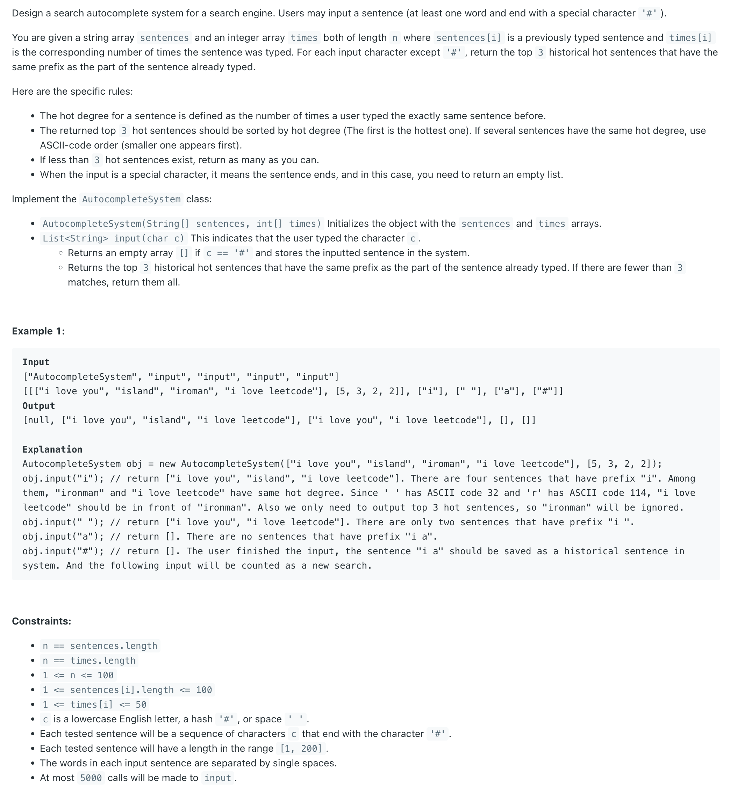
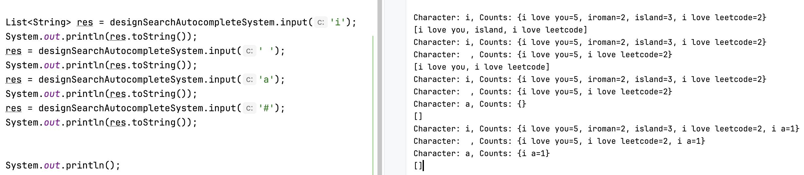
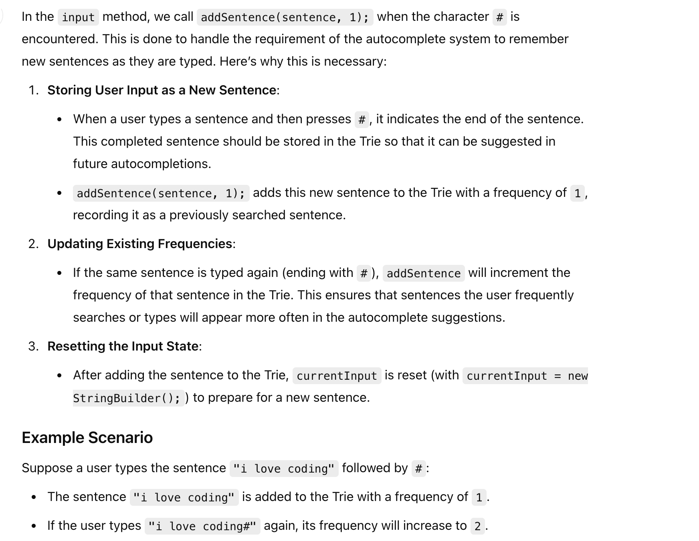
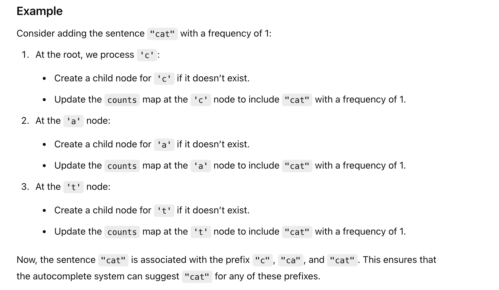
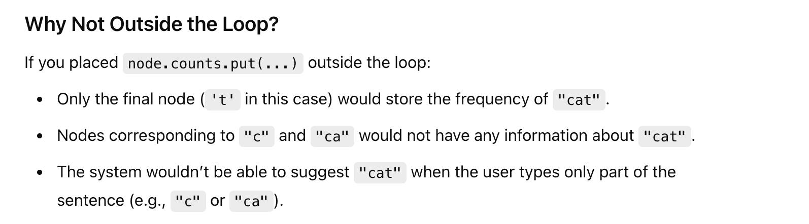
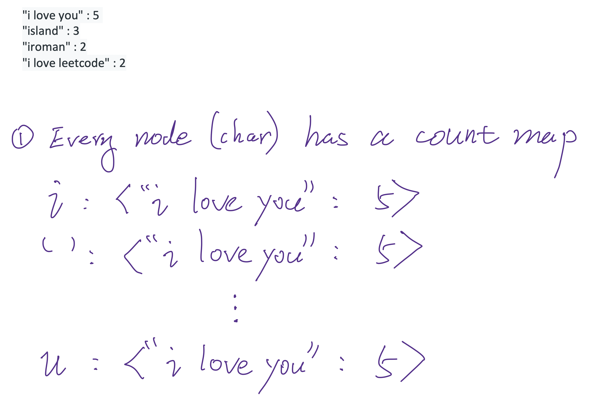
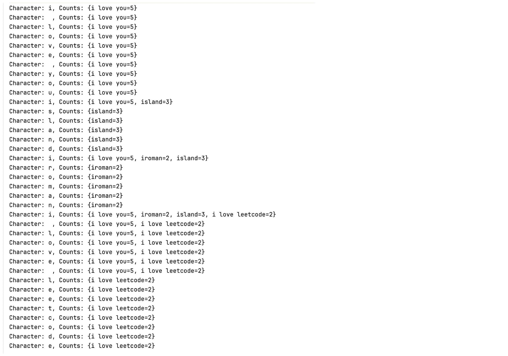
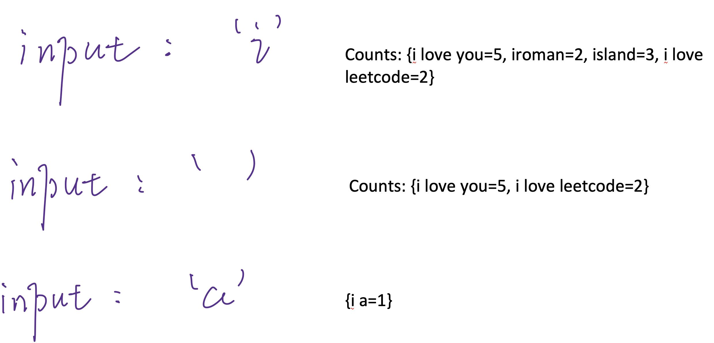

## 642. Design Search Autocomplete System


- 设计搜索引擎的**自动补全**系统
- Trie
---




#### why did I call this method again? `addSentence(sentence, 1)` 




#### Why Not placed `node.counts.put(...)` Outside the Loop?

```java
    // Method to add a sentence to the Trie with its frequency
    private void addSentence(String sentence, int frequency) {
        TrieNode node = root;
        for (char c : sentence.toCharArray()) {
            int index = c == ' ' ? 26 : c - 'a';
            if (node.children[index] == null) {
                node.children[index] = new TrieNode();
            }
            node = node.children[index];
            node.counts.put(sentence, node.counts.getOrDefault(sentence, 0) + frequency);
        }
    }
```




---

#### More explanation



---
```java
class _642_DesignSearchAutocompleteSystem {
    private TrieNode root;
    private StringBuilder currentInput;

    class TrieNode {
        TrieNode[] children = new TrieNode[27]; // Array to hold 26 letters + 1 empty space ' '
        Map<String, Integer> counts = new HashMap<>();
    }

    // Constructor to initialize the autocomplete system with initial sentences and times
    public _642_DesignSearchAutocompleteSystem(String[] sentences, int[] times) {
        root = new TrieNode();
        currentInput = new StringBuilder();

        // Initialize the Trie with the given sentences and their times
        for (int i = 0; i < sentences.length; i++) {
            addSentence(sentences[i], times[i]);
        }
    }

    // Method to add a sentence to the Trie with its frequency
    private void addSentence(String sentence, int frequency) {
        TrieNode node = root;
        for (char c : sentence.toCharArray()) {
            int index = c == ' ' ? 26 : c - 'a';
            if (node.children[index] == null) {
                node.children[index] = new TrieNode();
            }
            node = node.children[index];
            node.counts.put(sentence, node.counts.getOrDefault(sentence, 0) + frequency);
        }
    }

    public List<String> input(char c) {
        if (c == '#') {
            // End of input, add the current input sentence to Trie
            String sentence = currentInput.toString();
            addSentence(sentence, 1);
            currentInput = new StringBuilder(); // Reset input buffer
            return new ArrayList<>(); // Return an empty list after adding
        }
        currentInput.append(c); // Append current character to the ongoing sentence
        TrieNode node = root;

        // Traverse the Trie based on the current input characters
        for (char ch : currentInput.toString().toCharArray()) {
            int index = ch == ' ' ? 26 : ch - 'a';
            if (node.children[index] == null) {
                return new ArrayList<>(); // Return empty list if prefix doesn't match
            }
            node = node.children[index];
        }

        // Use a priority queue to retrieve the top 3 results
        PriorityQueue<Map.Entry<String, Integer>> pq = new PriorityQueue<>(
                (a, b) -> a.getValue().equals(b.getValue()) ? a.getKey().compareTo(b.getKey()) : b.getValue() - a.getValue()
        ); // Note: getKey() is a string

        // Add all sentences from the current node's counts map to the priority queue
        pq.addAll(node.counts.entrySet());

        // Extract the top 3 most frequent sentences
        List<String> result = new ArrayList<>();

        int i = 0;
        while (i < 3 && !pq.isEmpty()) {
            result.add(pq.poll().getKey());
            i++;
        }

        return result;
    }
}

```
---

#### Python
