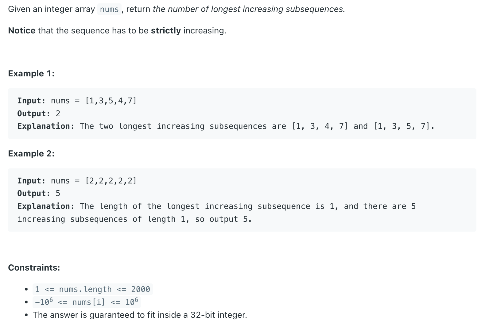
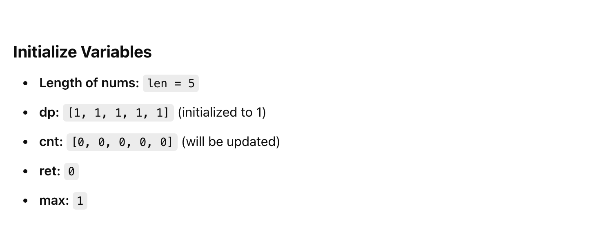

## 673. Number of Longest Increasing Subsequence

- [youtube](https://www.youtube.com/watch?v=0pRI4t9GteM)
---

1. `dp[i]`: the length of the longest increasing subsequence ending at index `i`.
2. `cnt[i]`: the number of longest increasing subsequences ending at index `i`.

#### Step-by-Step Explanation

1. Fill **dp** with 1s, since a single element is always an increasing subsequence of length 1. 
   Fill **cnt** with 0s, except for the first element, which is set to 1 (since there's only one way to form an increasing subsequence of 
   length 1 with a single element).

2. For each element `nums[i]`, iterate through the previous elements `nums[j]` (where `j < i`).
3. If `nums[i] > nums[j]`, it means we can potentially extend the increasing subsequence:
   - If `dp[j] + 1 > dp[i]`, it means we've found a longer increasing subsequence ending at i. 
     Update dp[i] to dp[j] + 1 and set count to cnt[j] (since we've found a new way to form an increasing subsequence of length dp[i]).
   - If dp[j] + 1 == dp[i], it means we've found another way to form an increasing subsequence of length `dp[i]`. 
     Increment count by `cnt[j]` (since we've found another way to form an increasing subsequence of length dp[i]).

---

