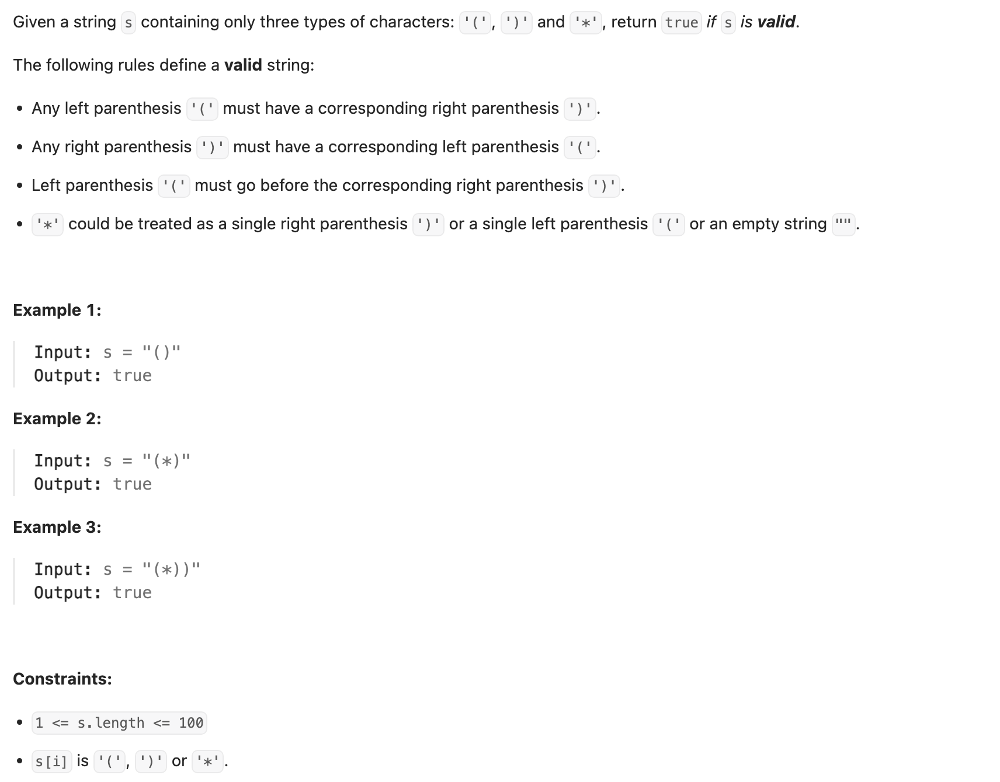

## 678. Valid Parenthesis String

---

#### Intuition
- One way to check if a given string of parentheses is valid is to use a stack. Whenever we encounter an opening bracket, we push 
  it onto the stack. Whenever we encounter a closing bracket, we pop an opening bracket from the stack. If the stack is empty at the end of the string, then the string is valid. This is similar to problem [20. Valid Parentheses](https://novemberfall.github.io/LeetCode-NoteBook/#/stack/valid).

```py
class Solution:
    def checkValidString(self, s: str) -> bool:
        stk = []
        for c in str:
            if c == ')':
                if len(stk) > 0 and stk[-1] != '(' and stk[-1] != '*':
                    return False
```

- Unfortunately, I got stuck at this point. 

- We can explore all possible combinations in branching scenarios by applying recursive solutions
- We can track whether a string is valid by counting opening brackets:
  - 1. When we encounter an opening bracket, we increment the count of opening brackets by 1.
  - 2. Conversely, for a closing bracket, we decrement the count by 1.
  - 3. After processing a valid string, the count of opening brackets is 0, indicating proper closure by corresponding closing 
   brackets.

- If s[index] is '*', we explore all possible scenarios:
  - 1. We can add an opening bracket (increment the count of opening brackets by 1) and move to index + 1.
  - 2. We can add a closing bracket (decrement the count of opening brackets by 1), if the count is positive, then move to index + 1.
  - 3. We can add an empty string and keep the count of opening brackets the same, then move to index + 1.

- The DP table caches the results of subproblems, with **1. rows representing different indices of the string s** and 
  **2. columns representing different counts of opening brackets**. **Each cell stores a boolean value** indicating whether the 
  string from the current index with the given count of opening brackets is valid or not.

```java
class memo_v1 {
    public boolean checkValidString(String s) {
        int n = s.length();
        int[][] dp = new int[n][n];
        for (int[] row : dp) {
            Arrays.fill(row, -1);
        }
        return dfs(0, 0, s, dp);
    }

    private boolean dfs(int index, int openCount, String str, int[][] dp) {
        // If reached end of the string, check if all brackets are balanced
        if (index == str.length()) {
            return openCount == 0;
        }
        if (openCount < 0) {
            return false;
        }


        if (dp[index][openCount] != -1) {
            return dp[index][openCount] == 1;
        }
        boolean isValid = false;
        // If encountering '*', try all possibilities
        if (str.charAt(index) == '*') {
            // 1.  Treat '*' as '('
            // 2.  Treat '*' as ')'
            // 3.  Treat '*' as empty
            isValid =  dfs(index + 1, openCount + 1, str, dp)
                    ||  dfs(index + 1, openCount - 1, str, dp)
                    || dfs(index + 1, openCount, str, dp);
        } else {
            // Handle '(' and ')'
            if (str.charAt(index) == '(') {
                isValid = dfs(index + 1, openCount + 1, str, dp);
            } else if (openCount > 0) {
                isValid = dfs(index + 1, openCount - 1, str, dp);
            }
        }

        // Memoize and return the result
        dp[index][openCount] = isValid ? 1 : 0;
        return isValid;
    }
}
```
---

```py

```