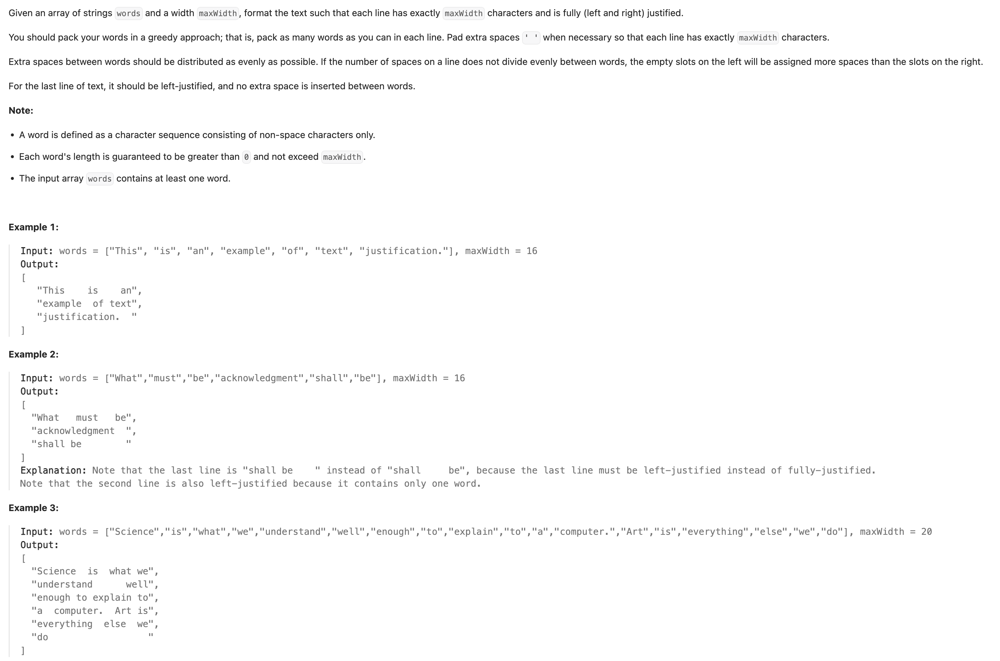
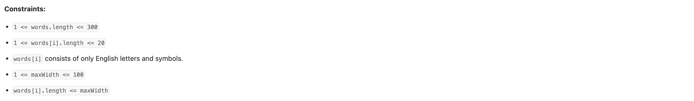
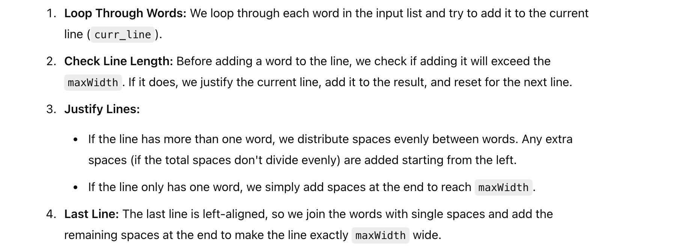
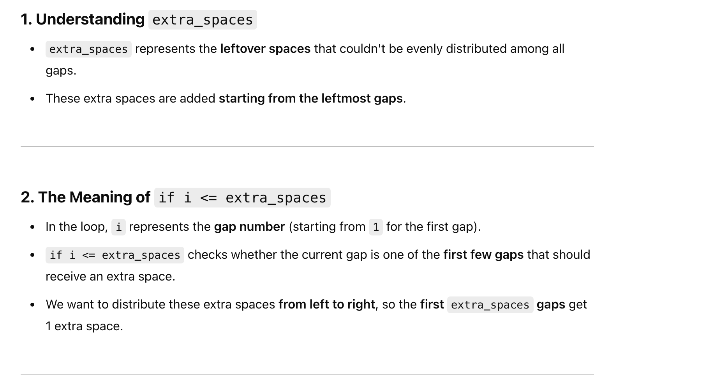
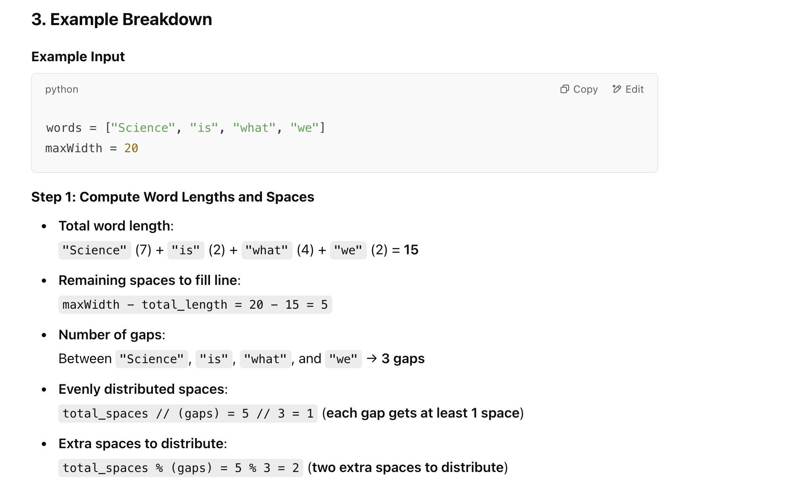
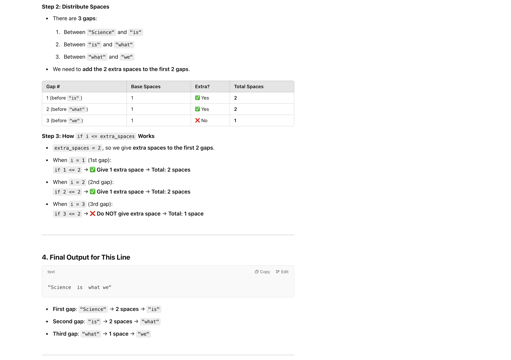

## 68. Text Justification


---

### Explanation:



---

#### why we use `if i <= extra_spaces` in the text justification logic:







- the following lines:

```py
if line_length + len(word) + len(line_words) > maxWidth:
    # Justify and add the current line to the result

    # Reset for the next line
    line_words = [word]
    line_length = len(word)
```

