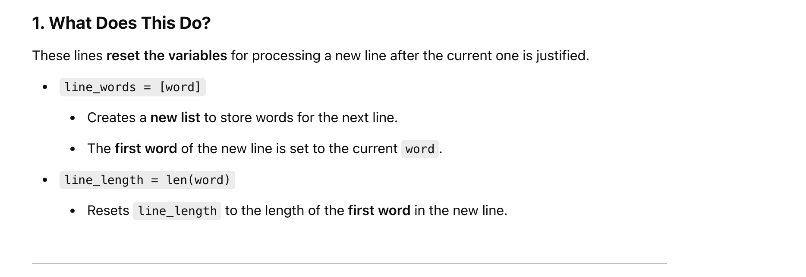
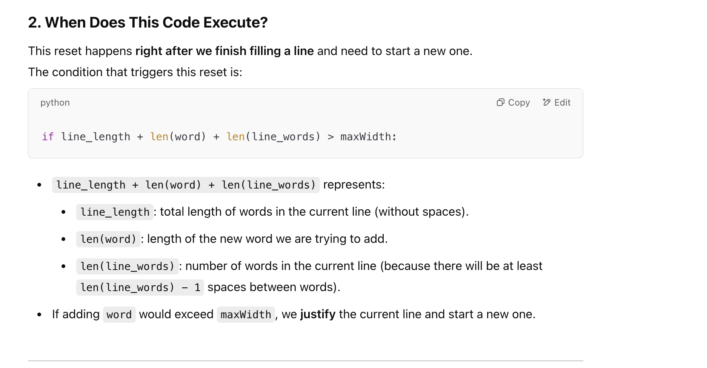
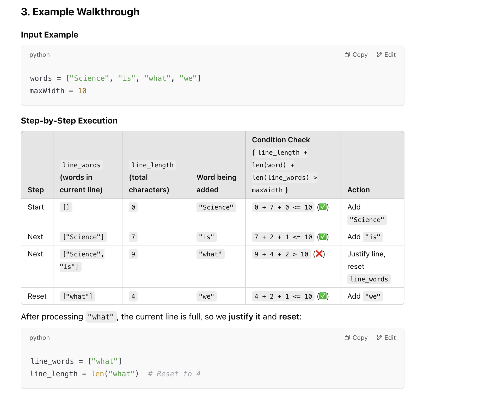
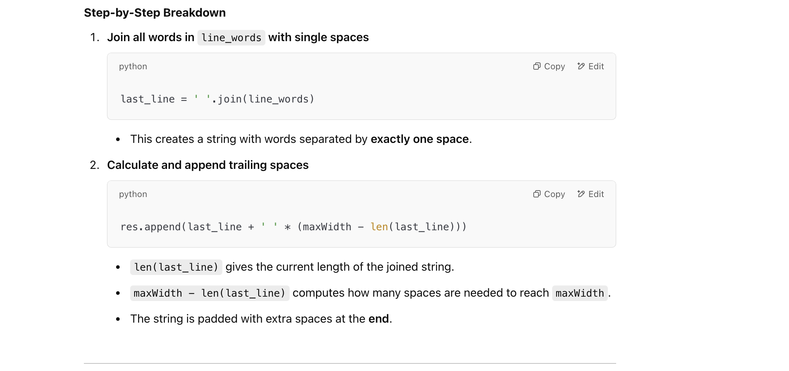

## 68. Text Justification


---

### Explanation:


---

#### why we use `if i <= extra_spaces` in the text justification logic:


- the following lines:

```py
if line_length + len(word) + len(line_words) > maxWidth:
    # Justify and add the current line to the result

    # Reset for the next line
    line_words = [word]
    line_length = len(word)
```







---

### Processing the Last Line (Left-Justified)


---

```py
class Solution:
    def fullJustify(self, words: List[str], maxWidth: int) -> List[str]:
        res = []
        line_words = []
        line_length = 0

        for word in words:
            # Check if adding this word would exceed the maxWidth
            if line_length + len(word) + (len(line_words) - 1) >= maxWidth:
                # If the current line is full, justify the text
                if len(line_words) == 1:
                    # Special case: only one word in the line (left-aligned)
                    res.append(line_words[0] + ' ' * (maxWidth - len(line_words[0])))
                else:
                    # Distribute spaces evenly
                    total_spaces = maxWidth - line_length
                    space_between_words = total_spaces // (len(line_words) - 1)
                    extra_spaces = total_spaces % (len(line_words) - 1)

                    justified_line = line_words[0]
                    for i in range(1, len(line_words)):
                        if i <= extra_spaces:
                            spaces = ' ' * (space_between_words + 1)
                        else:
                            spaces = ' ' * (space_between_words)
                        justified_line += spaces + line_words[i]

                    res.append(justified_line)

                # Reset for the next line
                line_words = [word]
                line_length = len(word)
            else:
                # Add word to the current line
                line_words.append(word)
                line_length += len(word)

        # Handle the last line (left-justified)
        last_line = ' '.join(line_words)
        res.append(last_line + ' ' * (maxWidth - len(last_line)))

        return res
```
