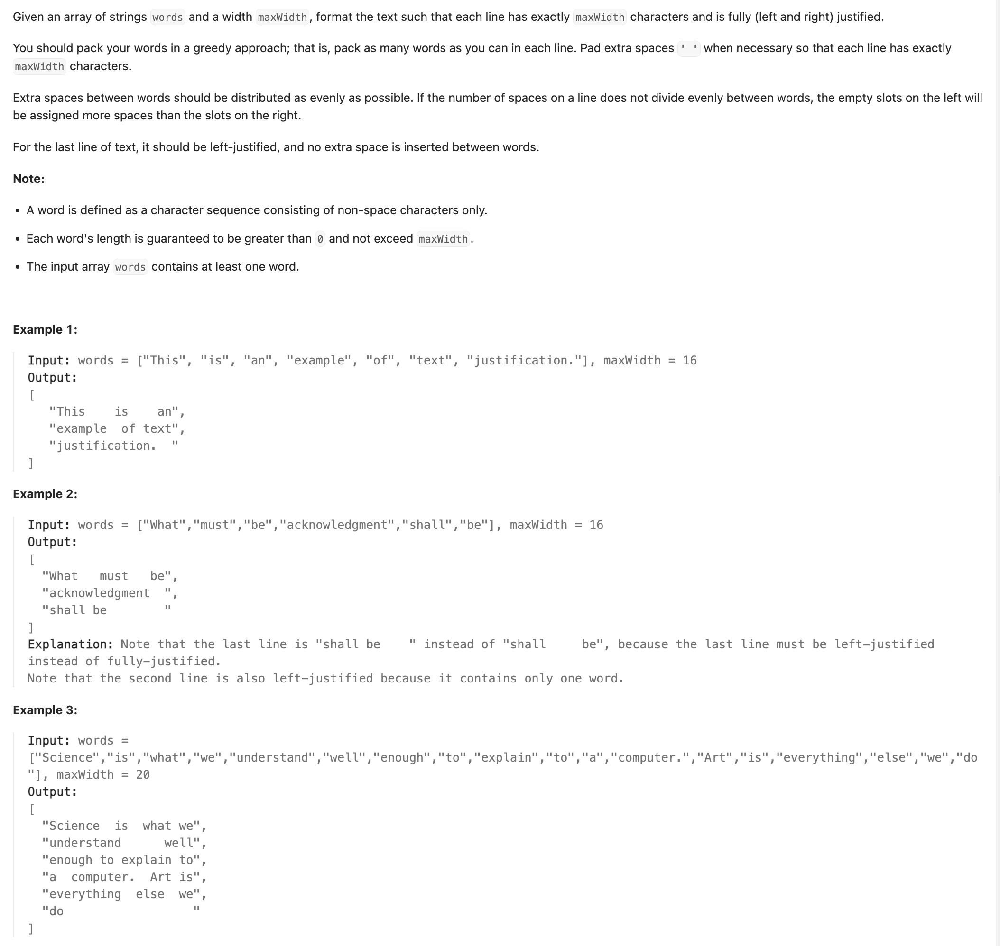
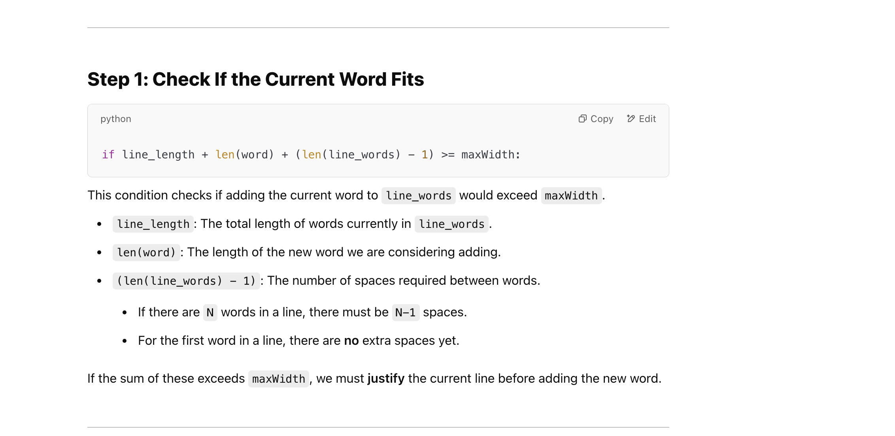
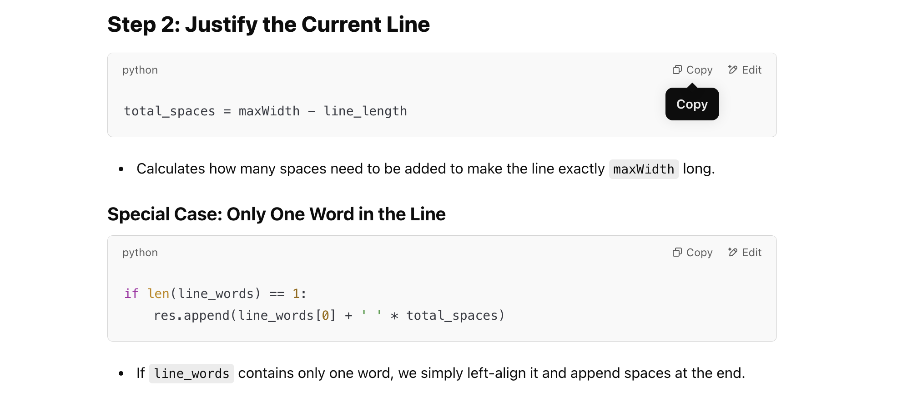
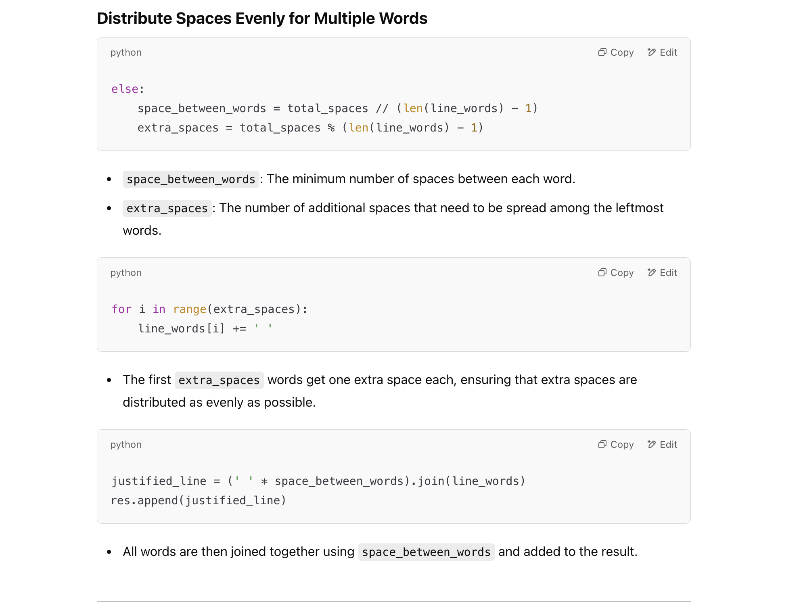
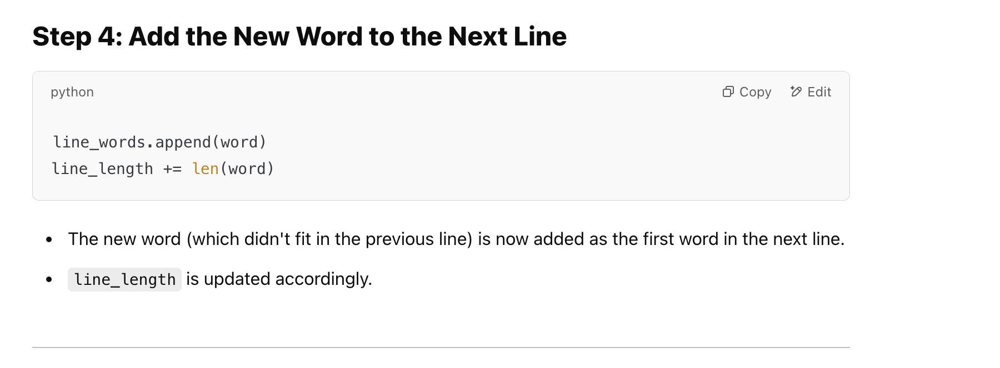
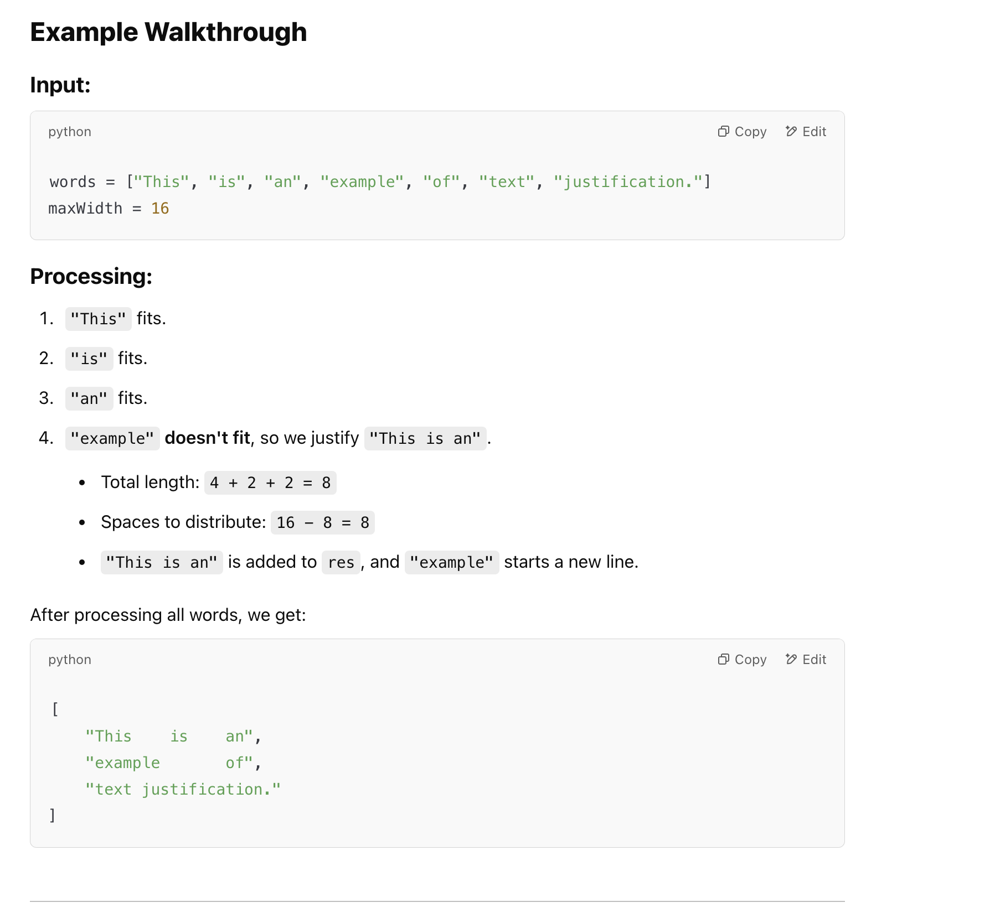

## 68. Text Justification


---

### Explanation:

- Step 1: Initialize Variables
- Step 2: Iterate Through Each Word
- Step 3: Check if the Word Fits in the Current Line
- Step 4: Justify the Current Line
  - Step 4.1: Distribute Spaces Evenly
- Step 5: Reset for the Next Line
- Step 6: Add the New Word to the Next Line
- Step 7: Handle the Last Line (Left-Justified)
---









---

### Processing the Last Line (Left-Justified)


---

```py
class Solution:
    def fullJustify(self, words: List[str], maxWidth: int) -> List[str]:
        res = []
        line_words = []
        line_length = 0

        for word in words:
            # Check if adding this word would exceed maxWidth
            if line_length + len(word) + (len(line_words) - 1) >= maxWidth:
                # Distribute spaces evenly
                total_spaces = maxWidth - line_length
                if len(line_words) == 1:
                    res.append(line_words[0] + ' ' * total_spaces)
                else:
                    space_between_words = total_spaces // (len(line_words) - 1)
                    extra_spaces = total_spaces % (len(line_words) - 1)

                    for i in range(extra_spaces):
                        line_words[i] += ' '

                    justified_line = (' ' * space_between_words).join(line_words)
                    res.append(justified_line)

                line_words.clear()  # Instead of resetting, just clear it
                line_length = 0

            line_words.append(word)
            line_length += len(word)

        # Handle the last line (left-justified)
        last_line = ' '.join(line_words)
        res.append(last_line + ' ' * (maxWidth - len(last_line)))

        return res
```
