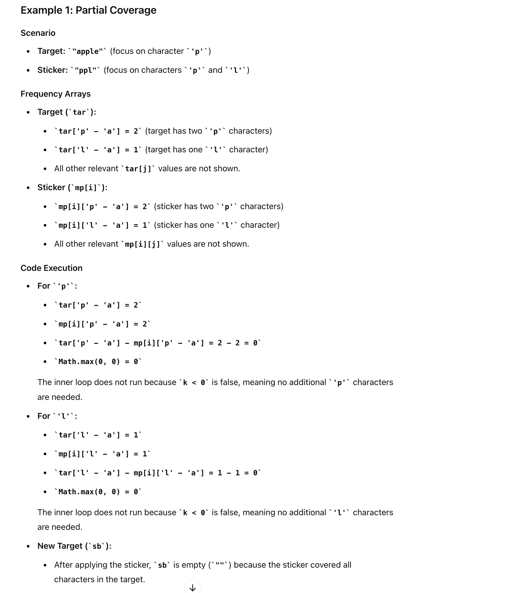

## 691. Stickers to Spell Word

---

```java
        for (int k = 0; k < Math.max(0, tar[j] - mp[i][j]); k++) {
            sb.append((char) (j + 'a'));
        }
```

- what does this line work?

 
---

- what if `mp[i][j] > tar[j]`, for example target = "apple", sticker = "aaaa", does it work?


---

- [Leetcode discussion](https://leetcode.com/problems/stickers-to-spell-word/discuss/108318/C%2B%2BJavaPython-DP-%2B-Memoization-with-optimization-29-ms-(C%2B%2B))


---

```java
class _691_Stickers_To_Spell_Word {
    public int minStickers(String[] stickers, String target) {
        int m = stickers.length;
        int[][] mp = new int[m][26];
        Map<String, Integer> dp = new HashMap<>(); // key = subseq of target | val = min num of stickers
        for (int i = 0; i < m; i++) {
            for (char c : stickers[i].toCharArray()) {
                mp[i][c - 'a']++;
            }
        }
        dp.put("", 0);
        return helper(dp, mp, target);
    }

    private int helper(Map<String, Integer> dp, int[][] mp, String target) {
        if (dp.containsKey(target)) {
            return dp.get(target);
        }
        int ans = Integer.MAX_VALUE, numOfStickers = mp.length;
        int[] tar = new int[26];
        for (char c : target.toCharArray()) {
            tar[c - 'a']++;
        }

        // try every sticker
        for (int i = 0; i < numOfStickers; i++) {
            // optimization
            if (mp[i][target.charAt(0) - 'a'] == 0) {
                continue;
            }
            StringBuilder sb = new StringBuilder();
            // apply a sticker on every character a-z
            for (int j = 0; j < 26; j++) {
                if (tar[j] > 0) {
                    for (int k = 0; k < Math.max(0, tar[j] - mp[i][j]); k++) {
                        sb.append((char) (j + 'a')); // sb records the remaining chars of target 
                    }
                }
            }
            String s = sb.toString();
            int tmp = helper(dp, mp, s);
            if (tmp != -1) {
                ans = Math.min(ans, 1 + tmp);
            }
        }
        dp.put(target, ans == Integer.MAX_VALUE ? -1 : ans);
        return dp.get(target);
    }
}
```
