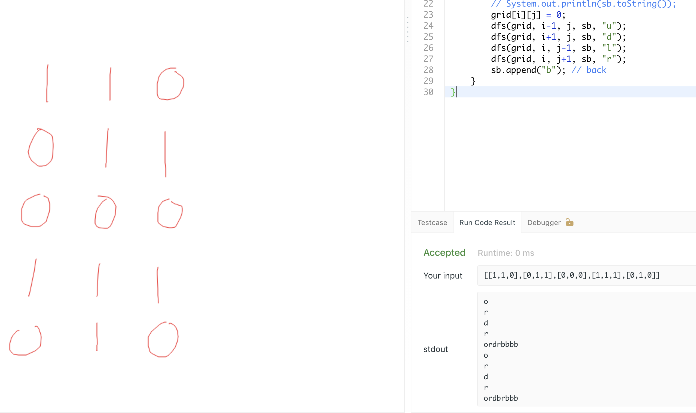

## 694. Number of Distinct Islands


---

- we have to mark `sb.append("b"); // back`



- we found the strings what we have appended are different!

---

```java
class Solution {
    public int numDistinctIslands(int[][] grid) {
        Set<String> set = new HashSet<>();
        for(int i = 0; i < grid.length; i++) {
            for(int j = 0; j < grid[i].length; j++) {
                if(grid[i][j] == 1) {
                    StringBuilder sb = new StringBuilder();
                    dfs(grid, i, j, sb, "o"); // origin
                    grid[i][j] = 0;
                    set.add(sb.toString());
                }
            }
        }
        return set.size();
    }
    private void dfs(int[][] grid, int i, int j, StringBuilder sb, String dir) {
        if(i < 0 || i == grid.length || j < 0 || j == grid[i].length
                || grid[i][j] == 0) return;
        sb.append(dir);
        grid[i][j] = 0;
        dfs(grid, i-1, j, sb, "u");
        dfs(grid, i+1, j, sb, "d");
        dfs(grid, i, j-1, sb, "l");
        dfs(grid, i, j+1, sb, "r");
        sb.append("b"); // back
    }
}
```