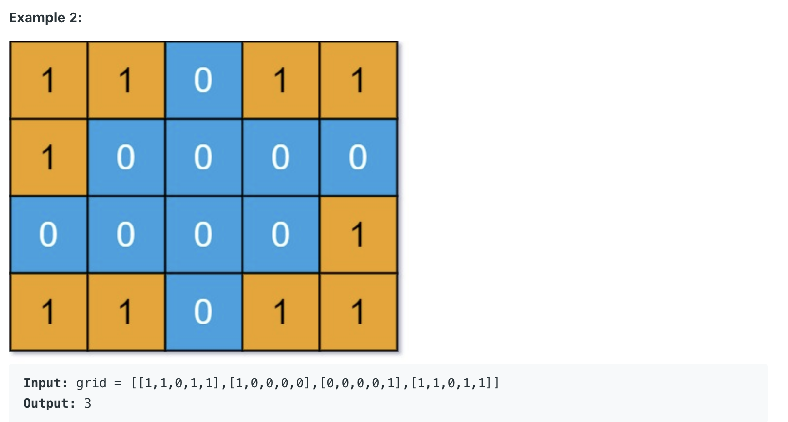

## 694. Number of Distinct Islands


---

- we have to mark `sb.append("b"); // back`
- we found the strings what we have appended are different!
---


---
- Time Complexity= `O(m * n)`
- Space Complexity= `O(m * n)`
---

```java
class _694_NumberOfDistinctIslands {
    public int numDistinctIslands(int[][] grid) {
        Set<String> set = new HashSet<>();
        for (int i = 0; i < grid.length; i++) {
            for (int j = 0; j < grid[i].length; j++) {
                if (grid[i][j] == 1) {
                    StringBuilder sb = new StringBuilder();
                    dfs(grid, i, j, sb, "o"); // origin
                    grid[i][j] = 0;
                    set.add(sb.toString());
                    System.out.println(sb.toString());
                }
            }
        }
        return set.size();
    }

    private void dfs(int[][] grid, int i, int j, StringBuilder sb, String dir) {
        if (i < 0 || i == grid.length || j < 0 || j == grid[i].length || grid[i][j] == 0) {
            return;
        }


        sb.append(dir);              // Append the direction
        grid[i][j] = 0;              // Mark the cell as visited by changing it to 0
        dfs(grid, i-1, j, sb, "u"); // Move Up
        dfs(grid, i+1, j, sb, "d"); // Move Down
        dfs(grid, i, j-1, sb, "l"); // Move Left
        dfs(grid, i, j+1, sb, "r"); // Move Right
        sb.append("b"); // Append 'b' (backtrack)
    }

    public static void main(String[] args) {
        _694_NumberOfDistinctIslands numberOfDistinctIslands = new _694_NumberOfDistinctIslands();
        int[][] grid = new int[][]{{1, 1, 0, 0}, {1, 0, 0, 1}, {0, 0, 1, 1}};
        int res = numberOfDistinctIslands.numDistinctIslands(grid);
        System.out.println(res);
    }
}
```
---


#### Python

```py
class Solution:
    def numDistinctIslands(self, grid: List[List[int]]) -> int:
        distinct_islands = set()
        for i in range(0, len(grid)):
            for j in range(0, len(grid[0])):
                if grid[i][j] == 1:
                    path = []
                    self.dfs(grid, i, j, path, 'o')
                    grid[i][j] = 0
                    distinct_islands.add("".join(path))
        return len(distinct_islands)
    
    def dfs(self, grid, i, j, path, dir):
        if i < 0 or i >= len(grid) or j < 0 or j >= len(grid[0]) or grid[i][j] == 0:
            return
        
        path.append(dir)
        grid[i][j] = 0

        self.dfs(grid, i-1, j, path, 'u')
        self.dfs(grid, i+1, j, path, 'd')
        self.dfs(grid, i, j-1, path, 'l')
        self.dfs(grid, i, j+1, path, 'r')

        path.append('b')
```