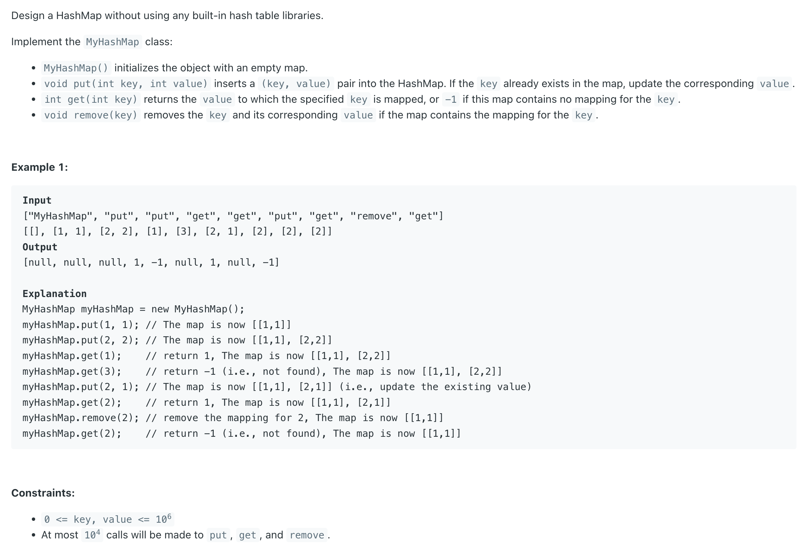

## 706. Design HashMap

---

```java
class MyHashMap {
    class Node {
        int key;
        int val;
        Node next;
        Node(int key, int val) {
            this.key = key;
            this.val = val;
        }
    }
    private Node[] array;

    public MyHashMap() {
        this.array = new Node[10_000];
    }

    public void put(int key, int value) {
        int index = getIndex(key);
        Node head = array[index];
        Node node = head;
        while (node != null) {
            if (equalsKey(node.key, key)) {
                node.val = value;
                return;
            }
            node = node.next;
        }
        // append the new node before the head and update the new head && insert operation
        Node newNode = new Node(key, value);
        newNode.next = array[index];
        array[index] = newNode;
    }

    private boolean equalsKey(int k1, int k2) {
        return k1 == k2;
    }

    private int getIndex(int key) {
        return Integer.hashCode(key) % array.length;
    }

    public int get(int key) {
        int index = getIndex(key);
        Node node = array[index];
        while (node != null) {
            if (equalsKey(node.key, key)) {
                return node.val;
            }
            node = node.next;
        }
        return -1;
    }

    public void remove(int key) {
        int index = getIndex(key);
        Node node = array[index];
        Node prev = null;
        while (node != null) {
            if (equalsKey(node.key, key)) {
                if (prev == null) {
                    // If Head is the removed node, prev is Still null
                    array[index] = node.next;
                }
                if (prev != null) {
                    // if Head is not the removed node delete current node, and connect prev to next node.
                    prev.next = node.next;
                }
            }
            prev = node;
            node = node.next;
        }
    }
}
```
---

#### Python

```py
class Node:
    def __init__(self, key: int, val: int):
        self.key = key
        self.val = val
        self.next = None


class MyHashMap:
    def __init__(self):
        self.array = [None] * 10_000

    def put(self, key: int, value: int) -> None:
        index = self.getIndex(key)
        head = self.array[index]
        node = head
        while node:
            if node.key == key:
                node.val = value
                return
            node = node.next

        new_node = Node(key, value)
        new_node.next = self.array[index]
        self.array[index] = new_node

    def getIndex(self, key: int) -> int:
        return hash(key) % len(self.array)

    def get(self, key: int) -> int:
        index = self.getIndex(key)
        node = self.array[index]
        while node:
            if node.key == key:
                return node.val
            node = node.next
        return -1

    def remove(self, key: int) -> None:
        index = self.getIndex(key)
        node = self.array[index]
        prev = None
        while node:
            if node.key == key:
                if prev is None:
                    self.array[index] = node.next
                if prev:
                    prev.next = node.next
                return
            prev = node
            node = node.next
```