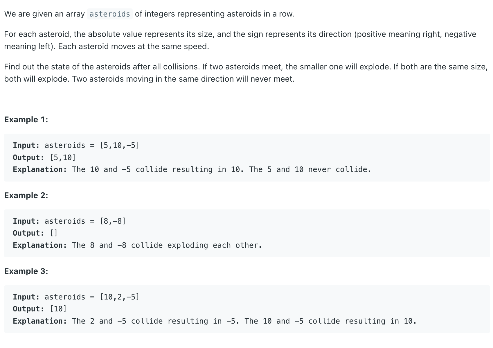
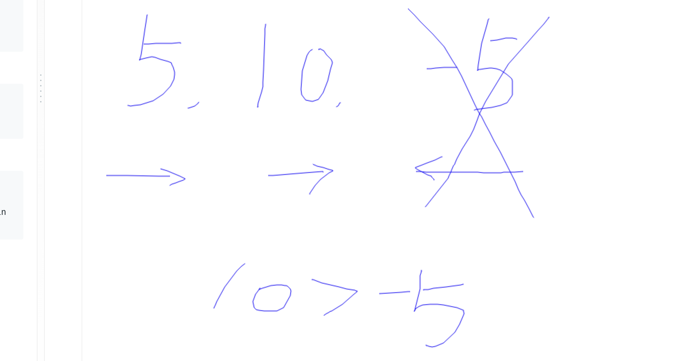

## 735. Asteroid Collision

---

- [youtube](https://www.youtube.com/watch?v=LN7KjRszjk4)




- **negative** means move to left, **positive** move to right

```ruby
      [-1, 3, 2, -3]

 stack[-1, 3, 2]
                 # since 2 < abs(-3)

 stack[-1, 3]
                 # since 3 == abs(-3)

 stack[-1]
```

-  case 1: **2 + (-3) = -1**, means negative win
-  cas2 2: **3 + (-3) = 0**, means draw

---

```java
class Solution {
    public int[] asteroidCollision(int[] asteroids) {
        Stack<Integer> stack = new Stack<>();
        for (int a : asteroids) {
            while (!stack.isEmpty() && stack.peek() > 0 && a < 0) {
                int diff = a + stack.peek();
                if (diff < 0) {
                    stack.pop();
                } else if (diff > 0) {
                    a = 0;
                } else {
                    stack.pop();
                    a = 0;
                }
            }
            
            if (a != 0) {
                stack.push(a);
            }
        }
        return stack.stream().mapToInt(i -> i).toArray();
    }
}
```


---

#### Python

```py
    def asteroidCollision(self, asteroids: List[int]) -> List[int]:
        stack = []

        for a in asteroids:
            while stack and a < 0 and stack[-1] > 0:
                diff = a + stack[-1]
                if diff < 0:  # if negative win
                    stack.pop()
                elif diff > 0:
                    a = 0 # set a = 0, means no input push to stack, and it will end the while loop
                else:
                    stack.pop()
                    a = 0

            if a:
                stack.append(a)

        return stack
```


