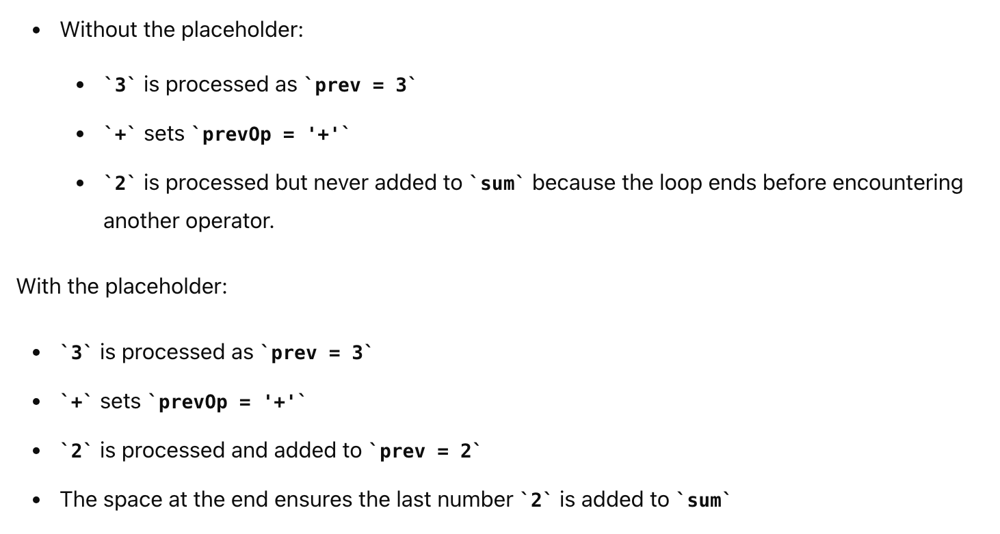

## 772. Basic Calculator III

---

- [youtube](https://youtu.be/ICfk--XA02E?t=108)


---

#### `T = O(N), Space = O(N)`

- **edge case 1**: 
- The line **queue.offer(' ')**; in your code acts as a placeholder to handle the final number and operator in the expression. 
  Removing this line can lead to incorrect results

- for exmple: `Queue: ['3', '+', '2', ' ']`


---
- **edge case 2**:
- he initialization of **prevOp to '+'** ensures that the first number in the expression is added to the sum correctly. 
  **If prevOp is not initialized**, the behavior of the calculation may be unpredictable for the first number, leading to 
  incorrect results.


```java
class _772_BasicCalculator_III {
    public int calculate(String s) {
        Queue<Character> queue = new ArrayDeque<>();
        for (char c : s.toCharArray()) {
            if (c != ' ') {
                queue.offer(c);
            }
        }
        queue.offer(' '); // placeholder
        return helper(queue);
    }

    private int helper(Queue<Character> queue) {
        int num = 0, prev = 0, sum = 0;
        char prevOp = '+';

        while (!queue.isEmpty()) {
            char c = queue.poll();
            if (c >= '0' && c <= '9') {
                num = num * 10 + c - '0';
            } else if (c == '(') {
                num = helper(queue);
            } else {
                if (prevOp == '+') {
                    sum += prev;
                    prev = num;
                } else if (prevOp == '-') {
                    sum += prev;
                    prev = -num;
                } else if (prevOp == '*') {
                    prev *= num;
                } else if (prevOp == '/') {
                    prev /= num;
                }

                if (c == ')') {
                    break;
                }
                prevOp = c;
                num = 0;
            }
        }
        return sum + prev;
    }
}
```