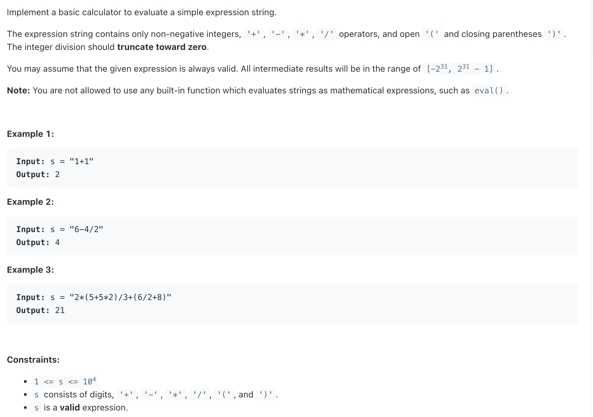
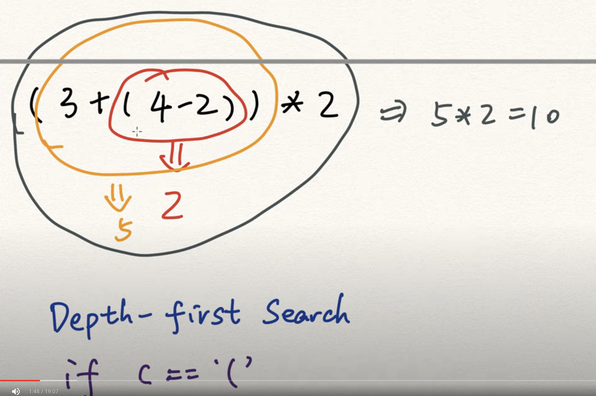

## 772. Basic Calculator III

---

- [youtube](https://youtu.be/ICfk--XA02E?t=108)


---

#### `T = O(N), Space = O(N)`
---


```java
class _Basic_Calculator_III {
    int index = 0;
    public int calculate(String s) {
        index = 0;
        return evaluate(s + "+");
    }

    private int evaluate(String s) {
        Deque<Integer> stack = new ArrayDeque<>();
        int curNum = 0;
        char lastOperator = '+';

        while (index < s.length()) {
            char curChar = s.charAt(index);
            index++;
            if (curChar == ' ') {
                continue;
            }
            if (Character.isDigit(curChar)) {
                curNum = curNum * 10 + curChar - '0';
            } else if (curChar == '(') {
                curNum = evaluate(s);
            } else {
                if (lastOperator == '+') {
                    stack.push(curNum);
                } else if (lastOperator == '-') {
                    stack.push(-curNum);
                } else if (lastOperator == '*') {
                    stack.push(stack.pop() * curNum);
                } else if (lastOperator == '/') {
                    stack.push(stack.pop() / curNum);
                }
                lastOperator = curChar;
                curNum = 0;
                if (curChar == ')') {
                    break;
                }
            }
        }

        int res = 0;
        while (!stack.isEmpty()) {
            res += stack.pop();
        }
        return res;
    }
}
```
---

```py
class Solution:
    def calculate(self, s: str) -> int:
        self.index = 0
        return self.evaluate(s + "+")

    def evaluate(self, s: str) -> int:
        stack = []
        lastOperator = '+'
        curNum = 0
        while self.index < len(s):
            curChar = s[self.index]
            self.index += 1
            if curChar == ' ':
                continue
            if curChar.isdigit():
                curNum = curNum * 10 + int(curChar)
            elif curChar == '(':
                curNum = self.evaluate(s)
            else:
                if lastOperator == '+':
                    stack.append(curNum)
                elif lastOperator == '-':
                    stack.append(-curNum)
                elif lastOperator == '*':
                    stack.append(stack.pop() * curNum)
                elif lastOperator == '/':
                    stack.append(int(stack.pop() / curNum))
                
                lastOperator = curChar
                curNum = 0
                if curChar == ')':
                    break

        return sum(stack)
```