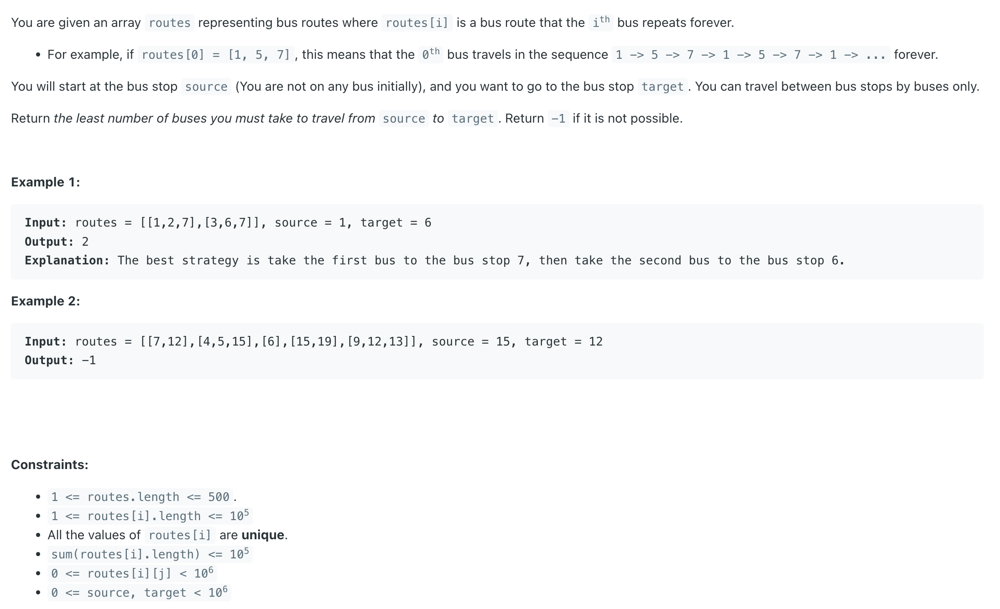

## 815. Bus Routes

---

- [youtube](https://www.youtube.com/watch?v=9m1ffWw62s0)


```ruby
Input: routes = [[1,2,7],[3,6,7]], source = 1, target = 6

  1 : [0], 
  2 : [0], 
  3 : [1],
  6 : [1],
  7 : [0, 1],

  we can find to take stop 7 can reach to Bus 0's all stops, 
  that means we can reach out to stop 1
```
---

- Time complexity: **O(N^2)** where `N` is the total number of stops across all routes.
- Space complexity: **O(N)** for the maps and sets.

---
```java
class _815_BusRoutes {
    public int numBusesToDestination(int[][] routes, int source, int target) {
        if (source == target) {
            return 0;
        }

        Map<Integer, List<Integer>> map = new HashMap<>();

        for (int busId = 0; busId < routes.length; busId++) {
            for (int j = 0; j < routes[busId].length; j++) {
                map.putIfAbsent(routes[busId][j], new ArrayList<>());
                map.get(routes[busId][j]).add(busId);
            }
        }

        Set<Integer> visitedStops = new HashSet<>();
        Set<Integer> visitedBuses = new HashSet<>();
        Queue<Integer> queue = new ArrayDeque<>();
        queue.offer(source);

        int res = 0;
        while (!queue.isEmpty()) {
            res++;
            int size = queue.size();
            for (int i = 0; i < size; i++) {
                int stop = queue.poll();
                List<Integer> buses = map.get(stop);
                if (buses == null) {
                    continue;
                }
                for (int bus : buses) {
                    if (visitedBuses.contains(bus)) {
                        continue;
                    }// 车已经走过一次了
                    visitedBuses.add(bus);
                    for (int nextStop : routes[bus]) {
                        if (nextStop == target) {
                            return res;
                        }
                        if (!visitedStops.contains(nextStop)) {
                            visitedStops.add(nextStop);
                            queue.offer(nextStop);
                        }
                    }
                }
            }
        }
        return -1;
    }
}
```
---


#### Python

```py
class Solution:
    def numBusesToDestination(self, routes: List[List[int]], source: int, target: int) -> int:
        if source == target:
            return 0

        # Map each stop to the list of buses (routes) that go through it
        # map = defaultdict(list)
        map = {}
        for bus_id in range(len(routes)):
            for stop in routes[bus_id]:
                map.setdefault(stop, []).append(bus_id)

        visited_stops = set([source])  # Keeps track of stops we have visited
        visited_buses = set()          # Keeps track of buses we've already taken
        queue = deque([source])        # Start BFS from the source stop
        res = 0                        # Number of buses taken

        while queue:
            res += 1  # Each level means one more bus taken
            size = len(queue)
            for _ in range(size):
                stop = queue.popleft()

                # if no buses go through this stop, skip
                if stop not in map:
                    continue

                # Explore all buses that go through this stop
                for bus in map[stop]:
                    if bus in visited_buses:
                        continue
                    visited_buses.add(bus)

                    # Add all the stops this bus goes to
                    for next_stop in routes[bus]:
                        if next_stop == target:
                            return res  # Found target, return number of buses taken
                        if next_stop not in visited_stops:
                            visited_stops.add(next_stop)
                            queue.append(next_stop)

        return -1
```