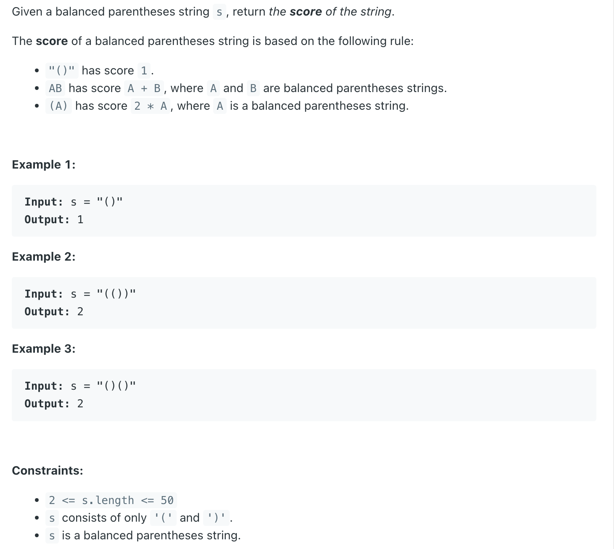
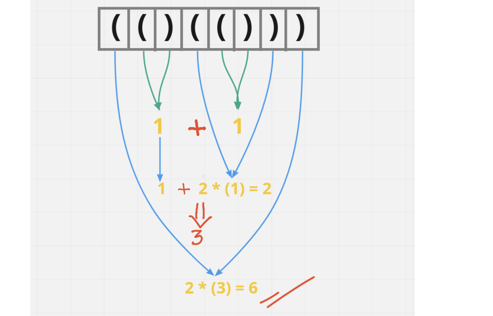
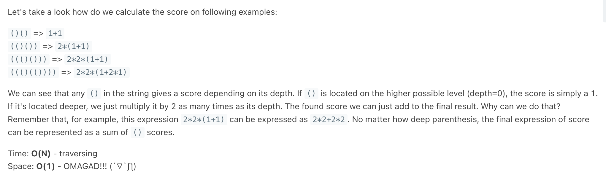

## 856. Score of Parentheses

---



- If our input string is "**()**" then our score will be 1, so this is our first rule
- If we have input string "**()()**" then our score will be **1 + 1** i.e. 2, where 1 is a score of a balanced parentheses. So, this is our second rule
- Now last rule say's, if we have given something like "**(())**" in our input string, our score will be **2 X 1** i.e. 2, 
  it means that we have something like nested parenthesis. Then **multiply it by 2**.
---



- [2nd method](https://leetcode.com/problems/score-of-parentheses/discuss/1856699/C%2B%2B-BEATS-100-OMG!!!-(-%22-)-O(1)-Space-Explained)

---

```java
class Solution {
    public int scoreOfParentheses(String s) {
        int res = 0;
        int depth = 0;
        for (int i = 0; i < s.length(); i++) {
            if (s.charAt(i) == '(') {
                depth++;
            } else {
                depth--;
                if (s.charAt(i - 1) == '(') {
                    res += Math.pow(2, depth);
                }
            }
        }
        return res;
    }
}
```