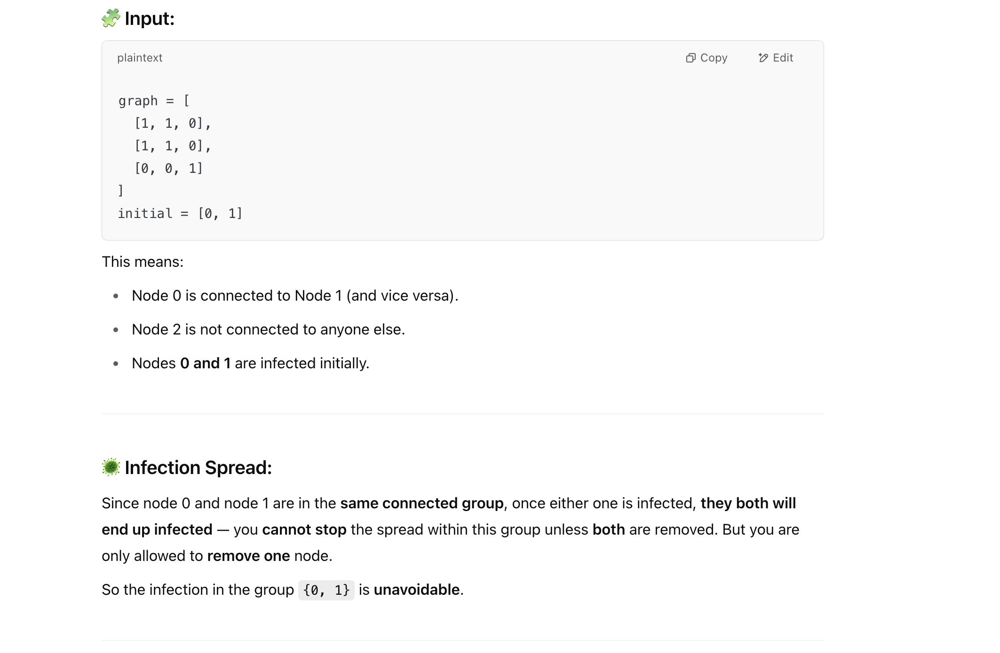
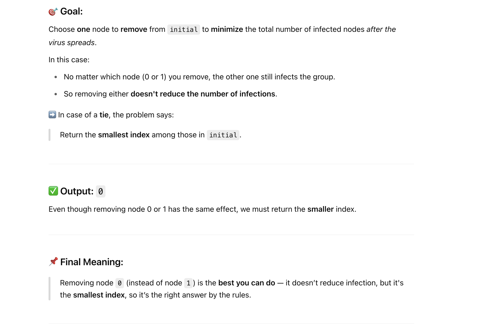

## 924. Minimize Malware Spread

---

- [difference between LC924 and LC928](https://youtu.be/3LIYcgtIXdg?t=69)
---



- 注意： initial array 包含了所有含有病毒的nodes

- 本题用 **union by size**, 而不是 union by rank!
---
```java
/*
    we don't have to emulate because only initial situation (`initials`) matters
    that's because if we construct connected component, no matter how many malwares are inside, all elements in the component will be malwared

    for each connected component,
        if numMalware >1, removal of one malware doesn't change anything
        if numMalware =1, removal of one malware save the whole component, so the biggest the component, the better)
           → In this case, we prefer to remove the malware from the largest such component to minimize overall infection.


    Therefore, we:
     1. Use Union Find to build connected components and record their sizes.
     2. Count how many malware nodes are in each component.
     3. Sort the initial malware list so that in case of ties (same saved size), we return the smallest index.
     4. For each node in the sorted initial list:
        - If it's the only malware in its component, and its component is larger than any previously considered:
            → update the result.
     5. Return the best node to remove.

    */
class _924_Minimize_Malware_Spread {
    public int minMalwareSpread(int[][] graph, int[] initial) {
        int n = graph.length;

        UF uf = new UF(n);
        // Step 1: Union all connected nodes into components
        for (int i = 0; i < n; i++) {
            for (int j = i + 1; j < n; j++) {
                if (graph[i][j] == 1) {
                    uf.union(i, j);
                }
            }
        }

        // Step 2: Count malware in each component
        int[] malwareCountInComponent = new int[n];
        for (int node : initial) {
            int root = uf.find(node);
            malwareCountInComponent[root]++;
        }

        // Step 3: Sort initial list to handle tie-breaking (smallest index)
        Arrays.sort(initial); // for example: initial = [4, 1, 3]; => becomes [1, 3, 4]

        int maxSavedSize = 0;
        int nodeToRemove = initial[0];

        // Step 4: Try removing each node and check if it minimizes spread
        for (int node : initial) {
            int root = uf.find(node);

            // Only consider components with exactly one malware
            if (malwareCountInComponent[root] == 1) {
                int componentSize = uf.getComponentSizes()[root];
                if (componentSize > maxSavedSize) {
                    maxSavedSize = componentSize;
                    nodeToRemove = node;
                }
            }
        }
        return nodeToRemove;
    }

    class UF {
        private int[] parent;
        private int[] rank;

        public UF(int n) {
            parent = new int[n];
            // rank = new int[n];
            rank = new int[n];
            for (int i = 0; i < n; i++) {
                parent[i] = i;
                rank[i] = 1;
            }
        }

        //time: O(log N)
        public int find(int x) {
            if (x == parent[x]) {
                return x;
            }
            return parent[x] = find(parent[x]);
        }

        // Union by Size (or Weight)
        public void union(int x, int y) {
            int rootX = find(x);
            int rootY = find(y);
            if (rootX == rootY) {
                return;
            }
            
            if (rank[rootX] > rank[rootY]) {
                parent[rootY] = rootX;
                rank[rootX] += rank[rootY];
            } else if (rank[rootX] < rank[rootY]) {
                parent[rootX] = rootY;
                rank[rootY] += rank[rootX];
            } else {
                parent[rootY] = rootX;
                rank[rootX] += rank[rootY];
            }
        }

        public boolean isConnected(int x, int y) {
            return find(x) == find(y);
        }

        public int[] getComponentSizes() {
            return rank;
        }
    }
}
```

