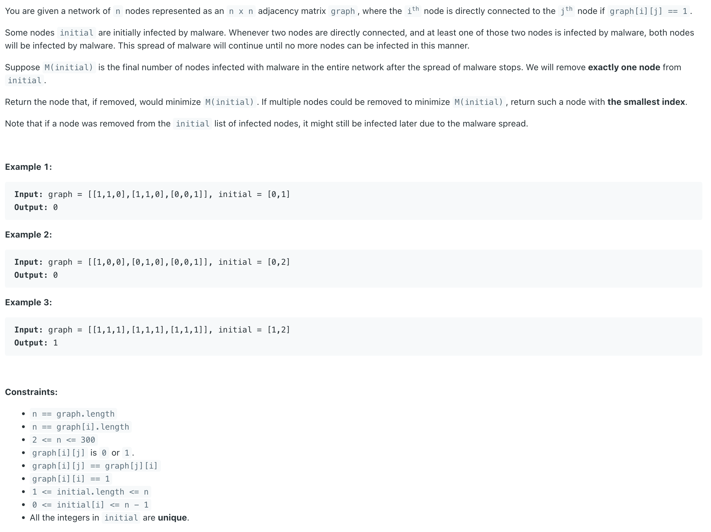
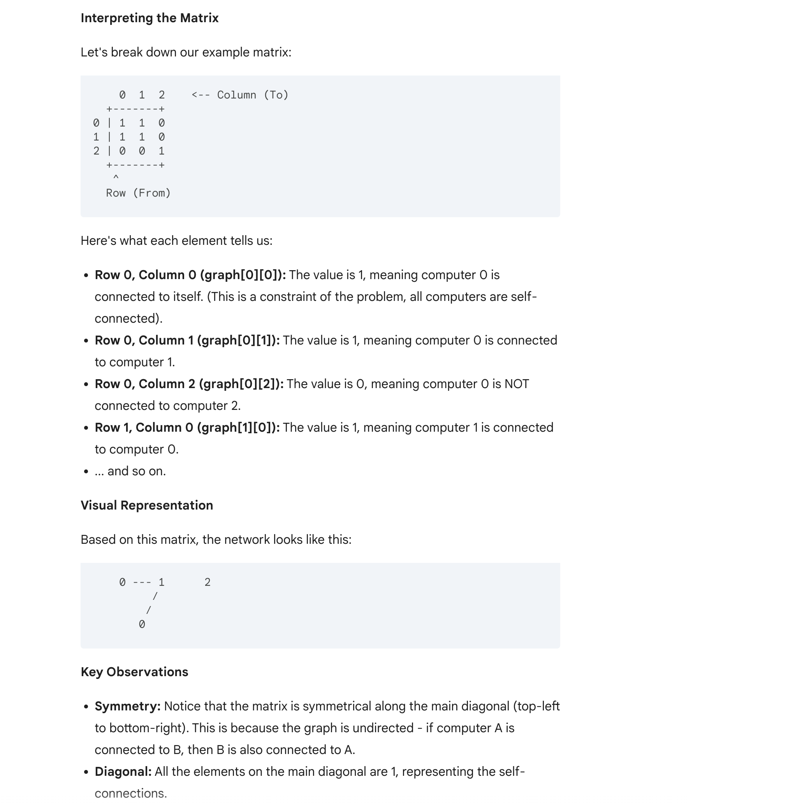
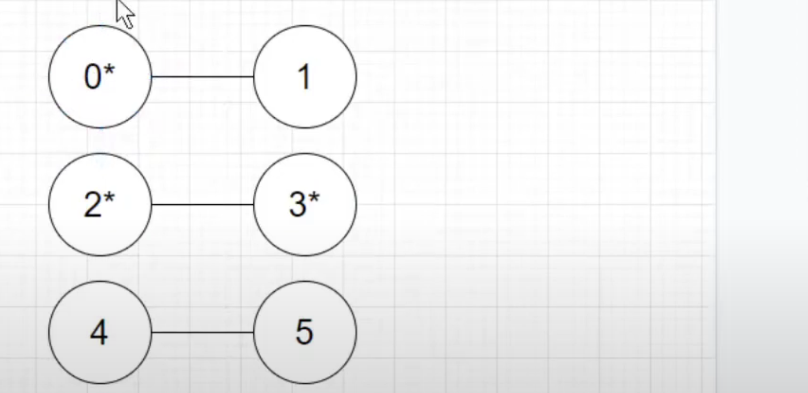
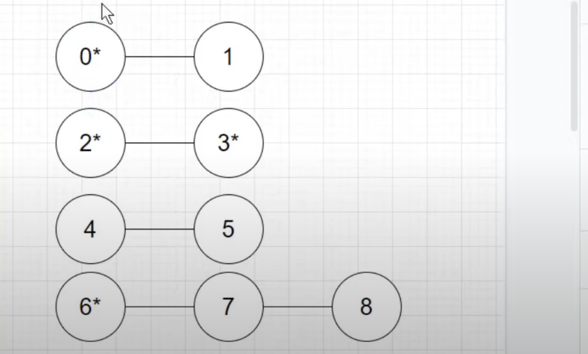

## 924. Minimize Malware Spread

---


---

- This problem asks you to determine which node, if removed from the initial list, would **minimize the total number** of infected nodes 
  after the malware spread stops. In this specific example, removing either node 0 or node 2 
  would result in only one infected node remaining.


- [difference between LC924 and LC928](https://youtu.be/3LIYcgtIXdg?t=69)

- Note that if a node was removed from the initial list of infected nodes, **it might still be infected later due to the malware spread**.
  so if remove **node 0** from infected nodes of list[0, 1], still there exists **two numbers** of infected nodes 
---

- [yoututbe](https://youtu.be/p5tFzm-j9eM?t=285)


- **6 nodes**



- initial [0, 2, 3], remove 0, M = 2
- initial [0, 2, 3], remove 2, M = 4


- **9 nodes**



- initial [0, 2, 3, 6]  remove 6, M = 4

---

0. find all connected components
1. find the connected components with **only one** initial infection
2. find the largest among above 
3. if there are tires, we choose smaller index


```java
/*
	we don't have to emulate because only initial situation (`initials`) matters
	that's because if we construct connected component, no matter how many malwares are inside, all elements in the component will be malwared
	
    for each connected component,
        if numMalware >1, removal of one malware doesn't change anything
        if numMalware =1, removal of one malware save the whole component, so the biggest the component, the better)
  
	we need to build a connected component and keep track of its size, that's natural to UnionFind(Disjoint Set data structure)
	
	so we
	sort initials increasingly
	for i in initaial
		check if i 's component with only one malware
		if it is, we update overall max size of such component with i as ans
	return ans
*/


class _924_MinimizeMalwareSpread {
    public int minMalwareSpread(int[][] graph, int[] initial) {
        int n = graph.length;

        UF uf = new UF(n);
        for (int i = 0; i < n; i++) {
            for (int j = i + 1; j < n; j++) {
                if (graph[i][j] == 1) {
                    uf.union(i, j);
                }
            }
        }

        int[] size = uf.getSize();

        int[] idToMalwareCount = new int[n];
        for (int i : initial) {
            idToMalwareCount[uf.find(i)]++;
            // System.out.println(idToMalwareCount[uf.find(i)]);
        }
        // since init 0, 1 are the same of root -> 0, so the idToMalwareCount[uf.find(i)] => 2 

        Arrays.sort(initial);

        int maxSize = 0, malwareInMaxSize = initial[0];
        for (int i : initial) {
            // Get number of malwares in i's locating component
            int rootI = uf.find(i);
            int malwareCount = idToMalwareCount[rootI];
            System.out.println("index of malware count: " + idToMalwareCount[rootI]);
            if (malwareCount == 1) {
                // Update overall max size of such componnet and malwareInMaxSize
                int sz = size[rootI];
                System.out.println("current root's rank: " + sz);
                if (sz > maxSize) {
                    maxSize = sz;
                    malwareInMaxSize = i;
                }
            }
        }

        return malwareInMaxSize;
    }

    class UF {
        private int[] parent;
        private int[] size;

        public UF(int n) {
            parent = new int[n];
            // rank = new int[n];
            size = new int[n];
            for (int i = 0; i < n; i++) {
                parent[i] = i;
                // rank[i] = 1;
                size[i] = 1;
            }
        }

        //time: O(log N)
        public int find(int x) {
            if (x == parent[x]) {
                return x;
            }
            return parent[x] = find(parent[x]);
        }
        
        // Union by Size (or Weight)
        public void union(int x, int y) {
            int rootX = find(x);
            int rootY = find(y);

            if (rootX != rootY) {
                parent[rootY] = rootX; // Attach smaller tree under larger one
                size[rootX] += size[rootY]; // Update size of the new root
            }
        }

        public boolean isConnected(int x, int y) {
            return find(x) == find(y);
        }

        public int[] getSize() {
            return size;
        }
    }
}
```

