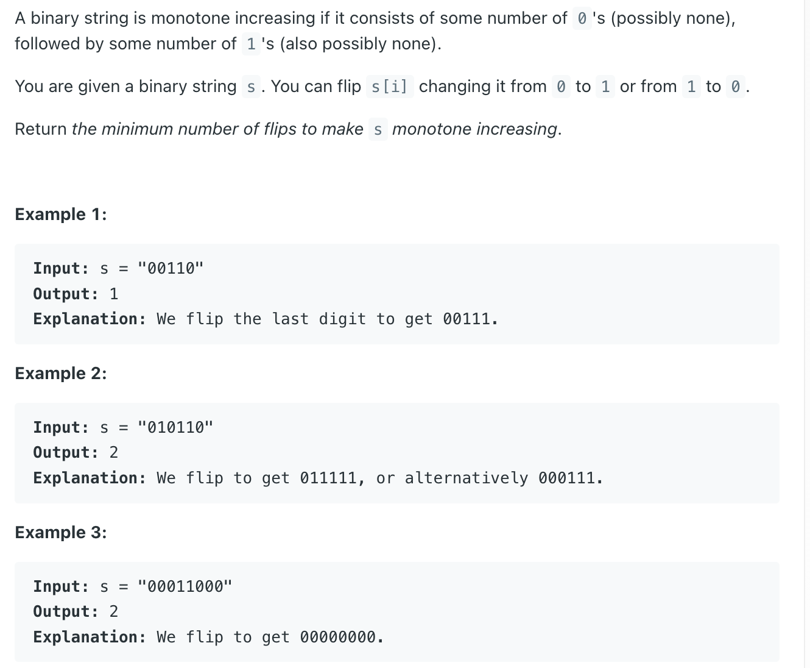

## 926. Flip String to Monotone Increasing

---

```java
class Solution {
    public int minFlipsMonoIncr(String s) {
        int n = s.length();
        int cntOnes = 0;
        int res = 0;
        for (int i = 0; i < n; i++) {
            char c = s.charAt(i);
            if (c == '1') {
                cntOnes++;
            } else {
                int tmp1 = cntOnes;
                int tmp2 = res + 1;
                res = Math.min(tmp1, tmp2);
            }
        }
        return res;
    }
}
```