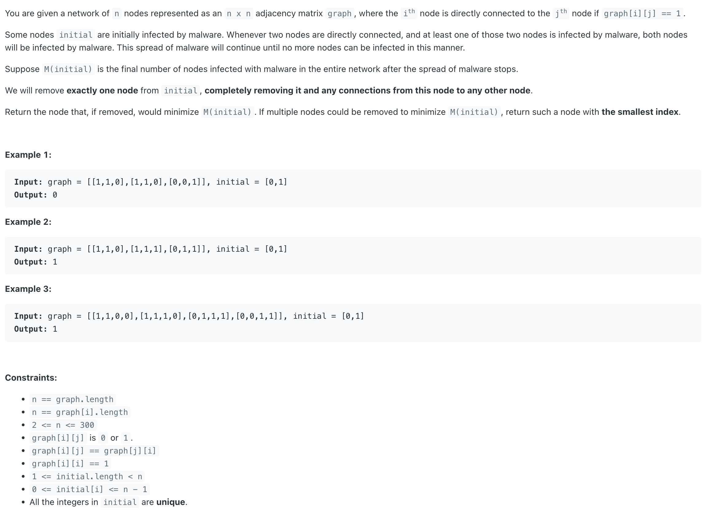

## 928. Minimize Malware Spread II

---

### 注意 924 vs 928 它们的不同点在于：

- in **928**, node has been removed competely, 节点被完成删除，**被删除的这个节点不会再被感染**
- in **924**, node has been removed, 节点被删除，**但是如果与之相邻的节点是被感染的，则当前节点即使被删除，之后依然会被感染！**
---

