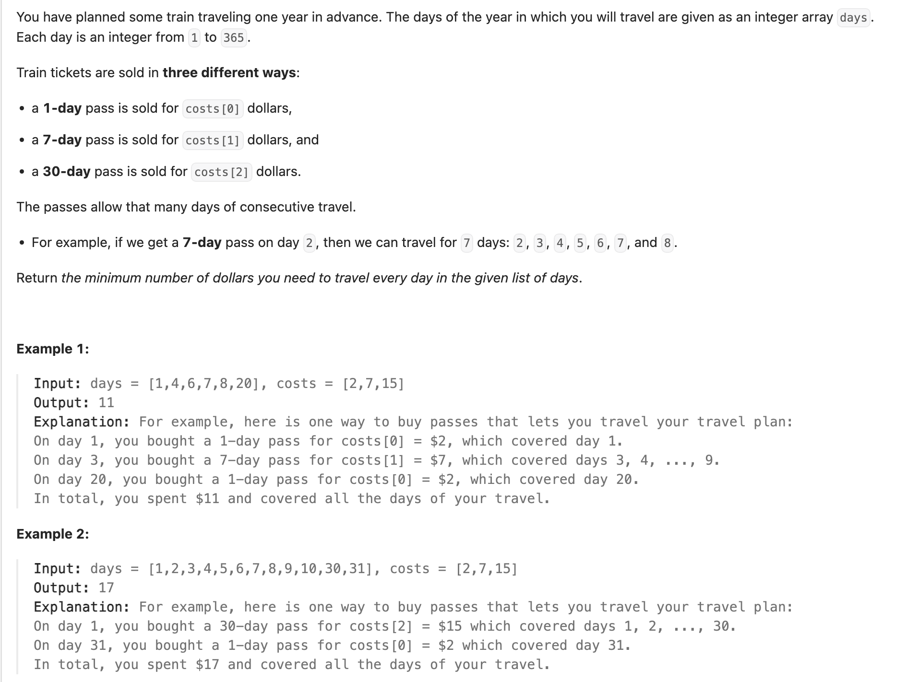

## 983. Minimum Cost For Tickets

---

- array `costs[]` only have 3 elements: `1-day, 7-day, 30-day`

---
### Top-Down DP

```py
class Solution:
    def mincostTickets(self, days: List[int], costs: List[int]) -> int:
        self.is_travel_needed = set(days)
        self.last_day = days[-1]
        dp = [-1] * (self.last_day + 1)
        return self.dfs(dp, days, costs, 1)

    def dfs(self, dp: List[int], days: List[int], costs: List[int], cur_day: int) -> int:
        if cur_day > self.last_day:
            return 0
        if cur_day not in self.is_travel_needed:
            return self.dfs(dp, days, costs, cur_day + 1)
        if dp[cur_day] != -1:
            return dp[cur_day]

        one_day = costs[0] + self.dfs(dp, days, costs, cur_day + 1)
        seven_day = costs[1] + self.dfs(dp, days, costs, cur_day + 7)
        thirty_day = costs[2] + self.dfs(dp, days, costs, cur_day + 30)

        dp[cur_day] = min(one_day, seven_day, thirty_day)
        return dp[cur_day]
```

- **TC = O(K)**, **K** it the last day we need to travel, the last value in the array `days`
- **SC = O(K)**, the size of **dp** array is **K + 1**, the maximum active recursion depth would be **K**, 
  The size of the set `isTravelNeeded` will be equal to the size of `days`, N <= K, so **O(K)**

  ---

  ### Tabulation

  ```py
  class Solution:
    def mincostTickets(self, days: List[int], costs: List[int]) -> int:
        is_travel_needed = set(days)
        last_day = days[-1]
        dp = [0] * (last_day + 1)

        for day in range(1, last_day + 1):
            if day not in is_travel_needed:
                dp[day] = dp[day - 1]
            else:
                one_day = costs[0] + dp[max(0, day - 1)]
                seven_day = costs[1] + dp[max(0, day - 7)]
                thirty_day = costs[2] + dp[max(0, day - 30)]
                dp[day] = min(one_day, seven_day, thirty_day)

        return dp[last_day]
  ```
  ---
  
  
  