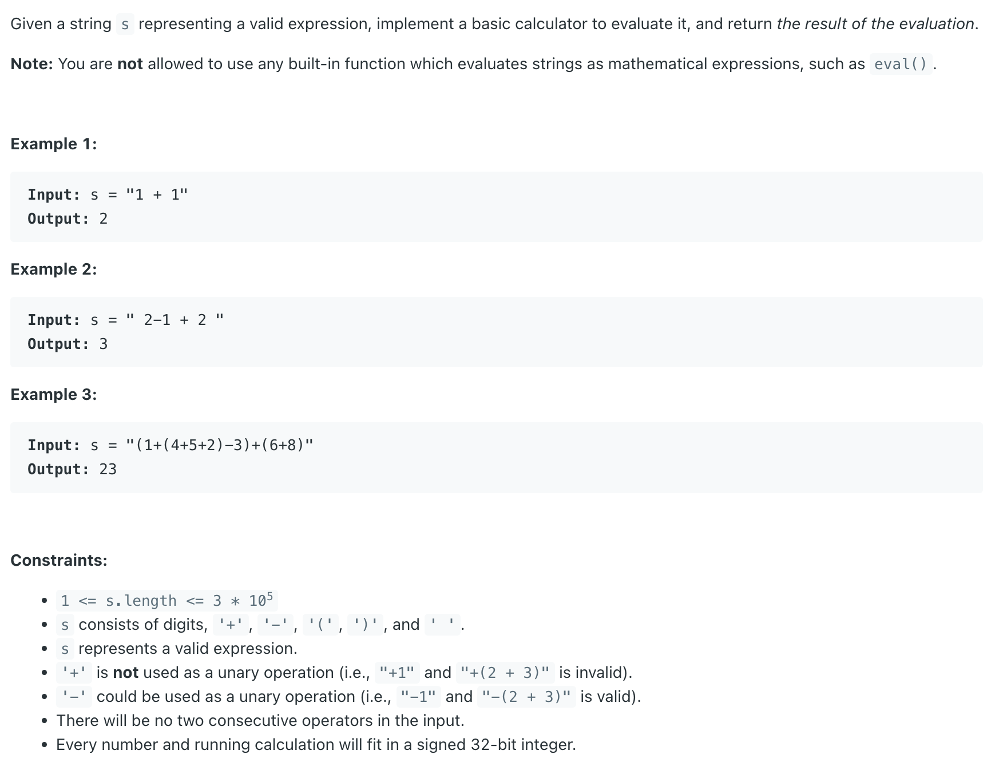

## 224. Basic Calculator

---
- recursion was **primarily** used to handle parentheses `()`. When an opening parenthesis **(** was encountered, the **evaluate** function called 
  itself to calculate the value of the sub-expression inside the parentheses. The result of this recursive call was then treated as a single number 
  (currentNumber) by the caller function. This elegantly mirrors the nested structure of parentheses.


- 使用递归的主要原因是为了优雅地处理括号 ()。
  - 1. 自然匹配嵌套结构: 计算器问题中，括号定义了运算的优先级和范围。括号内部可以嵌套更深的括号，形成一个天然的递归结构 (比如 (a + (b * c)) )。
  - 2. 简化括号处理逻辑: 当代码遇到一个左括号 ( 时，可以直接调用 evaluate 函数自身来计算这个括号内部子表达式的值。这个子调用会负责处理括号内的所有运算，直到遇到对应的右括号 )。子调用结束后，它会返回括号内表达式的计算结果。对于外层调用来说，它只需要把这个返回的结果当作一个普通的数字来继续运算即可。这种方式非常直观地模拟了我们手动计算带括号表达式的过程——先算括号里的。
  - 3. 代码相对简洁: 对于处理括号嵌套的这部分逻辑，递归写法通常比迭代写法更简洁、更易于理解。
---
```java
class _Basic_Calculator_dfs {
    int index = 0;
    public int calculate(String s) {
        // Append a sentinel '+' operator to ensure the last number is processed.
        return evaluate(s + "+");
    }

    private int evaluate(String s) {
        Deque<Integer> stack = new ArrayDeque<>();
        int curNum = 0;
        char lastOperator = '+';
        while (index < s.length()) {
            char curChar = s.charAt(index);
            index++;
            if (curChar == ' ') {
                continue;
            }
            if (Character.isDigit(curChar)) {
                curNum = curNum * 10 + curChar - '0';
            } else if (curChar == '(') {
                curNum = evaluate(s);
            } else { // curChar must be one of " +, -, *, / " or ")"
                if (lastOperator == '+') {
                    stack.push(curNum);
                } else if (lastOperator == '-') {
                    stack.push(-curNum);
                }
                lastOperator = curChar;
                curNum = 0;
                if (curChar == ')') {
                    break;
                }
            }
        }

        int res = 0;
        while (!stack.isEmpty()) {
            res += stack.pop();
        }
        return res;
    }
}
```
---


#### Python

```py
class Solution:
    def calculate(self, s: str) -> int:
        self.index = 0
        return self.evaluate(s + "+")

    def evaluate(self, s: str) -> int:
        stack = []
        curNum = 0
        lastOperator = '+'
        while self.index < len(s):
            curChar = s[self.index]
            self.index += 1
            if curChar == ' ':
                continue
            if curChar.isdigit():
                curNum = curNum * 10 + int(curChar)
            elif curChar == '(':
                curNum = self.evaluate(s)
            else:
                if lastOperator == '+':
                    stack.append(curNum)
                elif lastOperator == '-':
                    stack.append(-curNum)
                lastOperator = curChar
                curNum = 0
                if curChar == ')':
                    break
        
        return sum(stack)
```