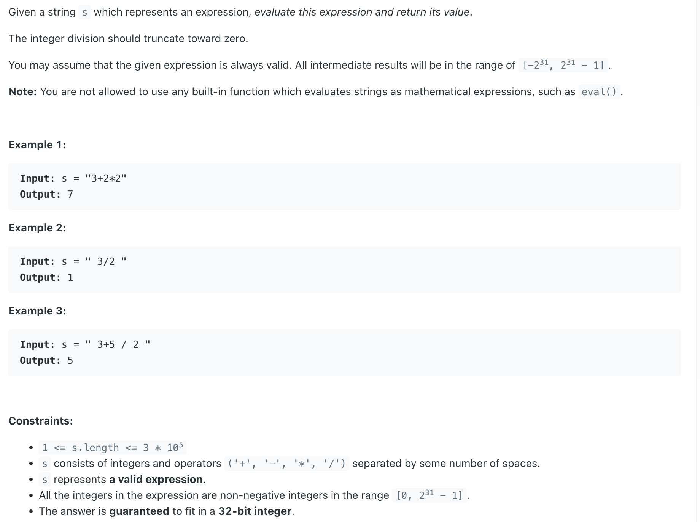
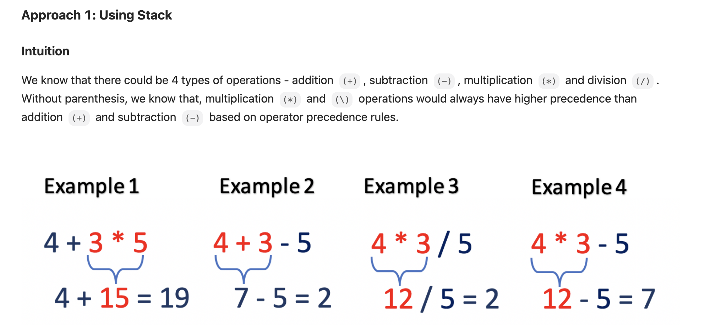

## 227. Basic Calculator II

---



---
```java
class _227_BasicCalculator_II {
    public int calculate(String s) {
        s = s.trim();
        int num = 0;
        Stack<Integer> stack = new Stack<>();
        char lastSign = '+';
        for (int i = 0; i < s.length(); i++) {
            char c = s.charAt(i);
            if (c == ' ') {
                continue;
            }
            if (Character.isDigit(c)) {
                num = num * 10 + c - '0';
            }
            if (!Character.isDigit(c) && c != ' ' || i == s.length() - 1) {
                if (lastSign == '+') {
                    stack.push(num);
                    lastSign = c;
                } else if (lastSign == '-') {
                    stack.push(-num);
                    lastSign = c;
                } else if (lastSign == '*') {
                    stack.push(stack.pop() * num);
                    lastSign = c;
                } else if (lastSign == '/') {
                    stack.push(stack.pop() / num);
                    lastSign = c;
                }
                num = 0;
            }
        }
        int sum = 0;
        for (int e : stack) {
            sum += e;
        }
        return sum;
    }
}
```
---

```py
class Solution:
    def calculate(self, s: str) -> int:
        s = s.strip()  # Remove leading/trailing whitespace
        stack = []  # use a list as a stack
        lastSign = '+'
        num = 0

        for i, ch in enumerate(s):
            c = s[i]
            if c.isdigit():
                num = num * 10 + int(c)

            if ch in "+-*/" or i == len(s) - 1:  # End of number or string
                if lastSign == '+':
                    stack.append(num)
                    lastSign = c
                elif lastSign == '-':
                    stack.append(-num)
                    lastSign = c
                elif lastSign == '*':
                    stack.append(stack.pop() * num)
                    lastSign = c
                elif lastSign == '/':
                    stack.append(int(stack.pop() / num))  # Ensure integer division
                    lastSign = c
                num = 0

        return sum(stack)
```