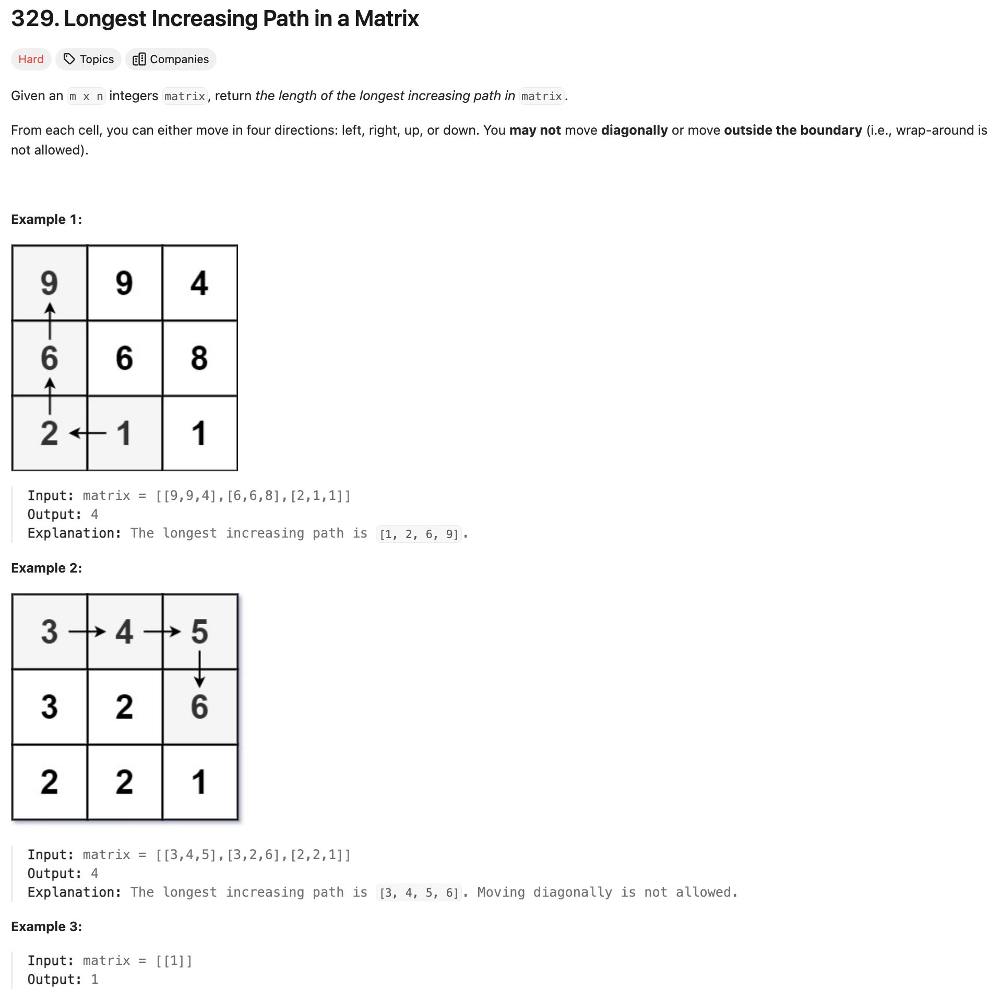

---

#### Memorization DFS

```java
class Solution {
    int[][] dirs = new int[][]{{0, 1},{0, -1},{1, 0},{-1, 0}};
    public int longestIncreasingPath(int[][] matrix) {
        int m = matrix.length, n = matrix[0].length;
        Map<String, Integer> memo = new HashMap<>();
        int longest = 0;
        for (int i = 0; i < m; i++) {
            for (int j = 0; j < n; j++) {
                longest = Math.max(longest, dfs(matrix, i, j, memo));
            }
        }
        return longest;
    }

    private int dfs(int[][] matrix, int i, int j, Map<String, Integer> memo) {
        String key = i + "," + j;
        if (memo.containsKey(key)) {
            return memo.get(key);
        }

        int maxLen = 1;
        for (int[] dir: dirs) {
            int row = i + dir[0];
            int col = j + dir[1];
            if (row >= 0 && row < matrix.length && col >= 0 && col < matrix[0].length && matrix[row][col] > matrix[i][j]) {
                maxLen = Math.max(maxLen, 1 + dfs(matrix, row, col, memo));
            }
        }
        memo.put(key, maxLen);
        return maxLen;
    }
}
```
---

#### Python

```py
class Solution:
    def __init__(self):
        self.m = 0
        self.n = 0
        self.dirs = [[0, 1],[0, -1],[1, 0],[-1, 0]]

    def longestIncreasingPath(self, matrix: List[List[int]]) -> int:
        if matrix is None or len(matrix) == 0:
            return 0
        self.m = len(matrix)
        self.n = len(matrix[0])
        longest = 0
        memo = [[0] * self.n for _ in range(self.m)]
        for i in range(self.m):
            for j in range(self.n):
                longest = max(longest, self.dfs(matrix, i, j, memo))
        return longest

    def dfs(self, matrix, i, j, memo) -> int:
        if memo[i][j] != 0:
            return memo[i][j]

        maxLen = 1
        for dir in self.dirs:
            row = i + dir[0]
            col = j + dir[1]
            if row >= 0 and row < self.m and col >= 0 and col < self.n and matrix[row][col] > matrix[i][j]:
                maxLen = max(maxLen, 1 + self.dfs(matrix, row, col, memo))
        memo[i][j] = maxLen
        return maxLen
```