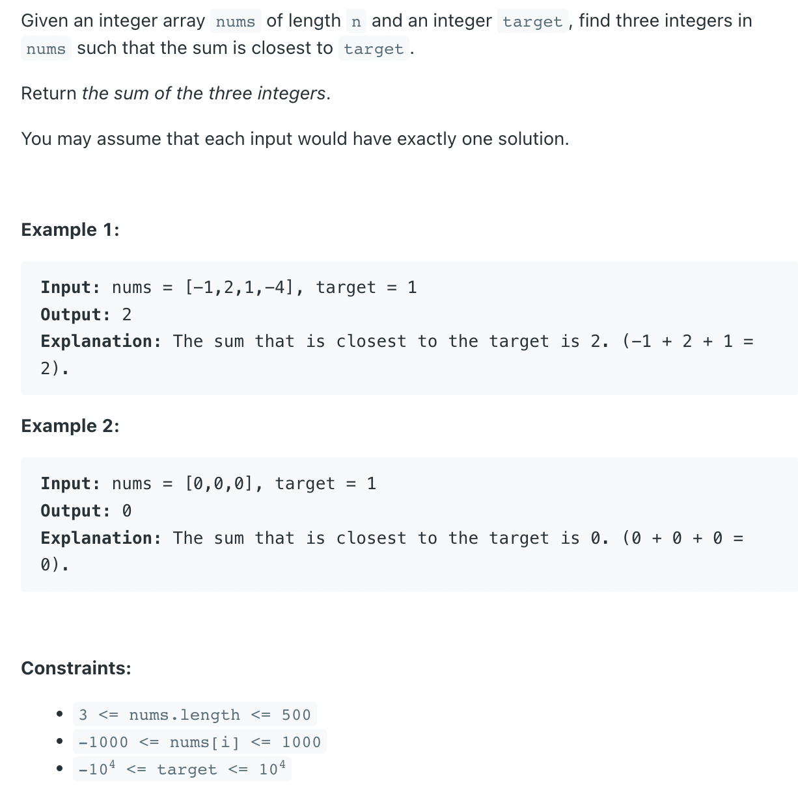

## 16. 3Sum Closest


- [ANS](https://leetcode.com/problems/3sum-closest/discuss/7883/C%2B%2B-solution-O(n2)-using-sort)

```ruby
Sort the vector and then no need to run O(N^3) algorithm as each index has a direction to move.

The code starts from this formation.

----------------------------------------------------
^  ^                                               ^
|  |                                               |
|  +- second                                     third
+-first
if nums[first] + nums[second] + nums[third] is smaller than the target, we know we have to increase the sum. 
so only choice is moving the second index forward.

----------------------------------------------------
^    ^                                             ^
|    |                                             |
|    +- second                                   third
+-first
if the sum is bigger than the target, we know that we need to reduce the sum. 
so only choice is moving 'third' to backward. of course if the sum equals to target, we can immediately return the sum.

----------------------------------------------------
^    ^                                          ^
|    |                                          |
|    +- second                                third
+-first
when second and third cross, the round is done so start next round by moving 'first' and resetting second and third.

----------------------------------------------------
  ^    ^                                           ^
  |    |                                           |
  |    +- second                                 third
  +-first
while doing this, collect the closest sum of each stage by calculating and comparing delta. Compare abs(target-newSum) 
and abs(target-closest). At the end of the process the three indexes will eventually be gathered at the end of the array.

----------------------------------------------------
                                         ^    ^    ^
                                         |    |    `- third
                                         |    +- second
                                         +-first
if no exactly matching sum has been found so far, the value in closest will be the answer.
```


```java
class _16_3SumClosest {
    public static int threeSumClosest(int[] nums, int target) {
        if (nums.length < 3) {
            return 0;
        }

        int closest = nums[0] + nums[1] + nums[nums.length - 1];
        Arrays.sort(nums);
        for (int first = 0; first < nums.length - 2; first++) {
            if (first > 0 && nums[first] == nums[first - 1]) {
                continue;
            }
            int second = first + 1;
            int third = nums.length - 1;            
            while (second < third) {
                int curSum = nums[first] + nums[second] + nums[third];
                if (curSum == target) {
                    return curSum;
                }
                if (Math.abs(target - curSum) < Math.abs(target - closest)) {
                    closest = curSum;
                }
                if (curSum > target) {
                    third--;
                } else {
                    second++;
                }
            }
        }
        return closest;
    }

    public static void main(String[] args) {
        int[] nums = {-1,2,1,-4};
        System.out.println(threeSumClosest(nums, 1));
        int[] nums2 = {0, 0, 0};
        System.out.println(threeSumClosest(nums2, 1));
    }
}
```
