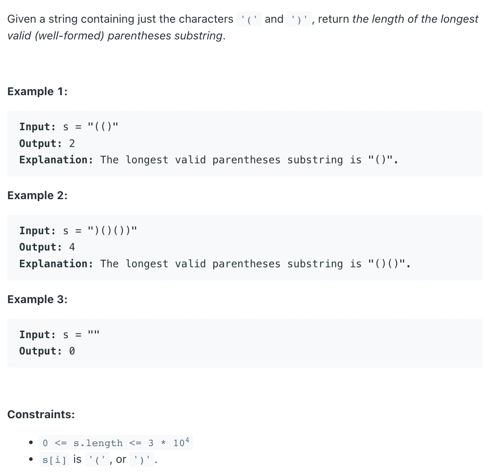

## 32. Longest Valid Parentheses


```ruby
") ( ) ( ) )"
 i 
stack [ -1, 


") ( ) ( ) )"
 i 
stack [ 0


") ( ) ( ) )"
   i 
stack [ 0, 1


") ( ) ( ) )"
     i 
stack [ 0,                  # max = 2 - 0 = 2


") ( ) ( ) )"
       i 
stack [ 0, 3     


") ( ) ( ) )"
         i 
stack [ 0,                 # max = 4 - 0 = 4     


") ( ) ( ) )"
           i 
stack [ 5,  

```

---
```java
public class _32_LongestValidParentheses {
    public static int longestValidParentheses(String s) {
        Stack<Integer> stk = new Stack<>();
        stk.push(-1);
        int max = 0;

        for (int i = 0; i < s.length(); i++) {
            if (s.charAt(i) == '(') {
                stk.push(i);
            } else {
                stk.pop();
                if (stk.isEmpty()) {
                    stk.push(i);
                } else {
                    max = Math.max(max, i - stk.peek());
                }
            }
        }
        return max;
    }

    public static void main(String[] args) {
        String str = ")()())";
        int res = longestValidParentheses(str);
        System.out.println(res);//4

        str = ")((((())";
        res = longestValidParentheses(str);
        System.out.println(res); // 4
    }
}
```