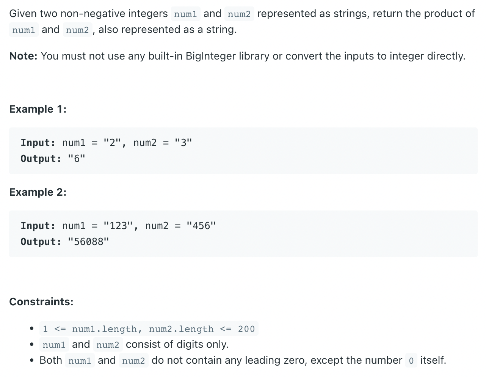
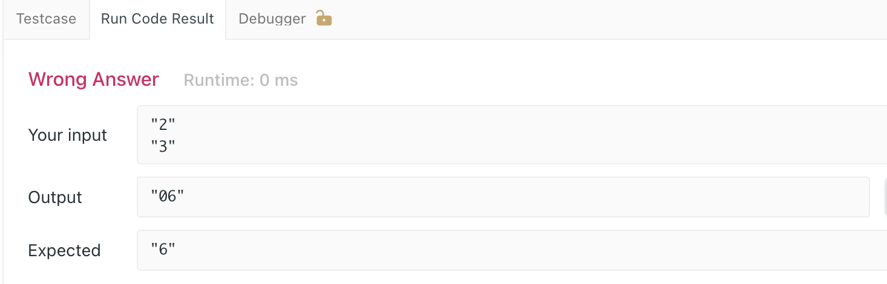

## 43. Multiply Strings

---

- [youtube](https://www.youtube.com/watch?v=1vZswirL8Y8&t=601s)


```ruby
index i      0   1   2
            [1   2   3]
           
index j          0   1
                [4   5]
--------------------------
                 1   5       indices[i + j, i + j + 1]
                             indices[] 

```

---
```java
StringBuilder sb = new StringBuilder();
boolean seen = false; // 还未见过第一个非0 数字
for (int c : pos) {
    if (c == 0 && !seen) continue;
    sb.append(c);
    seen = true;
}
```

- 注意，我们需要处理 `Leading ZERO`



---

```java
class Solution {
    public String multiply(String num1, String num2) {
        int m = num1.length(), n = num2.length();
        int[] pos = new int[m + n];

        for(int i = m - 1; i >= 0; i--) {
            for(int j = n - 1; j >= 0; j--) {
                int mul = (num1.charAt(i) - '0') * (num2.charAt(j) - '0'); 
                int p1 = i + j, p2 = i + j + 1;
                int sum = mul + pos[p2];

                pos[p1] += sum / 10;
                pos[p2] = (sum) % 10;
            }
        }  

        StringBuilder sb = new StringBuilder();
        boolean seen = false;
        for (int c : pos) {
            if (c == 0 && !seen) continue;
            sb.append(c);
            seen = true;
        }
        return sb.length() == 0 ? "0" : sb.toString();
    }
}
```