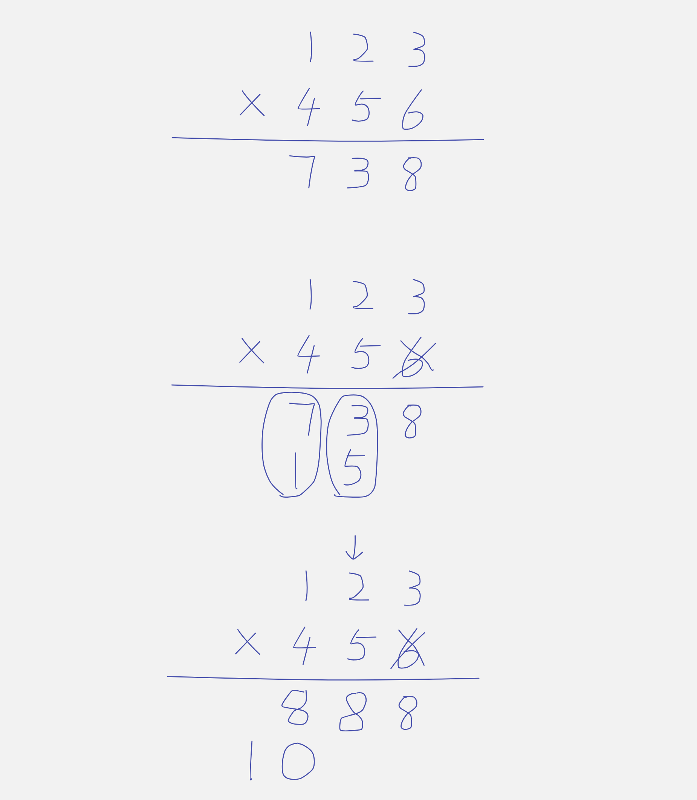
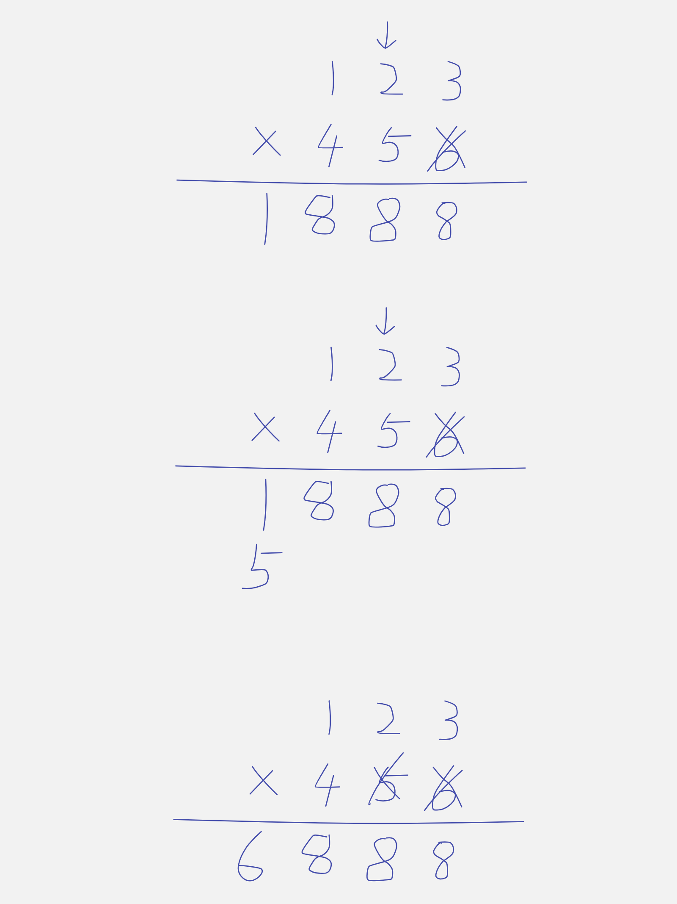
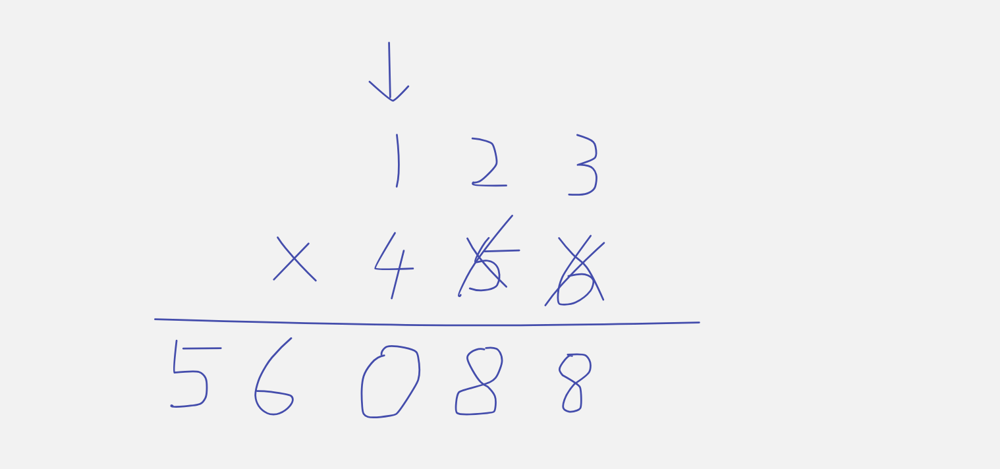

## 43. Multiply Strings

---

- [youtube](https://www.youtube.com/watch?v=1vZswirL8Y8&t=601s)







- [注意为什么这里用 (中文教程) `res[i + j + 1] += mul;`](https://youtu.be/G9OWbq-e9hw?t=302)

```ruby
            [0   1   2]
i            1   2   3
j        X   4   5   6
     --------------------
          
  
     
     i = 2, j = 2
     res's length = num1.length + num2.length = 3 + 3 = 6
     假设 3 x 6 ==> 我们需要把结果设置在 res[index=5], 
                                    ==> i + j + 1 
                                    ==> 2 + 2 + 1 = 5            
```

---
```java
class multiplyStrings {
    public String multiply(String num1, String num2) {
        int len1 = num1.length(), len2 = num2.length();
        int[] res = new int[len1 + len2];
        for (int i = len1 - 1; i >= 0; i--) {
            for (int j = len2 - 1; j >= 0; j--) {
                int mul = (num1.charAt(i) - '0') * (num2.charAt(j) - '0');
                res[i + j + 1] += mul;
            }
        }

        for (int i = res.length - 1; i > 0; i--) {
            res[i - 1] += res[i] / 10;
            res[i] %= 10;
        }

        StringBuilder sb = new StringBuilder();
        for (int num : res) {
            sb.append(num);
        }

        while (sb.length() != 0 && sb.charAt(0) == '0') {
            sb.deleteCharAt(0);
        }

        return sb.length() == 0 ? "0" : sb.toString();
    }
}
```

---

### 'the Easiest' solution

```java
class Solution {
	public String multiply(String num1, String num2) {
		if ("0".equals(num1) || "0".equals(num2))
			return "0";

		int[] ans = new int[num1.length() + num2.length() - 1];

		for (int i = 0; i < num1.length(); i++) {
			for (int j = 0; j < num2.length(); j++) {
				ans[i + j] += (num1.charAt(i) - '0') * (num2.charAt(j) - '0');
			}
		}

		for (int i = ans.length - 1; i > 0; i--) {
			ans[i - 1] += ans[i] / 10;
			ans[i] %= 10;
		}

		StringBuilder sb = new StringBuilder();
		for (int i : ans) {
			sb.append(i);
		}

		return sb.toString();
	}
}
```