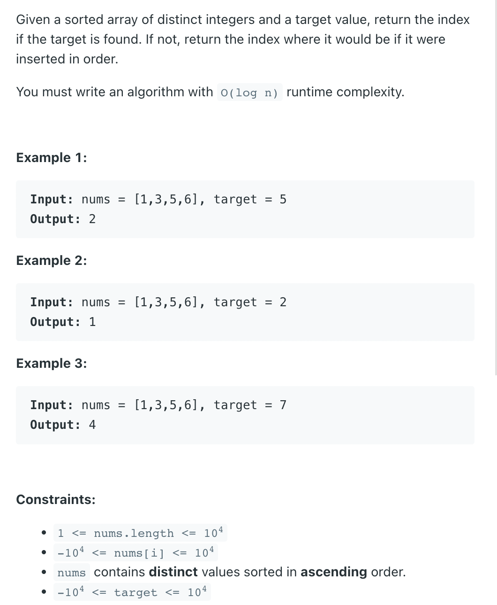

## 35. Search Insert Position

---
### [Template.2](https://suanfa8.com/binary-search/solutions-1/0035-search-insert-position)

```java
class SearchInsertPosition_v2 {
    public int searchInsert(int[] nums, int target) {
        int len = nums.length;
        if (nums[len - 1] < target) {
            return len;
        }

        int left = 0, right = len - 1;
        // 在区间 nums[left..right] 里查找第 1 个 >= target 的元素的下标
        while (left < right) {
            int mid = left + (right - left) / 2;
            if (nums[mid] < target) {
                // 下一轮搜索的区间是 [mid + 1..right]
                left = mid + 1;
            } else {
                // 下一轮搜索的区间是 [left..mid]
                right = mid;
            }
        }
        return left;
    }
}
```

---

### Template.1

```java
public class _35_SearchInsertPosition {
    public static int searchInsert(int[] nums, int target) {
        if (nums == null || nums.length == 0) return -1;

        int left = 0, right = nums.length - 1;
        while (left <= right) {
            int mid = left + (right - left) / 2;
            if (nums[mid] == target) {
                return mid;
            } else if (nums[mid] > target) {
                right = mid - 1;
            } else {
                left = mid + 1;
            }
        }
        return left;
    }

    public static void main(String[] args) {
        int[] nums = {1,3,5,6};
        int target = 5;
        int res = searchInsert(nums, target);

        System.out.println(res);

        nums = new int[]{1, 2, 3, 4, 5, 7, 9, 11};
        res = searchInsert(nums, 10);
        System.out.println(res);
    }
}
```