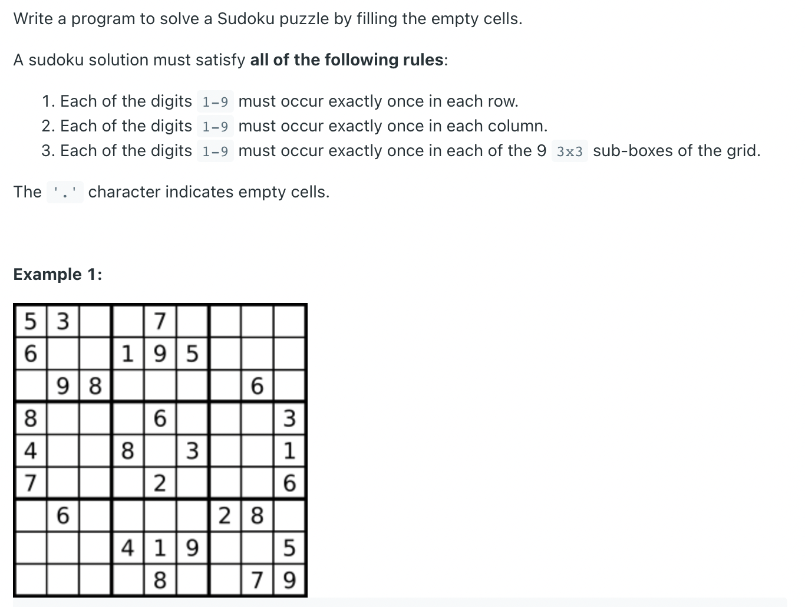
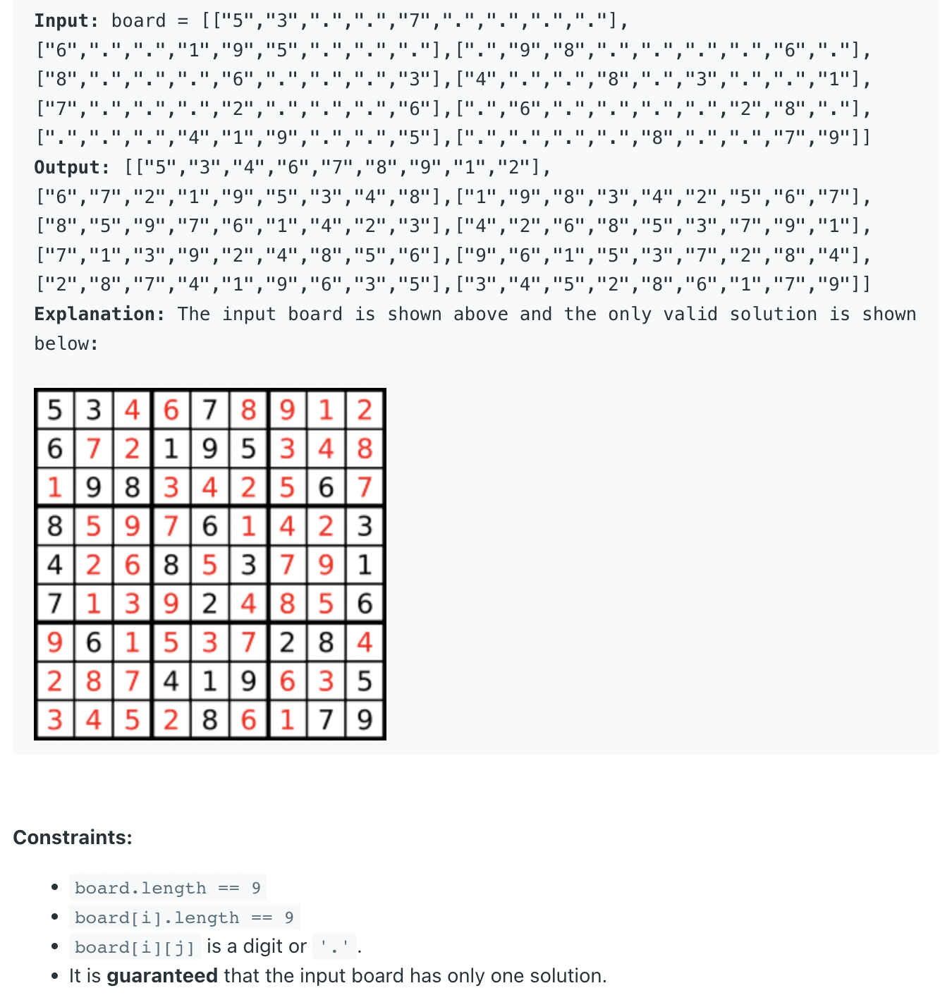

## 37. Sudoku Solver



```java
class _37_SudokuSolver {
    public void solveSudoku(char[][] board) {
        solve(board);
    }

    private boolean solve(char[][] board) {
        for (int i = 0; i < 9; i++) {
            for (int j = 0; j < 9; j++) {
                if (board[i][j] == '.') {
                    // We want to try every number for this block
                    for (char num = '1'; num <= '9'; num++) {
                        if (isValid(board, i, j, num)) {
                            board[i][j] = num;// Set the value of the current square to the valid num
                            if (solve(board)) {
                                //if it's true that means we have a solved board, so you just keep returning
                                return true;
                            }
                            board[i][j] = '.';
                            //If our board isn't solved, backtrack and try the next number
                        }
                    }
                    return false;
                    // If you get to this step, that means that no values fit, which means the current iteration of the board is wrong
                    // so return false and try the previous step again with a different value
                }
            }
        }
        return true;
    }

    private boolean isValid(char[][] board, int row, int col, char num) {
        for (int i = 0; i < 9; i++) {
            if (board[i][col] == num) {
                return false;
            }
            if (board[row][i] == num) {
                return false;
            }
            if (board[3 * (row / 3) + i / 3][3 * (col / 3) + i % 3] == num) {
                return false;
            }
        }
        return true;
    }

    public static void main(String[] args) {
        char[][] board = {
                {'5', '3', '.', '.', '7', '.', '.', '.', '.'},
                {'6', '.', '.', '1', '9', '5', '.', '.', '.'},
                {'.', '9', '8', '.', '.', '.', '.', '6', '.'},
                {'8', '.', '.', '.', '6', '.', '.', '.', '3'},
                {'4', '.', '.', '8', '.', '3', '.', '.', '1'},
                {'7', '.', '.', '.', '2', '.', '.', '.', '6'},
                {'.', '6', '.', '.', '.', '.', '2', '8', '.'},
                {'.', '.', '.', '4', '1', '9', '.', '.', '5'},
                {'.', '.', '.', '.', '8', '.', '.', '7', '9'}
        };
        _37_SudokuSolver sudokuSolver = new _37_SudokuSolver();
        sudokuSolver.solveSudoku(board);
//        System.out.println(Arrays.deepToString(board));
        for (int i = 0; i < board.length; i++) {
            for (int j = 0; j < board[0].length; j++) {
                System.out.print(board[i][j] + ", ");
            }
            System.out.println();
        }
    }
}
```