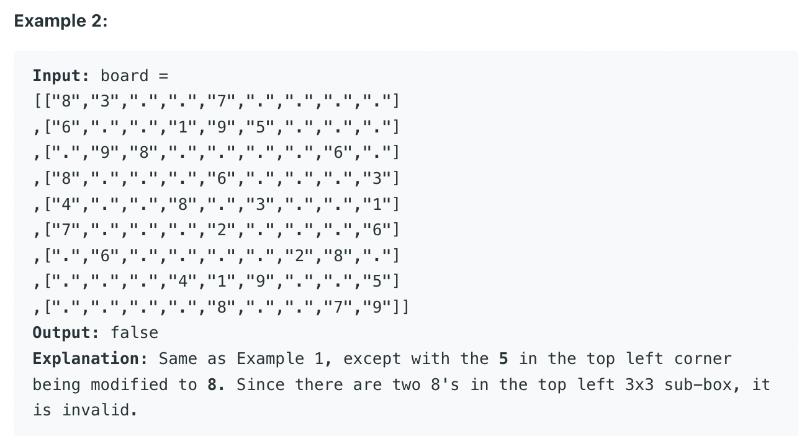

## 36. Valid Sudoku


---

- somehow, how can we convert `[4, 4]` to one of block `{1, 1}`?


- **Row:** `4 / 3 = 1`,  **Column:** `4 / 3 = 1`,  
- let's try `[8, 8]`,  
  - **Row:** `8 / 3 = 2`,  **Column:** `8 / 3 = 2`, block `{2, 2}`

---
```java
public class _36_ValidSudoku {
    public static boolean isValidSudoku(char[][] board) {
        Set<String> seen = new HashSet<>();
        for (int row = 0; row < 9; row++) {
            for (int col = 0; col < 9; col++) {
                char num = board[row][col];
                if (num != '.') {
                    if (!seen.add(num + " row " + row) ||
                        !seen.add(num + " col " + col) ||
                        !seen.add(num + " block " + row / 3 + "-" + col / 3)) {
                        return false;
                    }
                }
            }
        }
        return true;
    }

    public static void main(String[] args) {
        char[][] board = {
                {'5', '3', '.', '.', '7', '.', '.', '.', '.'},
                {'6', '.', '.', '1', '9', '5', '.', '.', '.'},
                {'.', '9', '8', '.', '.', '.', '.', '6', '.'},
                {'8', '.', '.', '.', '6', '.', '.', '.', '3'},
                {'4', '.', '.', '8', '.', '3', '.', '.', '1'},
                {'7', '.', '.', '.', '2', '.', '.', '.', '6'},
                {'.', '6', '.', '.', '.', '.', '2', '8', '.'},
                {'.', '.', '.', '4', '1', '9', '.', '.', '5'},
                {'.', '.', '.', '.', '8', '.', '.', '7', '9'}
        };
        boolean res = isValidSudoku(board);
        System.out.println(res);//true
    }
}

```