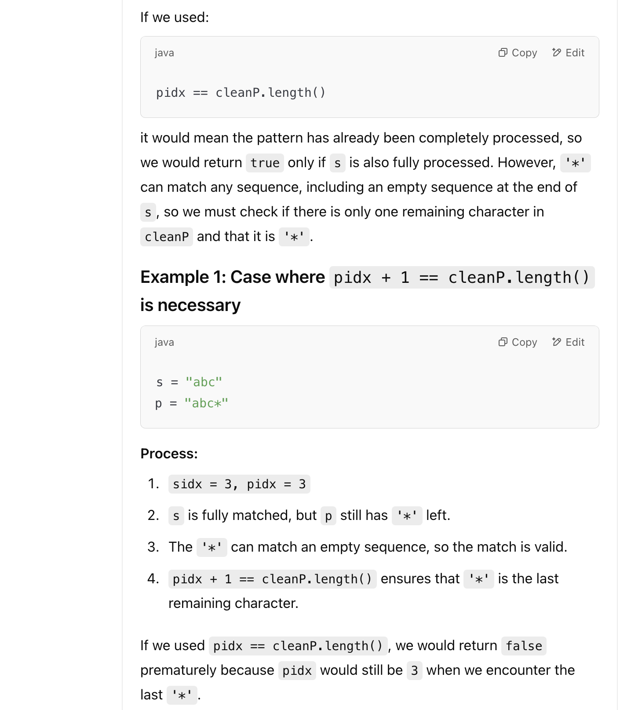
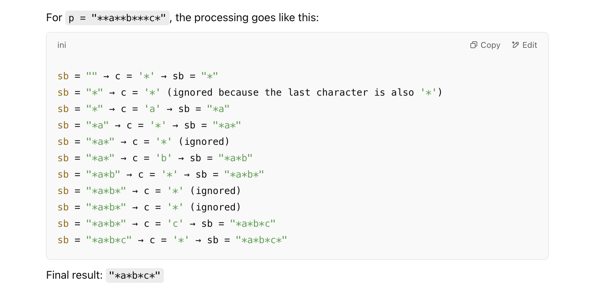
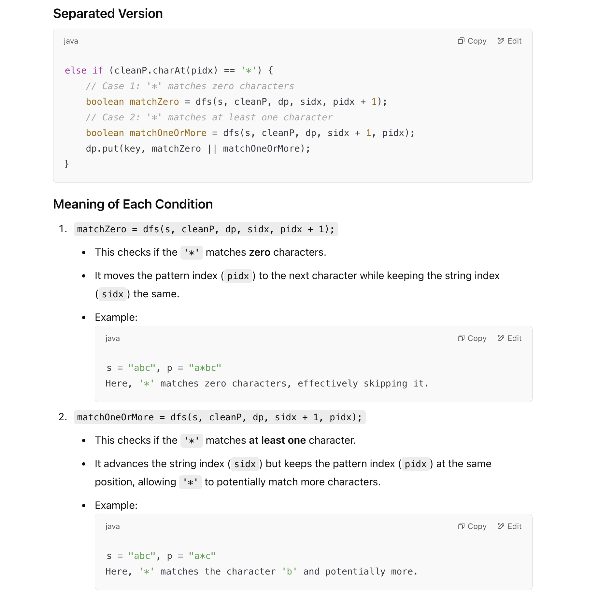
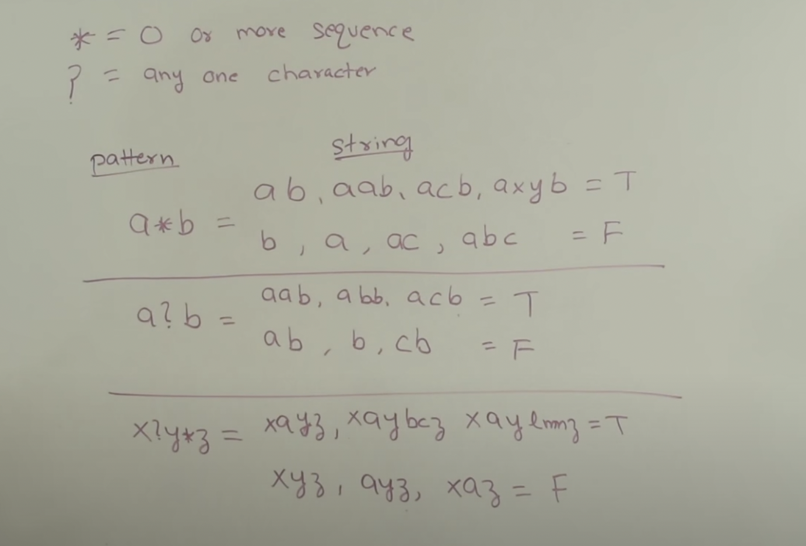
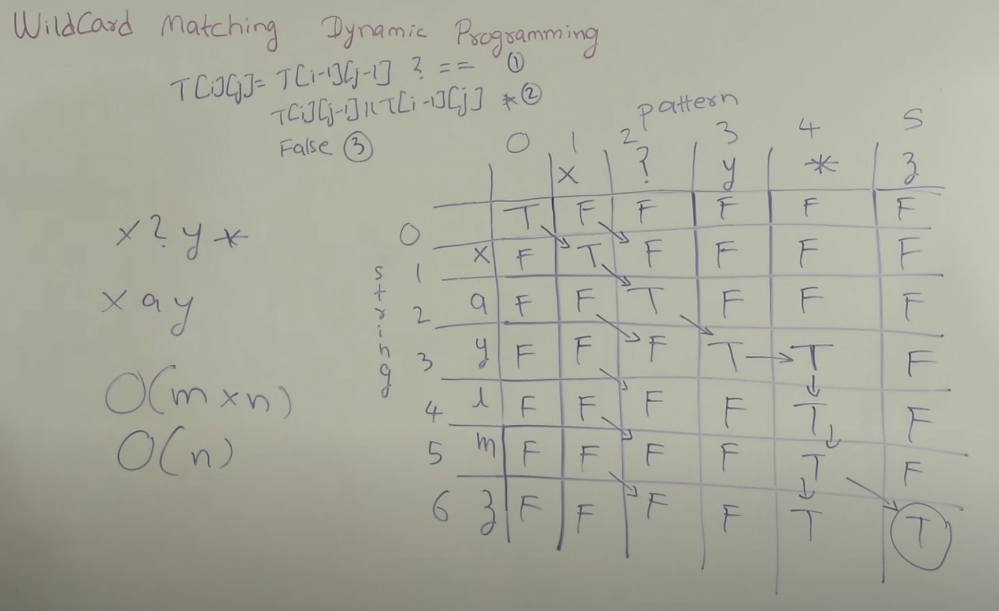

## 44. Wildcard Matching


- Note: if `s = aa`, `p = "*b"` => `return false`

- Note: "*" represents **Matches any sequence of characters** (including the empty sequence).
  - if `s = "aa", p = "**"` => return **true**, thus we can **remove duplicate** `"*"` to make it easy to solve

---
### Memorization DFS

```java
class Solution {
    public boolean isMatch(String s, String p) {
        Map<String, Boolean> dp = new HashMap<>();
        String clean_p = remove_duplicate_stars(p);
        return dfs(s, clean_p, dp, 0, 0);
    }

    private String remove_duplicate_stars(String p) {
        StringBuilder sb = new StringBuilder();
        for (char c : p.toCharArray()) {
            // If StringBuilder is empty, just append the character
            if (sb.length() == 0) {
                sb.append(c);
                continue;
            }
            // Get the last character in the StringBuilder
            char lastChar = sb.charAt(sb.length() - 1);
            
            // If the current character is not '*', append it
            if (c != '*') {
                sb.append(c);
            }
            // If the current character is '*', check the last character
            else if (lastChar != '*') {
                // Append '*' only if the last character is not also '*'
                sb.append(c);
            }
            // If the last character is already '*', do nothing (skip duplicate)
        }
        return sb.toString();
    }

    private boolean dfs(String s, String cleanP, Map<String, Boolean> dp, int sidx, int pidx) {
        String key = sidx + "," + pidx;
        if (dp.containsKey(key)) {
            return dp.get(key);
        }

        if (pidx == cleanP.length()) {
            dp.put(key, sidx == s.length());
        } else if (sidx == s.length()) {
            dp.put(key, pidx + 1 == cleanP.length() && cleanP.charAt(pidx) == '*');
        } else if (cleanP.charAt(pidx) == s.charAt(sidx) || cleanP.charAt(pidx) == '?') {
            dp.put(key, dfs(s, cleanP, dp, sidx + 1, pidx + 1));
        } else if (cleanP.charAt(pidx) == '*') {
            // Case 1: '*' matches zero characters
            boolean matchZero = dfs(s, cleanP, dp, sidx, pidx + 1);
            // Case 2: '*' matches at least one character
            boolean matchOneOrMore = dfs(s, cleanP, dp, sidx + 1, pidx);
            dp.put(key, matchZero || matchOneOrMore);

            // dp.put(key, dfs(s, cleanP, dp, sidx, pidx + 1) || dfs(s, cleanP, dp, sidx + 1, pidx));
        } else if (cleanP.charAt(pidx) != s.charAt(sidx)) {
            dp.put(key, false);
        }
        return dp.get(key);
    }
}
```


- **For** 

```java  
    else if (sidx == s.length()) {
        dp.put(key, pidx + 1 == cleanP.length() && cleanP.charAt(pidx) == '*');
    } 
```    

- why did it use `pidx + 1 == cleanP.length()` instead of `pidx == cleanP.length()`? 




- For `remove_duplicate_stars`, the result would be:
    - `s = "**a**b***c*"` => `s = "*a*b*c*"`





---

## DP 






- [video DP](https://youtu.be/3ZDZ-N0EPV0?t=316)

```java
class _44_WildcardMatching {
    public boolean isMatch(String s, String p) {
        int m = s.length(), n = p.length();
        boolean[][] dp = new boolean[m + 1][n + 1];
        dp[0][0] = true;
        // first col: dp[i][0]: can't match when p is empty. All false.

        for (int j = 1; j < dp[0].length; j++) {
            if (p.charAt(j - 1) == '*') {
                // first row: dp[0][j]: except for String p starts with *, otherwise all false
                dp[0][j] = dp[0][j - 1];
            }
        }

        for (int i = 1; i < dp.length; i++) {
            for (int j = 1; j < dp[0].length; j++) {
                if (p.charAt(j - 1) == s.charAt(i - 1) || p.charAt(j - 1) == '?') {
                    dp[i][j] = dp[i - 1][j - 1];
                } else if (p.charAt(j - 1) == '*') {
                    dp[i][j] = dp[i - 1][j] || dp[i][j - 1];
                } else {
                    dp[i][j] = false;
                }
            }
        }

        return dp[m][n];
    }

    public static void main(String[] args) {
        _44_WildcardMatching wm = new _44_WildcardMatching();
        String s = "acdcb", p = "a*c?b";
        boolean res = wm.isMatch(s, p);
        System.out.println(res); // false
    }
}
```
---

