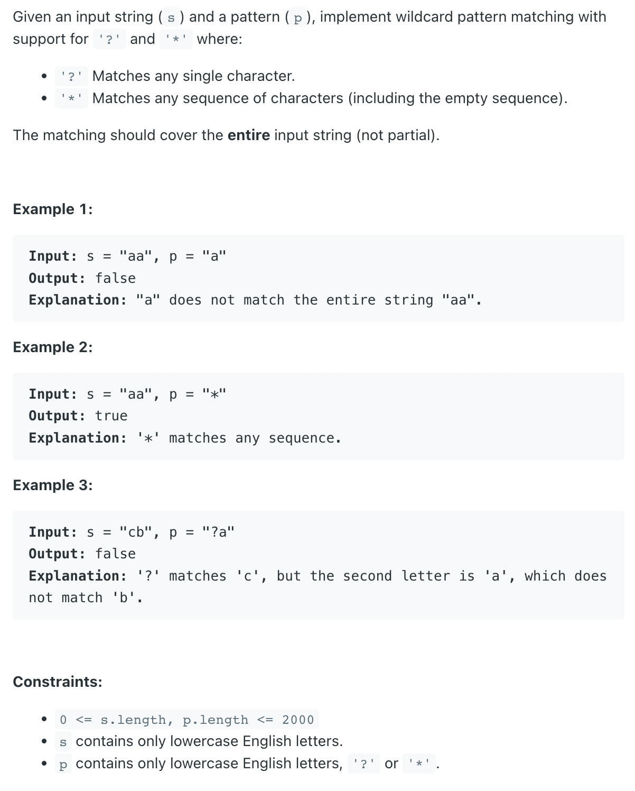

## 44. Wildcard Matching



- [video DP](https://youtu.be/3ZDZ-N0EPV0?t=316)

```java
class _44_WildcardMatching {
    public boolean isMatch(String s, String p) {
        int m = s.length(), n = p.length();
        boolean[][] dp = new boolean[m + 1][n + 1];
        dp[0][0] = true;
        for (int j = 1; j < dp[0].length; j++) {
            if (p.charAt(j - 1) == '*') {
                dp[0][j] = dp[0][j - 1];
            }
        }

        for (int i = 1; i < dp.length; i++) {
            for (int j = 1; j < dp[0].length; j++) {
                if (p.charAt(j - 1) == s.charAt(i - 1) || p.charAt(j - 1) == '?') {
                    dp[i][j] = dp[i - 1][j - 1];
                } else if (p.charAt(j - 1) == '*') {
                    dp[i][j] = dp[i - 1][j] || dp[i][j - 1];
                } else {
                    dp[i][j] = false;
                }
            }
        }

        return dp[m][n];
    }

    public static void main(String[] args) {
        _44_WildcardMatching wm = new _44_WildcardMatching();
        String s = "acdcb", p = "a*c?b";
        boolean res = wm.isMatch(s, p);
        System.out.println(res); // false
    }
}
```


---
### Iterator

```ruby
Input:
S: "a c c c b"
P: "a * b"

sp = 0, pp = 0, match(M) = 0, starIdx(SI) = -1;

===============================================
Round 1:
  
  a   c   c   c   b
  sp++
  a   *   b
  pp++


Round 2:

  a   c   c   c   b
      sp
      M
  a   *   b
      pp++
      SI


  a   c   c   c   b
      sp
      M
  a   *   b
          pp
      SI

Round 3:

  a   c   c   c   b
      sp
      M++
  a   *   b
          pp
      SI     


  a   c   c   c   b
          sp
          M
  a   *   b
          pp
      SI  


Round 4:

  a   c   c   c   b
          sp
          M++
  a   *   b
          pp
      SI   
     
     
  a  c  c  c  b
           sp
           M
  a  *  b
        pp
     SI
     
Round 5:

  a  c  c  c  b
           sp
           M++
  a  *  b
        pp
     SI


  a  c  c  c  b
              sp
              M
  a  *  b
        pp
     SI

Round 6:

  a  c  c  c  b
              sp++
              M
  a  *  b
        pp++
     SI


  a  c  c  c  b
                 sp
              M
  a  *  b
          pp
     SI
```

---

```java
class _44_WildcardMatching {
    public boolean isMatch(String s, String p) {
        int sp = 0, pp = 0, match = 0, starIdx = -1;
        while (sp < s.length()){
            // advancing both pointers
            if (pp < p.length()  && (p.charAt(pp) == '?' || s.charAt(sp) == p.charAt(pp))){
                sp++;
                pp++;
            }
            // * found, only advancing pattern pointer
            else if (pp < p.length() && p.charAt(pp) == '*'){
                starIdx = pp;
                match = sp;
                pp++;
            }
            // last pattern pointer was *, advancing string pointer
            else if (starIdx != -1){
                pp = starIdx + 1;
                match++;
                sp = match;
            }
            //current pattern pointer is not star, last patter pointer was not *
            //characters do not match
            else {
                return false;
            }
        }

        //check for remaining characters in pattern
        while (pp < p.length() && p.charAt(pp) == '*') {
            pp++;
        }

        return pp == p.length();
    }

    public static void main(String[] args) {
        _44_WildcardMatching wm = new _44_WildcardMatching();
        String s = "acdcb", p = "a*c?b";
        boolean res = wm.isMatch(s, p);
        System.out.println(res);
    }
}
```