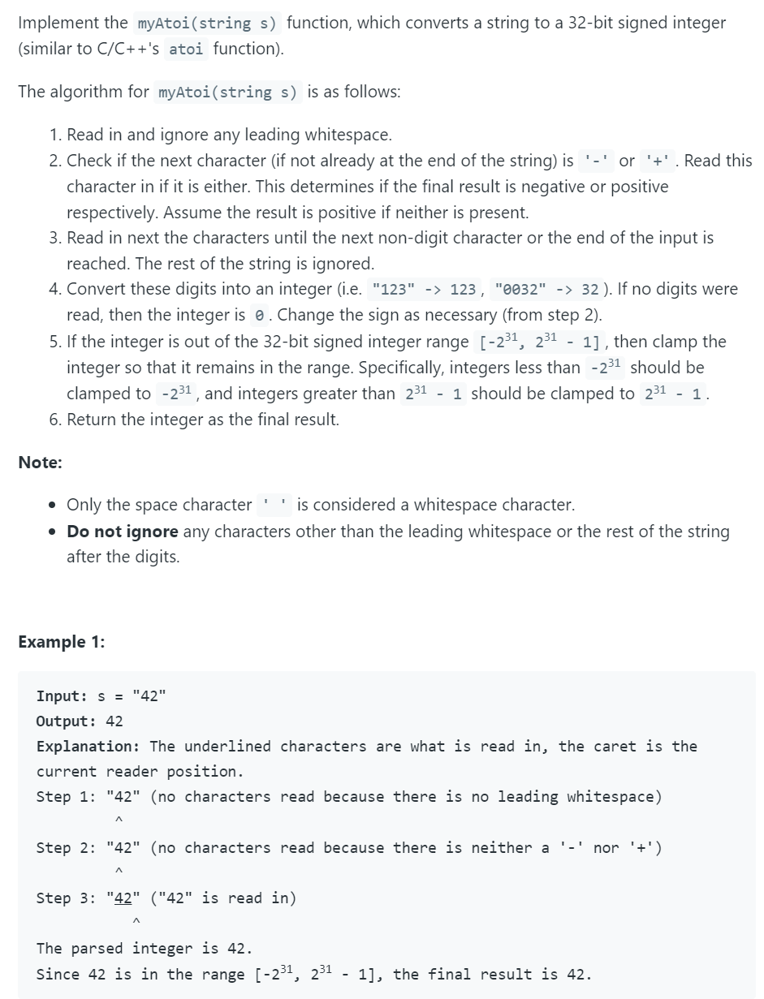
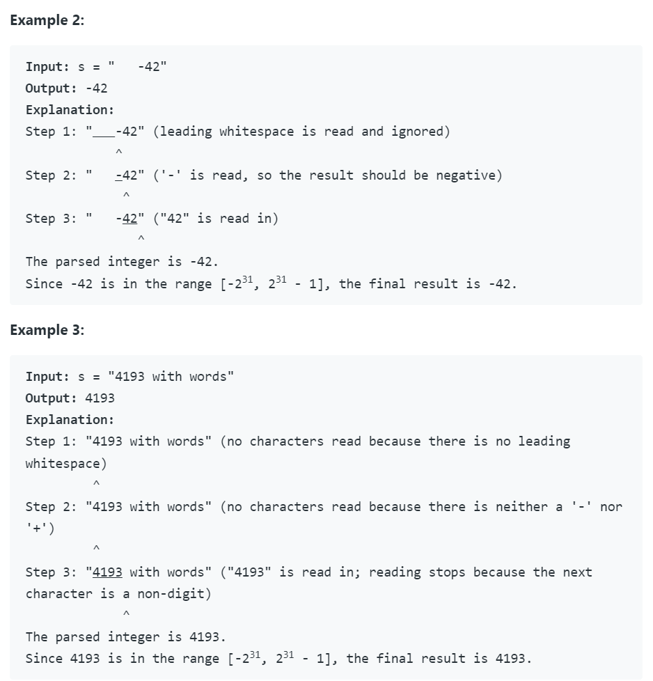
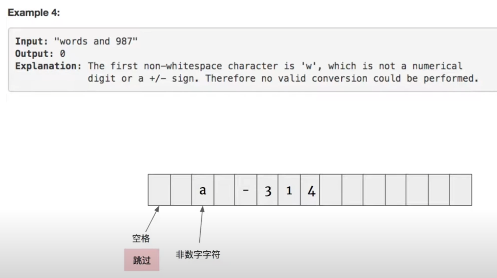
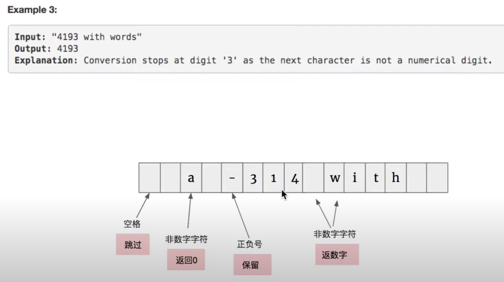
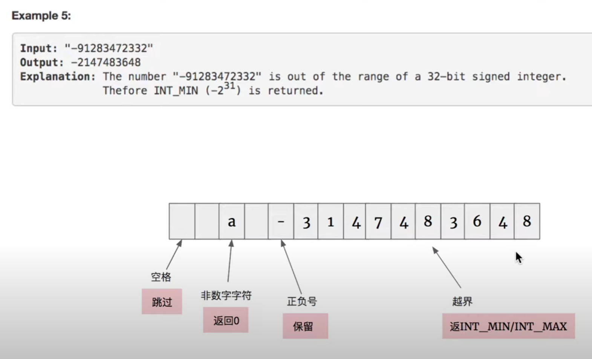

## 8. String to Integer (atoi)



- [youtube](https://www.youtube.com/watch?v=4eV6f9mmBQE)
---








```java
class Solution {
    public int myAtoi(String s) {
        s = s.trim();
        if (s == null || s.length() == 0) return 0;
        
        int sign = 1;
        int idx = 0;
        char c = s.charAt(0);
        if (c == '+') {
            sign = 1;
            idx++;
        } else if (c == '-') {
            sign = -1;
            idx++;
        }
        
        long sum = 0;
        for (int i = idx; i < s.length(); i++) {
            if (!Character.isDigit(s.charAt(i))) {
                return (int)sum * sign;
            }
            
            sum = sum * 10 + s.charAt(i) - '0';
        
            if (sign == 1 && sum > Integer.MAX_VALUE) {
                return Integer.MAX_VALUE;
            }
            if (sign == -1 && (-1)*sum < Integer.MIN_VALUE) {
                return Integer.MIN_VALUE;
            }            
        }
        return (int) sum * sign;
    }
}
```