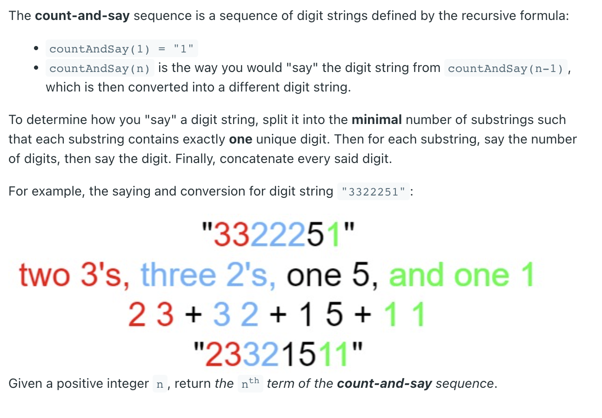
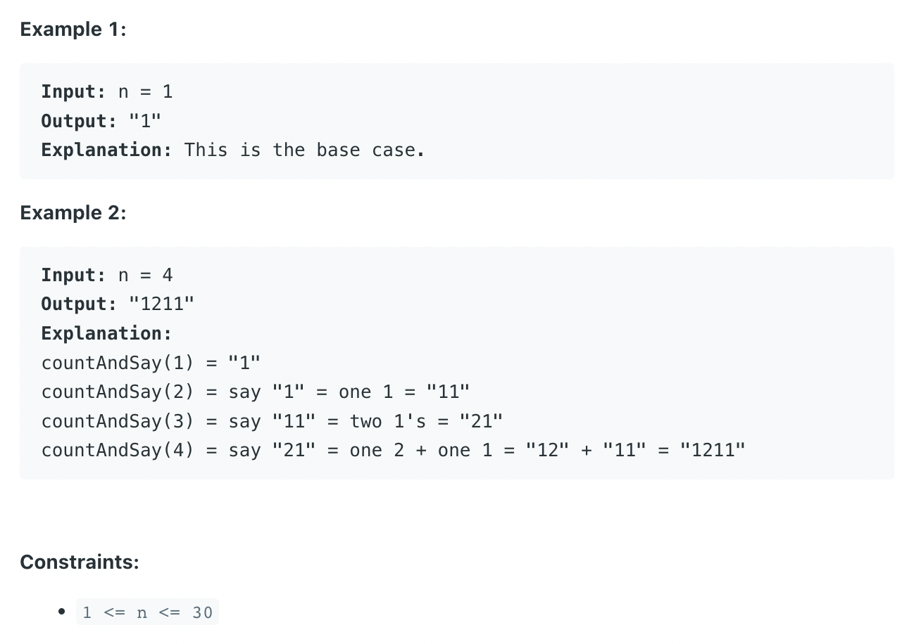

## 38. Count and Say



```ruby
 1.     1
 2.     11
 3.     21
 4.     1211
 5.     111221 
 6.     312211
 7.     13112221
 8.     1113213211
 9.     31131211131221
 10.   13211311123113112211
```

```java
class Solution {
    public String countAndSay(int n) {
        String prev = "1";
        for (int i = 1; i < n; i++) {
            StringBuilder cur = new StringBuilder();
            for (int j = 1, count = 1; j <= prev.length(); j++) {
                if (j == prev.length() || prev.charAt(j - 1) != prev.charAt(j)) {
                    cur.append(count);
                    cur.append(prev.charAt(j - 1));
                    count = 1;
                } else {
                    count++;
                }
            }
            prev = cur.toString();
        }
        return prev;
    }
}
```