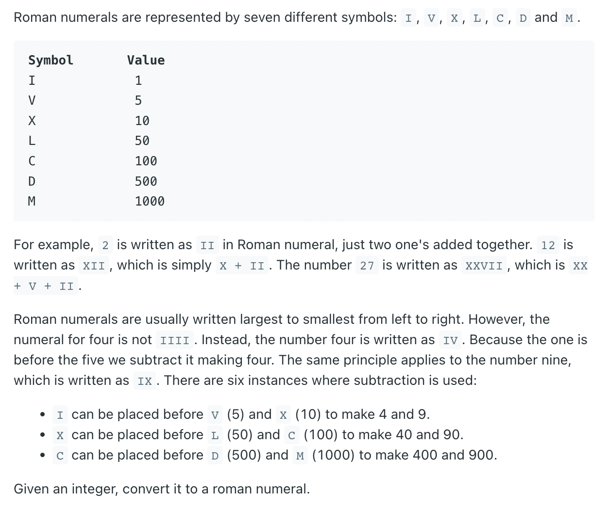
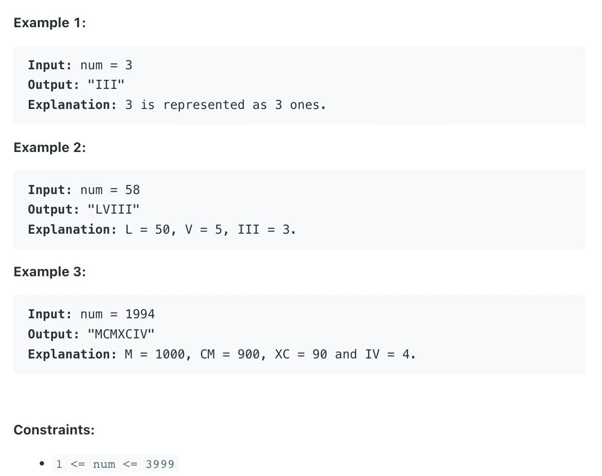

## 12. Integer to Roman



```java
class _12_IntegerToRoman {
    private static final String[] ones = {
            "","I","II","III","IV","V","VI","VII","VIII","IX"
    };
    private static final String[] tens = {
            "","X","XX","XXX","XL","L","LX","LXX","LXXX","XC"
    };
    private static final String[] hundreds = {
            "","C","CC","CCC","CD","D","DC","DCC","DCCC","CM"
    };
    private static final String[] thousands = {
            "","M","MM","MMM"
    };
    public static String intToRoman(int num) {
        return thousands[num / 1000] + hundreds[(num % 1000) / 100] + tens[(num % 100) / 10]
                + ones[num % 10];
    }

    public static void main(String[] args) {
        System.out.println(intToRoman(3999));
        System.out.println(intToRoman(3));
        System.out.println(intToRoman(100));
        System.out.println(intToRoman(4));
    }
}
```