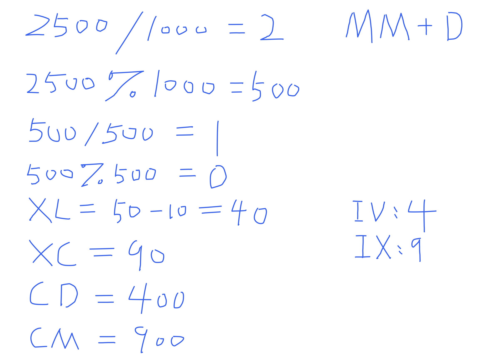

## 12. Integer to Roman


---

---
```java
class _12_IntegerToRoman {
    public String intToRoman(int num) {
        // symbol list
        String[][] symList = {
                {"I", "1"}, {"IV", "4"}, {"V", "5"}, {"IX", "9"},
                {"X", "10"}, {"XL", "40"}, {"L", "50"}, {"XC", "90"},
                {"C", "100"}, {"CD", "400"}, {"D", "500"}, {"CM", "900"},
                {"M", "1000"}
        };

        StringBuilder res = new StringBuilder();
        // Iterate over the symbol list in reverse order
        for (int i = symList.length - 1; i >= 0; i--) {
            String sym = symList[i][0];
            int val = Integer.parseInt(symList[i][1]);

            // Check if num // val is non-zero
            if (num / val > 0) {
                int count = num / val;
                for (int j = 0; j < count; j++) {
                    res.append(sym);
                }
                num = num % val;
            }
        }
        return res.toString();
    }
}
```
---
#### hashmap

```java
class integerToRoman_II {
    public String intToRoman(int num) {
        HashMap<Integer, String> map = new HashMap<Integer, String>();
        map.put(1, "I");
        map.put(4, "IV");
        map.put(5, "V");
        map.put(9, "IX");
        map.put(10, "X");
        map.put(40, "XL");
        map.put(50, "L");
        map.put(90, "XC");
        map.put(100, "C");
        map.put(400, "CD");
        map.put(500, "D");
        map.put(900, "CM");
        map.put(1000, "M");
        int count = 0;
        StringBuilder res = new StringBuilder();
        int[] arr = {1000, 900, 500, 400, 100, 90, 50, 40, 10, 9, 5, 4, 1};
        for (int i = 0; i < arr.length; i++) {
            if (num / arr[i] > 0) {
                count = num / arr[i];
                for (int j = 0; j < count; j++) {
                    res.append(map.get(arr[i]));
                }
                num = num % arr[i];
            }
        }
        return res.toString();
    }
}
```
---


#### Python

```py
class Solution:
    def intToRoman(self, num: int) -> str:
        # symbol list
        symList = [["I", 1], ["IV", 4], ["V", 5], ["IX", 9],
                   ["X", 10], ["XL", 40], ["L", 50], ["XC", 90],
                   ["C", 100], ["CD", 400], ["D", 500], ["CM", 900],
                   ["M", 1000]]

        res = ""
        for sym, val in reversed(symList):
            # Checking if num // val is non-zero: The if statement checks whether the result of the integer division is non-zero.
            # (num // val) > 0
            if num // val:   
                count = num // val
                res += (sym * count)
                num = num % val
        return res
```