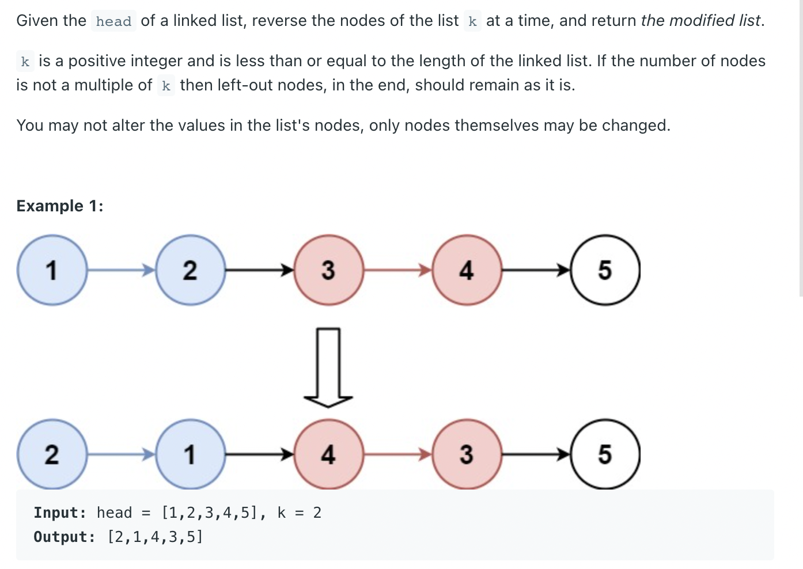
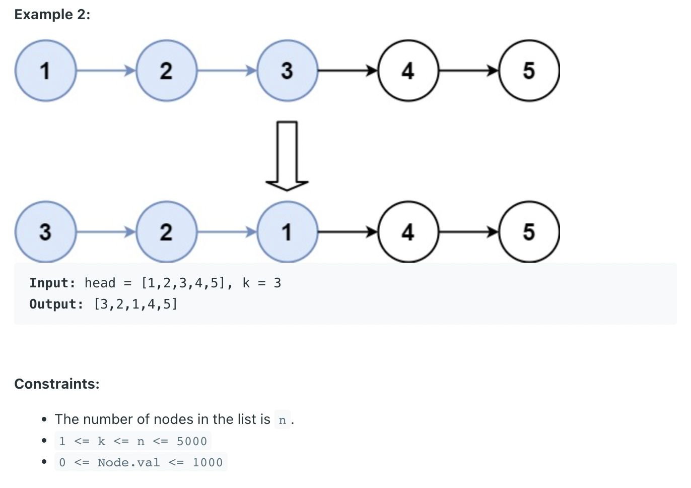
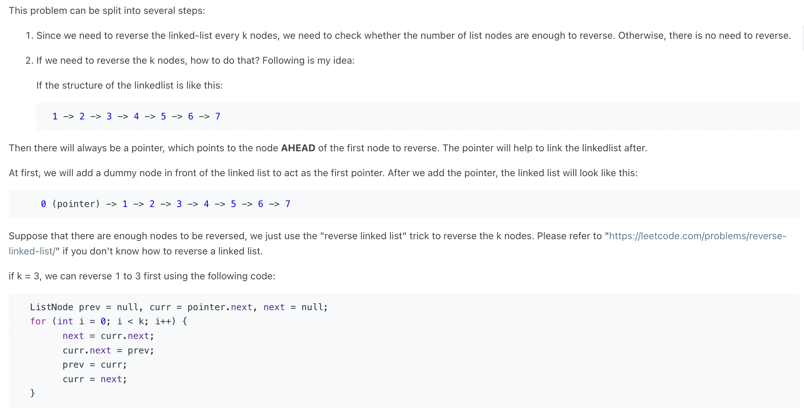

## 25. Reverse Nodes in k-Group



- [Java O(n) solution with super detailed explanation & illustration](https://leetcode.com/problems/reverse-nodes-in-k-group/discuss/183356/Java-O(n)-solution-with-super-detailed-explanation-and-illustration)




```java
/**
 * Definition for singly-linked list.
 * public class ListNode {
 *     int val;
 *     ListNode next;
 *     ListNode() {}
 *     ListNode(int val) { this.val = val; }
 *     ListNode(int val, ListNode next) { this.val = val; this.next = next; }
 * }
 */
class Solution {
    public ListNode reverseKGroup(ListNode head, int k) {
        ListNode dummy = new ListNode(0);
        dummy.next = head;
        ListNode pointer = dummy; 
        
        while (pointer != null) {
            ListNode node = pointer;
            for (int i = 0; i < k && node != null; i++) {
                node = node.next;
            }
            if (node == null) break;
            
            ListNode prev = null, cur = pointer.next, next = null;
            for (int i = 0; i < k; i++) {
                next = cur.next;
                cur.next = prev;
                prev = cur;
                cur = next;
            }
            
            ListNode tail = pointer.next;
            tail.next = cur;
            pointer.next = prev;
            pointer = tail;
        }
        return dummy.next;
    }
}
```