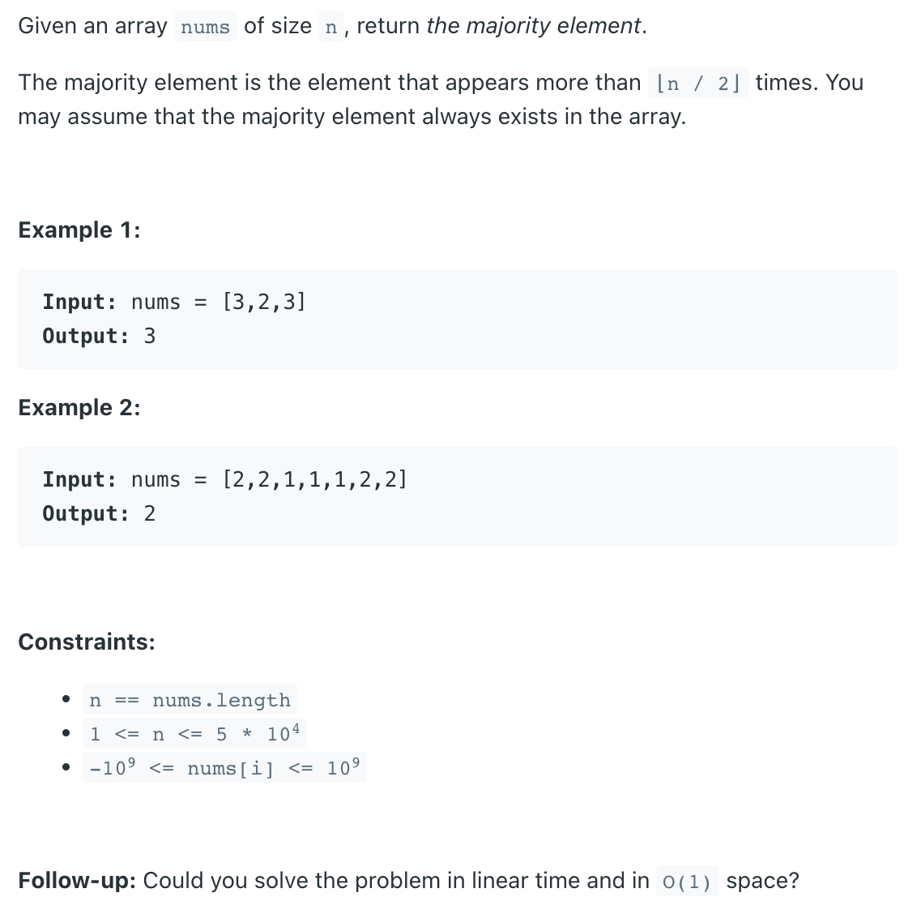

## 169. Majority Element


- [Majority Voting Algorithm](https://www.geeksforgeeks.org/boyer-moore-majority-voting-algorithm/)


```java
class Solution {
    public int majorityElement(int[] nums) {
        if (nums == null || nums.length == 0) return 0;
        
        int count = 0, candicate = -1;
        for (int i = 0; i < nums.length; i++) {
            if (count == 0) {
                candicate = nums[i];
                count = 1;
            } else {
                if (nums[i] == candicate) {
                    count++;
                } else {
                    count--;
                }
            }
        }
        
        count = 0;
        for (int i = 0; i < nums.length; i++) {
            if (nums[i] == candicate) {
                count++;
            }
        }
        
        if (count > (nums.length / 2)) {
            return candicate;
        } else {
            return -1;
        }
    }
}
```


---
- using `Java8` :

```java
class Solution {
    public int majorityElement(int[] nums) {
        if (nums == null || nums.length == 0) return 0;
        
        Map<Integer, Integer> map = new HashMap<>();
        for (int num : nums) {
            if (!map.containsKey(num)) {
                map.put(num, 1);
            } else {
                map.put(num, map.get(num) + 1);                
            }
        }
        
        return Collections.max(map.entrySet(), (e1, e2) -> 
                               (e1.getValue() - e2.getValue())).getKey();
    }
}
```
