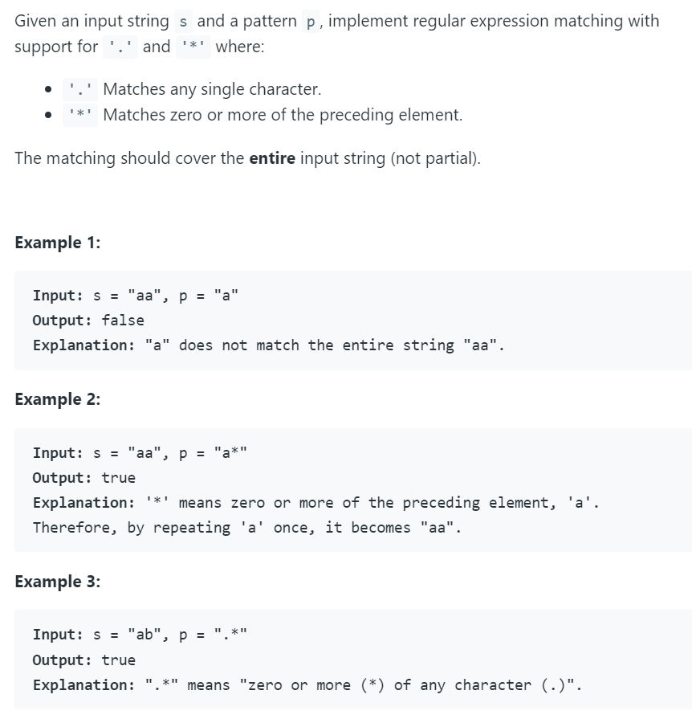
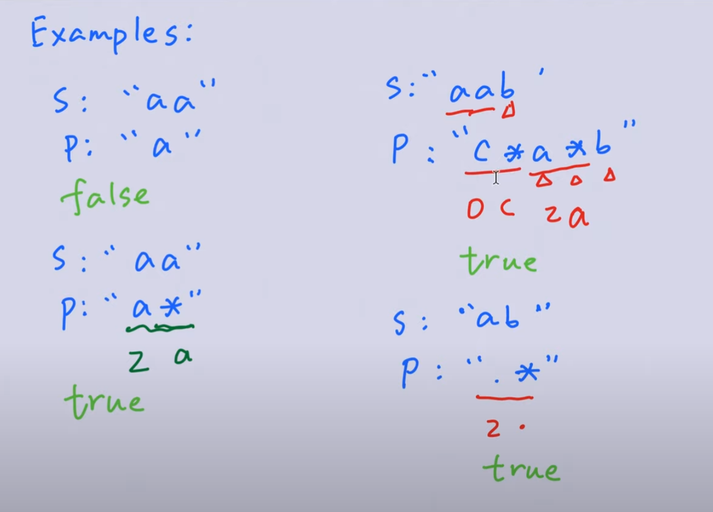
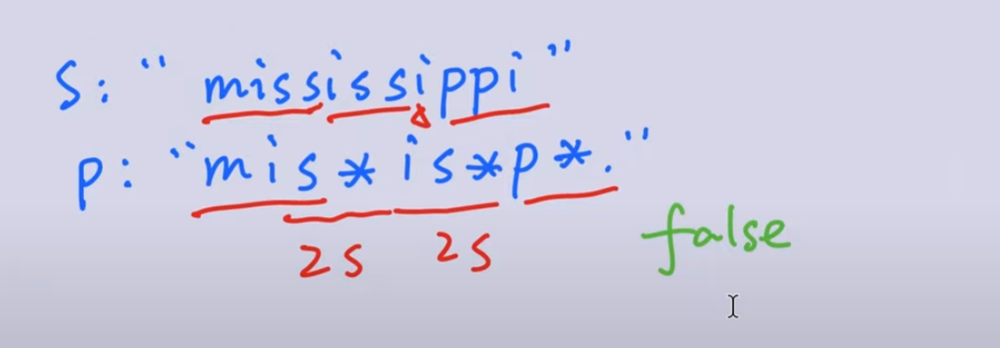

## 10. Regular Expression Matching

---




---

- [DFS](https://www.youtube.com/watch?v=EdWzV-9lQMw)

```java
class _10_RegularExpressionMatching {
    public boolean isMatch(String s, String p) {
        if (p.length() == 0) {
            return s.length() == 0;
        }
        if (p.length() > 1 && p.charAt(1) == '*') {// second char is *
            if (isMatch(s, p.substring(2))) {
                return true;
            }
            if (s.length() > 0 && (p.charAt(0) == '.' || s.charAt(0) == p.charAt(0))) {
                return isMatch(s.substring(1), p);
            }
            return false;
        } else {                                    // second char is not *
            if (s.length() > 0 && (p.charAt(0) == '.' || s.charAt(0) == p.charAt(0))) {
                return isMatch(s.substring(1), p.substring(1));
            }
            return false;
        }
    }
}
```