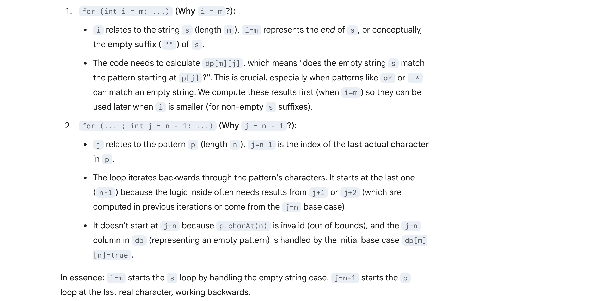

## 10. Regular Expression Matching


- since **'*'** Matches zero or more of the preceding element.
    - thus, s = `ab` doesn't match to p = `a*`,   =>   `s = ab` compare to `p = aa`


- recursive method:

```java
class _10_RegularExpressionMatching {
    public boolean isMatch(String s, String p) {
        if (p.length() == 0) {
            return s.length() == 0;
        }
        //Note: "*b" is invalid!!!
        if (p.length() > 1 && p.charAt(1) == '*') {// second char is *
            if (isMatch(s, p.substring(2))) {
                return true;
            }
            if (s.length() > 0 && (p.charAt(0) == '.' || s.charAt(0) == p.charAt(0))) {
                return isMatch(s.substring(1), p);
            }
            return false;
        } else {                                    // second char is not *
            if (s.length() > 0 && (p.charAt(0) == '.' || s.charAt(0) == p.charAt(0))) {
                return isMatch(s.substring(1), p.substring(1));
            }
            return false;
        }
    }
}
```
---

### Memorization

```java
class Solution {
    private Boolean[][] dp;
    private String s;
    private String p;
    public boolean isMatch(String s, String p) {
        this.s = s;
        this.p = p;
        dp = new Boolean[s.length() + 1][p.length() + 1];
        return dfs(0, 0);
    }

    private boolean dfs(int i, int j) {
        if (j == p.length()) {
            return dp[i][j] = (i == s.length());
        }
        if (dp[i][j] != null) {
            return dp[i][j];
        }
        if (j + 1 < p.length() && p.charAt(j + 1) == '*') {
            // Case 1: first char matches, consume one char from s
            // s = aaaxxx   p = a*  这里的p可以等待接下来的char from s, 也就是可以把状态传递给 next dfs
            if (i < s.length() && (p.charAt(j) == '.' || s.charAt(i) == p.charAt(j))) {
                if (dfs(i + 1, j)) {
                    return dp[i][j] = true;
                }
            }

            // Case 2: zero occurrences of char before '*'
            // s = aaaxxx   p = b*  这里的p可以直接表示0个前面字母，所以skip 2 个 chars
            if (dfs(i, j + 2)) {
                return dp[i][j] = true;
            }

            return dp[i][j] = false;
        } else {
            // Second char is not '*'
            if (i < s.length() && (p.charAt(j) == '.' || s.charAt(i) == p.charAt(j))) {
                dp[i][j] = dfs(i + 1, j + 1);
                return dp[i][j];
            }
            return dp[i][j] = false;
        }
    }
}
```


-  if s = `"aaaaaab"`, p = `"a*b"`, so `"a*"` can **consume** "aaaaaa"(remaining a **b**) and p is unchanged, right?
   -  Exactly right!
   -  Let a* consume all `'a'`s → so `s = "b"` remains
   -  Pattern is still at **"a*b"** (we haven’t moved past * yet)
   -  Then try `isMatch("b", "a*b")` again:
      -  "a" still matches → a* consumes nothing this time
      -  Move on: try isMatch("b", "b")
---

### Bottom-Up DP

```java
class tabulation_v1 {
    public boolean isMatch(String s, String p) {
        int m = s.length();
        int n = p.length();
        // Use boolean primitive, defaults to false
        boolean[][] dp = new boolean[m + 1][n + 1];

        // Base case: empty string matches empty pattern
        dp[m][n] = true;

        // Fill the table bottom-up
        // i = index in s (from end to start), j = index in p (from end to start)
        for (int i = m; i >= 0; i--) {
            // Start j from n-1 since dp[...][n] is handled by the base case or implicitly false,
            // except for dp[m][n].
            for (int j = n - 1; j >= 0; j--) {
                // Check if current characters match (only if s is not exhausted(耗尽) at index i)
                boolean first_match = (i < m && (p.charAt(j) == '.' || s.charAt(i) == p.charAt(j)));

                // Check if the next pattern character is '*'
                if (j < n - 1 && p.charAt(j + 1) == '*') {
                    // If p[j+1] is '*':
                    // Option 1: Treat '*' as zero occurrences of p[j].
                    // Check if s[i:] matches p[j+2:] (equivalent to skipping p[j] and '*')
                    boolean match_zero = dp[i][j + 2];

                    // Option 2: Treat '*' as one or more occurrences of p[j].
                    // Requires current characters to match (first_match)
                    // AND s[i+1:] must match p[j:] (stay at p[j] due to '*')
                    boolean match_one_or_more = first_match && dp[i + 1][j];

                    dp[i][j] = match_zero || match_one_or_more;
                } else {
                    // Normal character match (no '*' following p[j])
                    // Check if current s[i] matches p[j] (and s is not exhausted)
                    dp[i][j] = first_match && dp[i + 1][j + 1];


                    // No else needed here: if the characters don't match,
                    // dp[i][j] remains default false, which is correct.
                }
            }
        }

        // The result is whether the full string s (from index 0) matches the full pattern p (from index 0)
        return dp[0][0];
    }
}
```
---

1. `dp[m][n]` corresponds to checking if `s.substring(m)` matches `p.substring(n)`. Since m is the length of s and n is the length of p, both 
   substring(m) and substring(n) represent empty strings ("").

2. for init **i = m**, **j = n - 1**, why?




---
## DP

- [video 5:38](https://www.youtube.com/watch?v=l3hda49XcDE&t=303s)

