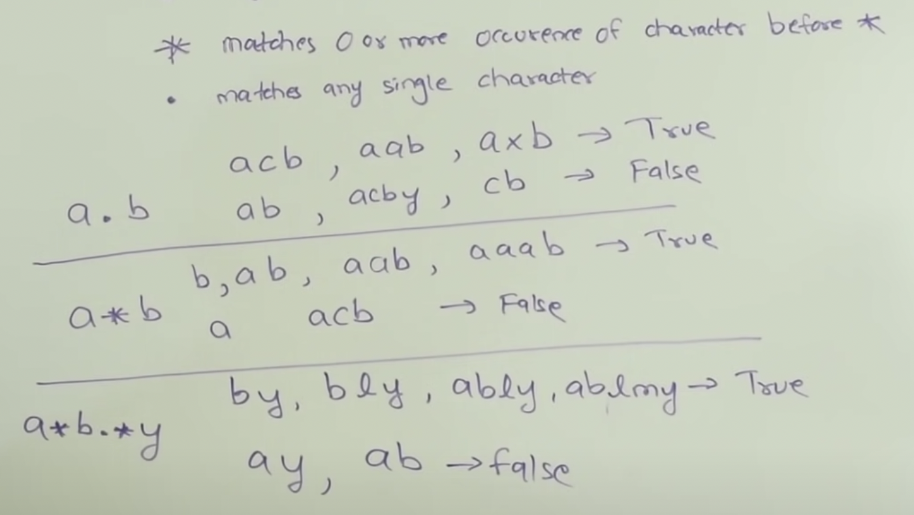
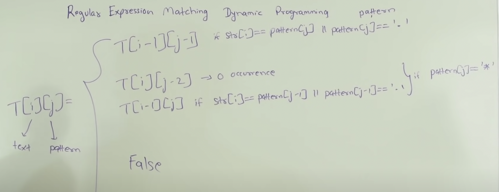
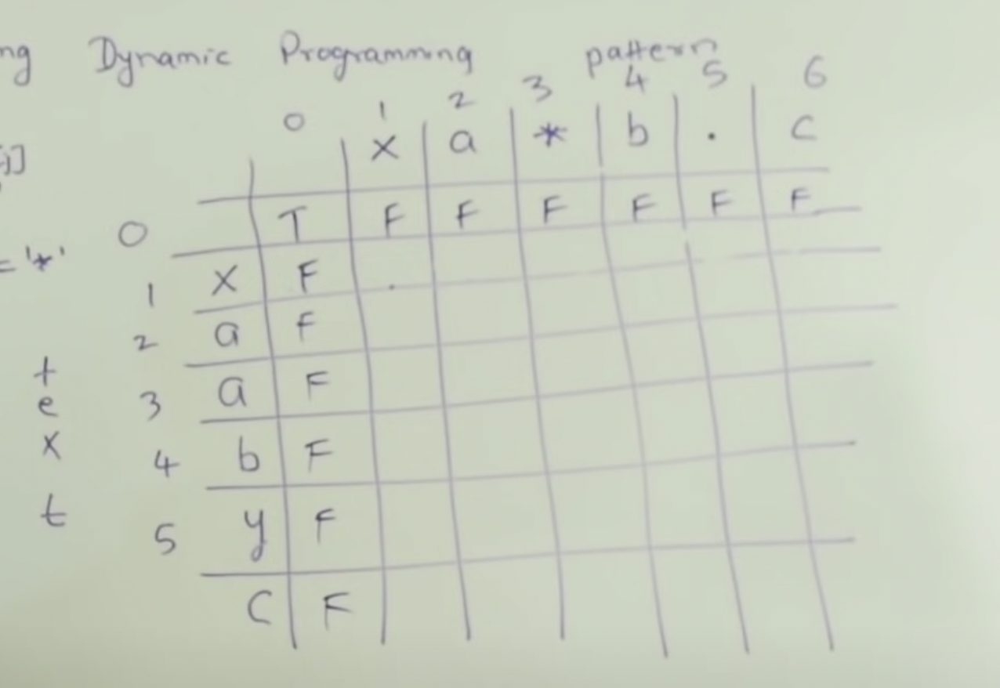

## 10. Regular Expression Matching

---




```ruby
##  How does "ablmy" stand true to "a*b.*y"?

    a* ---> a
    b ---> b
    .* ----> . . ----> lm
    y ----> y

    In regular expression, single * has no meaning. It has to be *
    Examples:
    a*
    b*
    .*
```

- Note: `*b`  is **invalid**


- for `column 0`, the pattern string for `index 0` is empty string, so filling up `column 0` all `False`
  
```java
M[0][0] = true;
```


- [video 5:38](https://www.youtube.com/watch?v=l3hda49XcDE&t=303s)
- [LeetCode10 Discussion:](https://leetcode.com/problems/regular-expression-matching/discuss/280588/DP-solution-with-the-most-general-natural-explanation)

- Now for `row 0`, `a*` or `a*b*` or `a*b*c*` can match text empty string 

```java
/**
    1. M[i][0] = false(which is default value of the boolean array) since empty pattern cannot match non-empty string
    2. M[0][j]: what pattern matches empty string ""? It should be #*#*#*#*..., or (#*)* 
        if allow me to represent regex using regex :P, and for this case we need to check manually: 
            as we can see, the length of pattern should be even && the character at the even position should be *, 
		    thus for odd length, M[0][j] = false which is default. So we can just skip the odd position, i.e. j starts from 2, 
            the interval of j is also 2. 
		and notice that the length of repeat sub-pattern #* is only 2, we can just make use of M[0][j - 2] 
            rather than scanning j length each time 
		for checking if it matches #*#*#*#*.

*/
    for (int i = 2; i < T[0].length; i+=2) {
        if (pattern[i-1] == '*') {
            T[0][i] = T[0][i - 2];
        }
    }

// OR:

    for(int j = 2; j < n + 1; j +=2){
        if(p.charAt(j - 1) == '*' && M[0][j - 2]){
            M[0][j] = true;
        }
    }
```


#### DP

```java
/**
  Note:  dp[0][0] = true, becase empty string vs empty string is True
*/


```

---

### Recursion


---

- [DFS](https://www.youtube.com/watch?v=EdWzV-9lQMw)

```java
class _10_RegularExpressionMatching {
    public boolean isMatch(String s, String p) {
        if (p.length() == 0) {
            return s.length() == 0;
        }
        //Note: "*b" is invalid!!!
        if (p.length() > 1 && p.charAt(1) == '*') {// second char is *
            if (isMatch(s, p.substring(2))) {
                return true;
            }
            if (s.length() > 0 && (p.charAt(0) == '.' || s.charAt(0) == p.charAt(0))) {
                return isMatch(s.substring(1), p);
            }
            return false;
        } else {                                    // second char is not *
            if (s.length() > 0 && (p.charAt(0) == '.' || s.charAt(0) == p.charAt(0))) {
                return isMatch(s.substring(1), p.substring(1));
            }
            return false;
        }
    }
}
```
