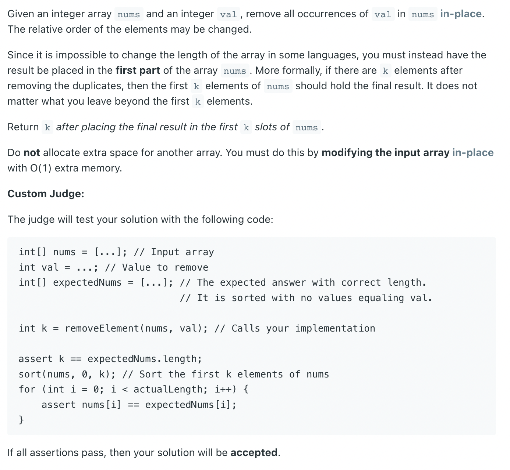
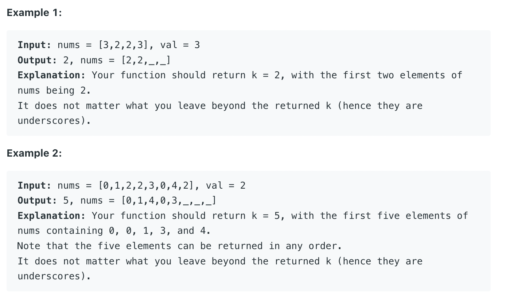

## 27. Remove Element



```java
/**
 * Using Two Pointers - when elements to remove are rare.
 *
 * Here whenever we find val, we replace it with num at len-1 and reduce the
 * length of the array by one. Total number of assignment operations required
 * are less.
 *
 * Time Complexity: O(N)
 *
 * Space Complexity: O(1)
 *
 * N = Length of input array.
 */
class _27_RemoveElement {
    public static int removeElement(int[] nums, int val) {
        if (nums == null || nums.length == 0) {
            return 0;
        }
        int len = nums.length;
        int left = 0;
        int count = 0;
        while (left < len) {
            if (nums[left] == val) {
                nums[left] = nums[len - 1];
                // Reduce Array's length by one
                len--;
            } else {
                left++;
            }
        }
        return len;
    }
}
```