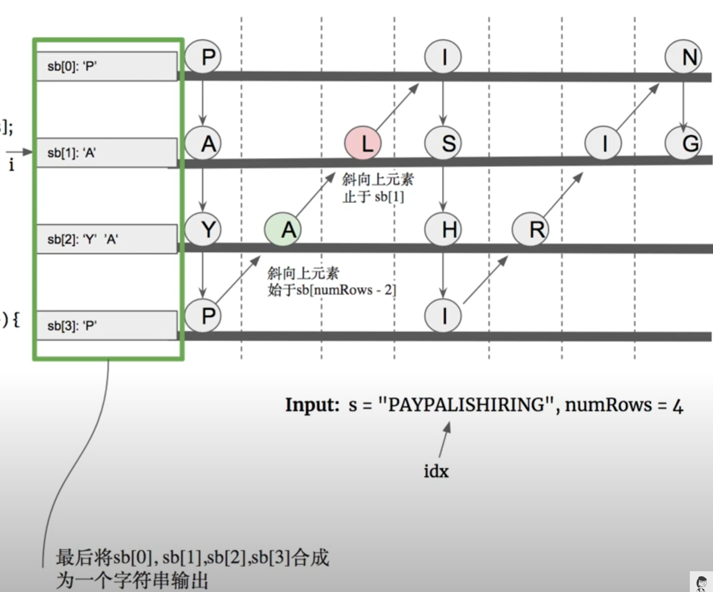

## 6. Zigzag Conversion




- [youTuBe](https://www.youtube.com/watch?v=CPamjPdCvIk&t=2s)

```java
class Solution {
    public String convert(String s, int numRows) {
        char[] c = s.toCharArray();
        StringBuilder[] sb = new StringBuilder[numRows];
        int len = c.length;
        for (int i = 0; i < numRows; i++) {
            sb[i] = new StringBuilder();
        }
        
        int idx = 0;
        while (idx < len) {
            for (int i = 0; i < numRows && idx < len; i++) {
                sb[i].append(c[idx++]);
            }
            for (int i = numRows - 2; i >= 1 && idx < len; i--) {
                sb[i].append(c[idx++]);
            }
        }
        
        for (int i = 1; i < numRows; i++) {
            sb[0].append(sb[i]);
        }
        return sb[0].toString();
    }
}
```