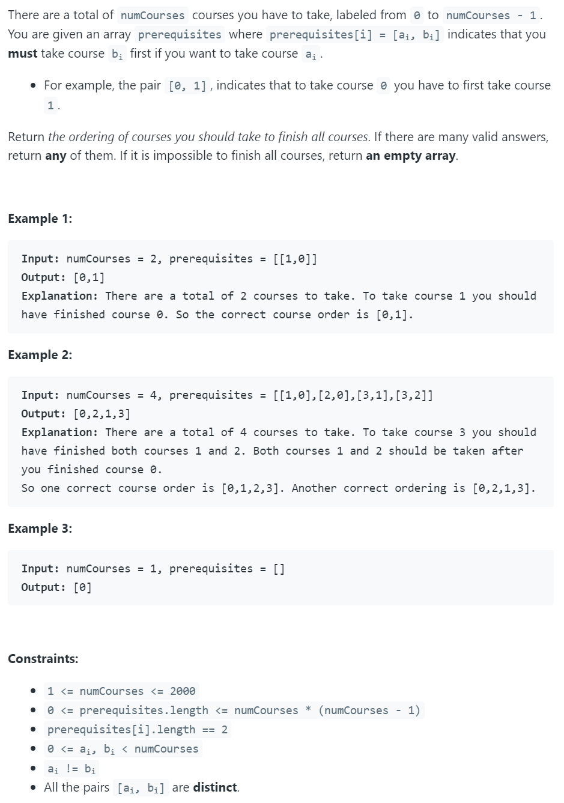

## 210. Course Schedule II


---

```java
class course2 {
    public int[] findOrder(int numCourses, int[][] prerequisites) {
        if (numCourses <= 0) {
            return new int[0];
        }

        // 1. init Map
        int[] inDegree = new int[numCourses];
        Map<Integer, List<Integer>> graph = new HashMap<>();

        // 2. Build Map
        buildMap(inDegree, graph, prerequisites);

        // 3. bfs
        return bfs(numCourses, graph, inDegree);
    }

    private void buildMap(int[] inDegree, Map<Integer, List<Integer>> graph, int[][] prerequisites) {
        for (int i = 0; i < prerequisites.length; i++) {
            inDegree[prerequisites[i][0]]++;
            graph.putIfAbsent(prerequisites[i][1], new ArrayList<>());
            graph.get(prerequisites[i][1]).add(prerequisites[i][0]);
        }
    }

    private int[] bfs(int numCourses, Map<Integer, List<Integer>> graph, int[] inDegree) {
        int[] res = new int[numCourses];
        int index = 0;
        Queue<Integer> queue = new LinkedList<>();
        for (int i = 0; i < numCourses; i++) {
            if (inDegree[i] == 0) {
                queue.add(i);
            }
        }

        while (!queue.isEmpty()) {
            int curCourse = queue.poll();
            res[index++] = curCourse;
            List<Integer> toTake = graph.get(curCourse);
            if (toTake != null) {
                int n = toTake.size();
                for (int i = 0; i < n; i++) {
                    int pointer = toTake.get(i);
                    inDegree[pointer]--;
                    if (inDegree[pointer] == 0) {
                        queue.offer(pointer);
                    }
                }
            }
        }
        if (index != numCourses) {
            return new int[0];
        }
        return res;
    }

    public static void main(String[] args) {
        int numCourse = 4;
        int[][] prerequisites = new int[][]{
                {1, 0}, {2, 0}, {3, 1}, {3, 2}
        };
        course2 c2 = new course2();
        int[] res = c2.findOrder(numCourse, prerequisites);
        System.out.println(Arrays.toString(res));
    }
}
```

---

```java
class Solution {
    public int[] findOrder(int numCourses, int[][] prerequisites) {
        Map<Integer, List<Integer>> graph = new HashMap<>();
        int[] indegree = new int[numCourses];
        buildGraph(graph, prerequisites, indegree);
        return bfs(graph, indegree, numCourses);        
    }
    
    private void buildGraph(Map<Integer, List<Integer>> graph, int[][] prerequisites, int[] indegree) {
        for (int i = 0; i < prerequisites.length; i++) {
            graph.putIfAbsent(prerequisites[i][1], new ArrayList<>());
            graph.get(prerequisites[i][1]).add(prerequisites[i][0]);
            indegree[prerequisites[i][0]]++;
        }
    }
    
    private int[] bfs(Map<Integer, List<Integer>> graph, int[] indegree, int numCourses) {
        List<Integer> res = new ArrayList<>();
        Queue<Integer> queue = new ArrayDeque<>();
        for (int i = 0; i < numCourses; i++) {
            if (indegree[i] == 0) {
                queue.offer(i);
            }
        }
        
        int count = 0;
        while (!queue.isEmpty()) {
            int course = queue.poll();
            res.add(course);
            List<Integer> list = graph.get(course);
            if (list != null) {
                int n = list.size();
                for (int i = 0; i < n; i++) {
                    int pointer = graph.get(course).get(i);
                    indegree[pointer]--;
                    if (indegree[pointer] == 0) {
                        queue.offer(pointer);
                    }
                }
            }
            count++;
        }
        if (count != numCourses) {
            return new int[0];
        }
        return res.stream().mapToInt(i -> i).toArray();
    } 
}
```

