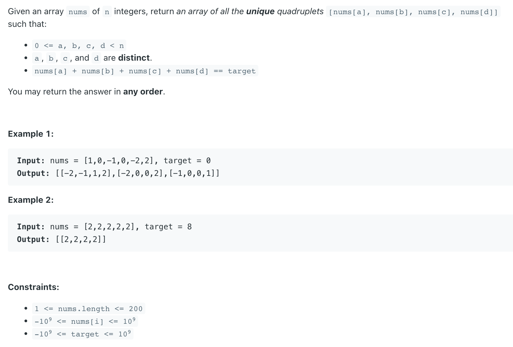

## 18. 4Sum

---

### withOut HashSet

```java
class _18_4Sum_without_Set {
    public static List<List<Integer>> fourSum(int[] nums, int target) {
        List<List<Integer>> res = new ArrayList<>();
        int n = nums.length;
        if (n < 4) {
            return res;
        }
        long tar = (long) target;
        Arrays.sort(nums);
        for (int first = 0; first < n - 3; first++) {
            if (first > 0 && nums[first] == nums[first - 1]) {
                continue;
            }
            for (int second = first + 1; second < n - 2; second++) {
                if (second > first + 1 && nums[second] == nums[second - 1]) {
                    continue;
                }
                int third = second + 1;
                int fourth = n - 1;
                while (third < fourth) {
                    int curSum = nums[first] + nums[second] + nums[third] + nums[fourth];
                    if (curSum == tar) {
                        res.add(Arrays.asList(nums[first], nums[second], nums[third], nums[fourth]));
                        third++;
                        fourth--;
                        while (third < fourth && nums[third] == nums[third - 1]) {
                            third++;
                        }
                        while (third < fourth && nums[fourth] == nums[fourth + 1]) {
                            fourth--;
                        }
                    } else if (curSum < tar) {
                        third++;
                    } else {
                        fourth--;
                    }
                }
            }
        }
        return res;
    }

    public static void main(String[] args) {
        int[] nums = {1,0,-1,0,-2,2};
        System.out.println(fourSum(nums, 0));
        // [[-2, -1, 1, 2], [-2, 0, 0, 2], [-1, 0, 0, 1]]
    }
}
```
---

### With HashSet

```java
class _18_4Sum_Set {
    public static List<List<Integer>> fourSum(int[] nums, int target) {
        Set<List<Integer>> res = new HashSet<>();
        long tar = (long) target;
        int n = nums.length;
        if (n < 4) {
            return new ArrayList<>(res);
        }
        Arrays.sort(nums);
        for (int first = 0; first < n - 3; first++) {
            for (int second = first + 1; second < n - 2; second++) {
                int third = second + 1;
                int fourth = n - 1;
                while (third < fourth) {
                    long curSum = (long) nums[first] + nums[second] + nums[third] + nums[fourth];
                    if (curSum == tar) {
                        res.add(Arrays.asList(nums[first], nums[second], nums[third], nums[fourth]));
                        third++;
                        fourth--;
                    } else if (curSum < tar) {
                        third++;
                    } else {
                        fourth--;
                    }
                }
            }
        }
        return new ArrayList<>(res);
    }
}
```