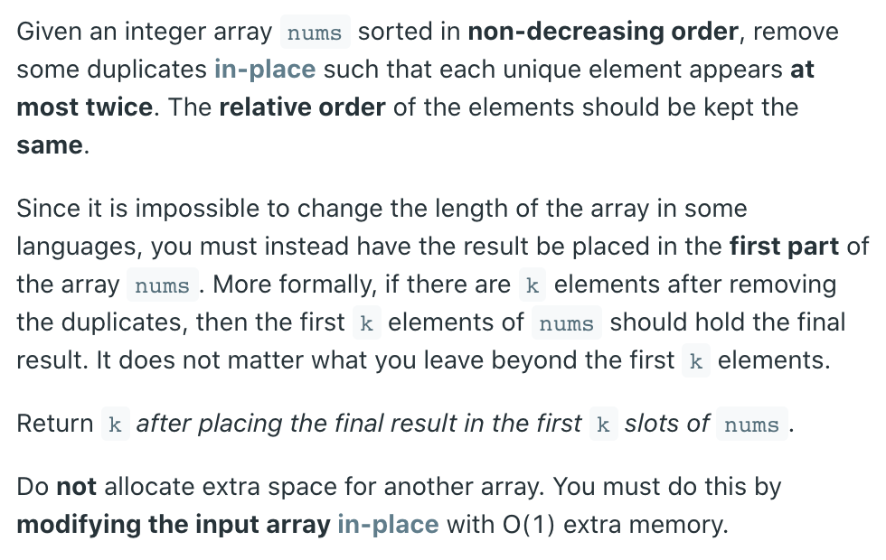
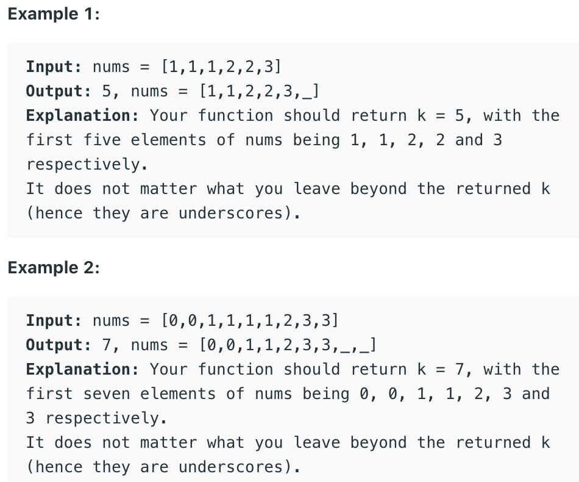

## 80. Remove Duplicates from Sorted Array II || Array Deduplication II



## Analysis:

- [reference 26. Remove Duplicates from Sorted Array](https://novemberfall.github.io/LeetCode-NoteBook/#/twopoint/rmDupEle)

- slow: all elements to the left side of the slow (excluding slow) pointer are the result for  
  the elements that have been processed.

- fast: the current index being processed. (all elements to the right side of the fast pointer
  have not been processed.)

## Algorithm

- Initialize: s = 2, f = 2
- case1: a[f] == a[s-2], we are sure a[f] == a[s - 1], not copy
- case2: a[f] != a[s - 2], a[s] = a[f]; s++; 


```js
1   2   2   3   3   3
        f->
        s->             //since arr[f] != arr[s - 2], 
                        //copy arr[f] to arr[s]
                        //slow++;

1   2   3   3   3   3
        f->             
            s->        //then loop, f++;


1   2   3   3   3   3
            f->             
            s->        //since arr[f] != arr[s - 2], 
                       //copy arr[f] to arr[s] 
                       //slow++;


1   2   3   3   3   3
            f->             
                s->        
                       //then loop, f++;
    


1   2   3   3   3   3
                f->             
                s-> //since arr[f] = arr[s - 2], continue
                    //f++;
                     

1   2   3   3   3   3
                    f->             
                s->        
                    //then loop is done!                 


return slow index.
```


```java
class Solution {
    public int removeDuplicates(int[] nums) {
        if (nums == null || nums.length == 0) {
            return 0;
        }
        
        int slow = 2;
        for (int fast = 2; fast < nums.length; fast++) {
            if (nums[fast] != nums[slow - 2]) {
                nums[slow++] = nums[fast];
            }
        }
        return slow;
    }
}
```


---

## 变种题型


```ruby
Given a sorted integer array, remove duplicate elements. 
For each group of elements with the same value keep 
at most two of them. Do this in-place, using the left side 
of the original array and maintain the relative order of 
the elements of the array. 
Return the array after deduplication.

Assumptions

The given array is not null
Examples

{1, 2, 2, 3, 3, 3} → {1, 2, 2, 3, 3}
```


```java
public class Solution {
  public int[] dedup(int[] array) {
    // Write your solution here
    if(array.length <= 2){
      return array;
    }
    int slow = 2;
    for(int fast = 2; fast < array.length; fast++){
      if(array[fast] == array[slow - 2]){
        continue;
      }
      array[slow] = array[fast];
      slow++;
    }
    return Arrays.copyOf(array, slow);
  }
}
```


