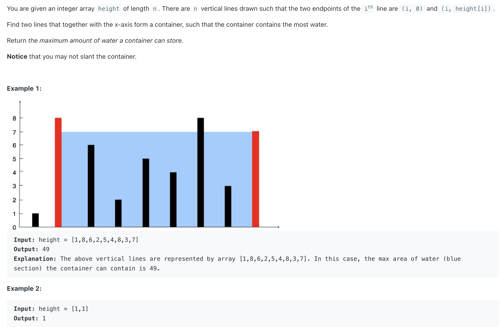

## 11. Container With Most Water

---
- [youtube](https://www.youtube.com/watch?v=UuiTKBwPgAo)

```java
class Solution {
    public int maxArea(int[] height) {
        int water = 0;
        int left = 0, right = height.length - 1;
        while (left < right) {
            int high = Math.min(height[left], height[right]);
            water = Math.max(water, high * (right - left));
            
            if (height[left] < height[right]) {
                left++;
            } else if (height[left] > height[right]) {
                right--;
            } else {
                // if height[left] == height[right], we can either move left or right pointer:
                right--;
            }
        }
        return water;
    }
}
```


---
### Brute Force

```java
class Solution {
    public int maxArea(int[] height) {
        int water = 0;
        for (int left = 0; left < height.length; left++) {
            for (int right = left + 1; right < height.length; right++) {
                int h = Math.min(height[left], height[right]);
                water = Math.max(water, h * (right - left));
            }
        }
        return water;
    }
}
```