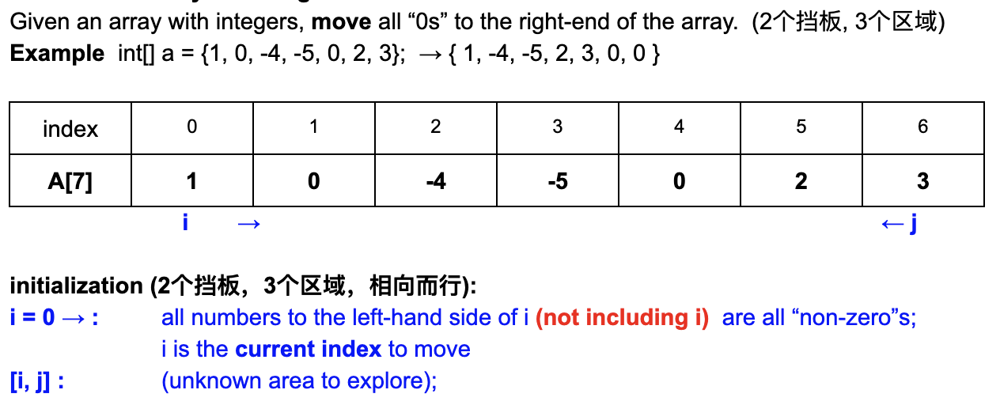
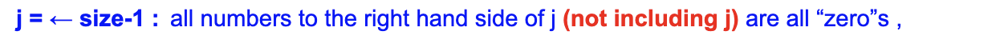

## 283. Move Zeroes 

---


```ruby
1      0       3       0       1
f->                                 
s->                                                


1      0       3       0       1
       f->
       s->                          


1      0       3       0       1
               f->
       s->                         


1      3       3       0       1
                       f->
               s->                                   


1      3       3       0       1
                               f->
               s->                 # a[fast] != 0 , arr[slow++] = arr[fast++]      


1      3       1       0       1
                                    f->
                       s->               

当处理完中间遇到的0， 剩下只要把 slow pointer剩下的元素全部 assign to 0


1      3       1       0       0
                               s->                      //arr[s] = 0
```
---

```java
class moveZerosToTheEnd {
    public void moveZeroes(int[] nums) {
        if (nums == null || nums.length == 0) {
            return;
        }
        int slow = 0, fast = 0;
        while (fast < nums.length) {
            if (nums[fast] != 0) {
                nums[slow] = nums[fast];
                fast++;
                slow++;
            } else {
                fast++;
            }
        }

        while (slow < nums.length) {
            nums[slow] = 0;
            slow++;
        }
    }

    public static void main(String[] args) {
        int[] nums = new int[]{1, 0, 3, 0, 1};
        moveZerosToTheEnd mztte = new moveZerosToTheEnd();
        mztte.moveZeroes(nums);
        System.out.println(Arrays.toString(nums)); // [1, 1, 3, 0, 0]
    }
}
```

---

#### 

---


---
- when `left` don’t meet `0`, `left++`
- when `right` meet with `0`, `right–-`
- when `left` meet with `0` AND `right` don’t meet `0`, => `swap(left, right)`
---
```ruby
## loop1
    [1    0    3    0    1]    
     l++                 r

    [1    0    3    0    1]    
          l              r   
          
          
## loop2
    [1    0    3    0    1]    
          l              r

    [1    1    3    0    0]    
          l++            r--  

    [1    1    3    0    0]    
               l    r


## loop3
    [1    1    3    0    0]    
               l++  r 

    [1    1    3    0    0]    
                    l
                    r-- 

    [1    1    3    0    0]    
                    l
               r 
```
---
```java
class moveZerosToTheEnd {
    public void moveZeroes(int[] nums) {
        if (nums == null || nums.length == 0) {
            return;
        }
        int left = 0, right = nums.length - 1;

        while (left <= right) {
            if (nums[left] != 0) {
                left++;
            } else if (nums[right] == 0) {
                right--;
            } else if (nums[left] == 0 && nums[right] != 0) {
                swap(nums, left, right);
                left++;
                right--;
            }
        }
    }

    private void swap(int[] nums, int left, int right) {
        int tmp = nums[left];
        nums[left] = nums[right];
        nums[right] = tmp;
    }

    public static void main(String[] args) {
        int[] nums = new int[]{1, 0, 3, 0, 1};
        moveZerosToTheEnd mztte = new moveZerosToTheEnd();
        mztte.moveZeroes(nums);
        System.out.println(Arrays.toString(nums)); //[1, 1, 3, 0, 0]
    }
}
```

