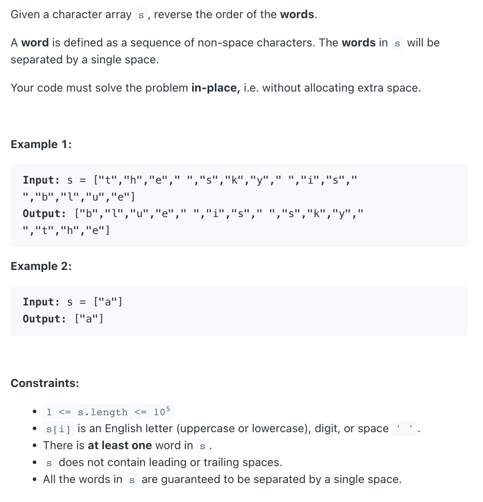

## 186. Reverse Words in a String II

---
## Analysis

- "I love Google" -> Step 1: reverse the whole sentence => "elgooG evol I"
- "Google love I" -> Step 2: reverse every single word in this sentence


- 本题先把整句字符串 反转
- 然后利用两个pointer,  `start` and `end`
- 标记出 一个单独word的 `begin index` and `end index`
- 最后对每一个单词进行反转


---
```java
class Solution {
    public void reverseWords(char[] s) {
        if (s == null || s.length == 0) {
            return;
        }
        int left = 0;
        int right = s.length - 1;

        // 1st, reverse the whole sentence => eulb si yks eht
        reverse(s, left, right);
        
        // 2st, separate every sigle word
        int startIndex = 0;
        for (int i = 0; i < s.length; i++) {
            if (s[i] != ' ' && (i == 0 || s[i - 1] == ' ')) {
                startIndex = i;
            }
            if (s[i] != ' ' && (i == s.length - 1 || s[i + 1] == ' ')) {
                //reverse every single word
                reverse(s, startIndex, i);
            }
        }
    }
    
    private void reverse(char[] res, int left, int right){
        while(left <= right){
            char temp = res[left];
            res[left] = res[right];
            res[right] = temp;
            left++;
            right--;
        }
    }
}
```

---

### Similar Questions: `Rotate Array`