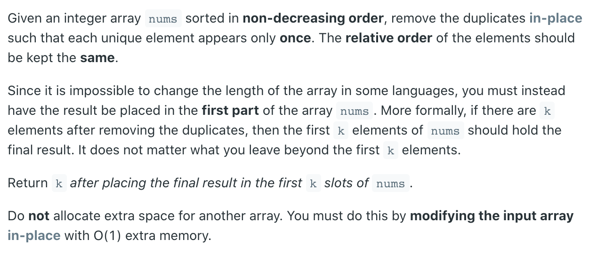
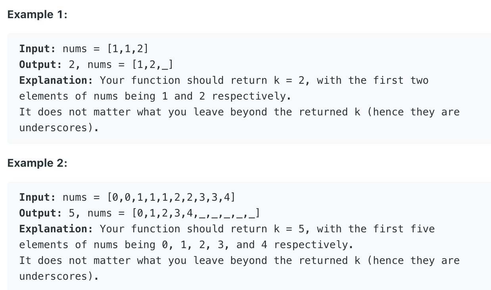
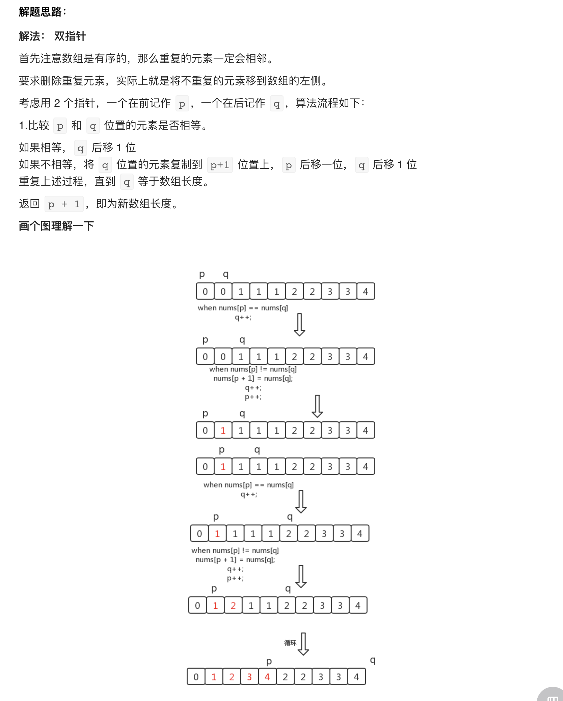

## 26. Remove Duplicates from Sorted Array





---



- Time = 0(n)
- Space = O(1)


```java
class Solution {
    public int removeDuplicates(int[] nums) {
        int slow = 0;
        for (int fast = 1; fast < nums.length; fast++) {
            if (nums[slow] != nums[fast]) {
                slow++;
                nums[slow] = nums[fast];
            }
        }
        return ++slow;
    }
}
```